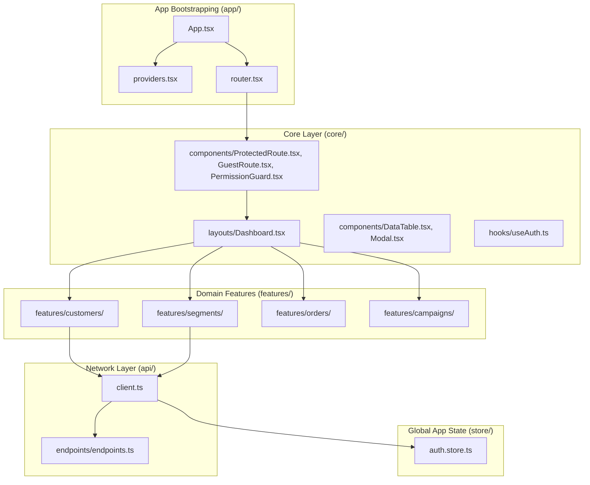
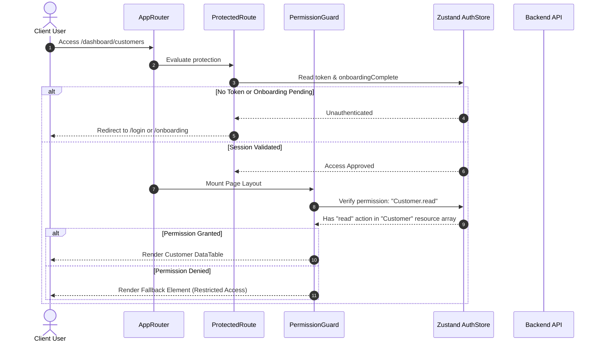
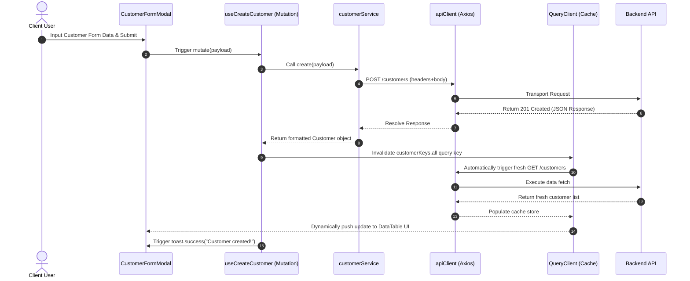

# Chapter 3 — Frontend System Design and Implementation

## 3.1 Overview of Frontend Architecture

The architectural design of the Briefly customer relationship management (CRM) frontend is constructed upon the principles of domain isolation, clear separation of concerns, and strict modularity. Traditional web architectures often arrange files by technical type—placing all components in a single folder, all state managers in another, and all hooks in a third. While this model is simple to initialize, it degrades rapidly under scale as domain logic becomes scattered across the codebase. 

To prevent cross-domain coupling and visual noise in a multi-tenant CRM context containing over ten distinct business domains, the Briefly frontend utilizes a domain-driven architectural pattern. The codebase divides its logic into four main directories:

*   **`/src/app/`**: Serves as the bootstrapping and execution shell of the web application. It orchestrates global context providers (e.g., query caching, hot notifications) and handles root-level routes.
*   **`/src/api/`**: Forms the global network infrastructure. It configures the HTTP client, handles global token interceptors, manages automatic authorization failures, and maps a centralized endpoint directory.
*   **`/src/core/`**: Houses all feature-agnostic, reusable infrastructure. Any component, utility, helper, or layout in this folder must have zero awareness of specific CRM domains (e.g., customers or campaign management).
*   **`/src/features/`**: Represents the core domain layer. Every functional CRM module (such as Customers, Segments, or Campaigns) is housed inside a self-contained feature folder containing its own UI components, state queries, types, services, and formatting utilities.

This structure guarantees that any domain-specific folder can be deleted or updated without causing compilation errors in unrelated areas of the application. 


*Figure 3.1: Architectural Layering and Modular Dependency Graph*

---

## 3.2 UI/UX Design Strategy and Visual Infrastructure

The user interface of the Briefly platform is engineered to optimize data density, cognitive clarity, and accessibility, catering specifically to e-commerce merchants who interact with high-volume analytics daily. To establish a premium visual identity that avoids browser defaults and generic styling palettes, the design system utilizes TailwindCSS (v4) paired with custom CSS variables to drive consistent rendering patterns.

### 3.2.1 Color Systems and Color Theory
The visual layer uses a curated HSL palette, translating semantic utility roles directly into CSS custom properties. Rather than relying on rigid Tailwind defaults, the palette adapts to multi-tenant branding via runtime variables:
*   **Brand Action Colors**: Represented by `var(--color-primary-500)` and `var(--color-primary-600)`. These drive high-priority actions, visual progress hooks, and navigational focus states.
*   **Data Canvas and Backgrounds**: The layout sits on a light neutral canvas (`#F8FAFC`), while dashboards and interactive cards use pure white backgrounds (`#FFFFFF`) framed by fine-grained neutral borders (`1px border-gray-100`). This contrast isolates analytical charts from structural components.
*   **Typography Hierarchy**: The system employs the *Poppins* typeface, prioritizing geometric readability. Structural copy uses varying weights of gray (`text-gray-900` for titles, `text-gray-700` for readable descriptions, and `text-gray-400` for metadata annotations).

### 3.2.2 Structural Patterns and Micro-Animations
The client layout enforces a rigid dashboard shell, reserving full-screen rendering for public landing and onboarding routes. Dashboard features share a standardized card design:
```html
<div className="bg-white rounded-2xl border border-gray-100 shadow-sm p-6">
```
To elevate interaction cues, micro-animations are built in using `framer-motion`. State transitions, such as opening slide-over filter menus, closing modals, or hover states on interactive table rows, are governed by cubic-bezier transition curves. This ensures the app feels responsive and smooth, minimizing visual delay.

---

## 3.3 Declarative Routing and Route Protection System

Routing in the Briefly application is driven by React Router. The routing logic is designed around a clear separation between public marketing spaces, onboarding checkpoints, and protected tenant dashboards. 

### 3.3.1 Route Hierarchy
The application defines three major routes:
1.  **Public Routes (`/`, `/forgot-password`, `/reset-password`)**: Accessible without credentials. These serve landing content, pricing tables, and public documentation.
2.  **Guest-Only Routes (`/login`, `/signup`)**: Wrapped in a specialized `GuestRoute` wrapper. If an authenticated user attempts to access these paths, the guard intercepts the transition and redirects them to the active dashboard.
3.  **Protected Routes (`/onboarding`, `/dashboard/*`)**: Wrapped in a `ProtectedRoute` wrapper. These require a valid authentication token. If the user session lacks confirmation of onboarding completion, the guard routes them directly to `/onboarding`.

### 3.3.2 Guard Configurations
The route guard system acts as an inline firewall. During route evaluation, the application checks the local Zustand state to assess security conditions before rendering children.

Listing 3.1 displays the core implementation of the protected route interceptor.

```typescript
// Listing 3.1: Route protection and layout wrapper
import { Navigate, useLocation } from "react-router-dom";
import { useAuthStore } from "@/store/auth.store";

export function ProtectedRoute({ children }: { children: React.ReactNode }) {
    const token = useAuthStore((s) => s.token);
    const onboardingComplete = useAuthStore((s) => s.onboardingComplete);
    const location = useLocation();

    if (!token) {
        return <Navigate to="/login" state={{ from: location }} replace />;
    }

    if (!onboardingComplete && location.pathname !== "/onboarding") {
        return <Navigate to="/onboarding" replace />;
    }

    return <>{children}</>;
}
```

The layout router utilizes nested routing structures. When the route path matches `/dashboard/*`, the shell mounts `src/core/layouts/Dashboard.tsx`. Inside this layout, the main navigation elements (the sidebar and navigation bar) remain stationary, while the content pane mounts domain-isolated sub-routes dynamically using a secondary `<Routes>` router. This architecture prevents full-page re-renders during app navigation, preserving memory states.

---

## 3.4 Client State Management Architecture

A major challenge in building a dashboard-heavy SaaS platform is balancing local UI states, global application states, and remote database synchronization. Briefly solves this by dividing state management into three isolated layers:

| Layer | Responsibility | Technology |
|---|---|---|
| **Component-Local UI State** | Modals, active tab indexes, form values, and visual toggle states. | React `useState` & Formik |
| **Global Application State** | Token storage, active tenant variables, authorization scopes, and user session flags. | Zustand |
| **Server State and Query Cache** | CRM database entities (customers, segments, orders). | TanStack Query (v5) |

### 3.4.1 Zustand Global State Layer
The global app state is managed through Zustand. The auth store manages user credentials, role definitions, and access permissions. Because Zustand stores run as in-memory JavaScript objects, they do not naturally survive browser refreshes. Briefly addresses this by using Zustand's persistence middleware, which serializes session data directly into `localStorage`. 

Listing 3.2 illustrates the structure of the authentication state manager:

```typescript
// Listing 3.2: Zustand auth store configuration with persistent middleware
import { create } from "zustand";
import { persist, createJSONStorage } from "zustand/middleware";
import type { AuthUser, AuthState } from "./types";

export const useAuthStore = create<AuthState>()(
    persist(
        (set) => ({
            token: null,
            user: null,
            role: null,
            permissions: null,
            onboardingComplete: false,

            setSession: (token, user, role, permissions, onboardingComplete = false) =>
                set({ token, user, role, permissions, onboardingComplete }),

            completeOnboarding: () =>
                set({ onboardingComplete: true }),

            clearSession: () =>
                set({ token: null, user: null, role: null, permissions: null, onboardingComplete: false }),
        }),
        {
            name: "briefly-auth",
            storage: createJSONStorage(() => localStorage),
        }
    )
);
```

### 3.4.2 TanStack Query Server State Layer
Zustand is purposely kept lightweight. Feature-level data fetching and state synchronization bypass Zustand entirely. They are managed by TanStack Query, which treats server responses as a cache key repository. 

To maintain key consistency across various components, each feature exports a structured `Query Key Factory`. When queries execute, they match the target key; when mutations succeed (e.g., adding a customer note or updating an order status), they target that specific key factory to invalidate the cache, prompting automatic re-fetching.

---

## 3.5 API Integration and Networking Layer

The API integration layer acts as the communication pipeline between the React frontend and the multi-tenant backend. Decoupling network code from visual components is enforced throughout this layer.

### 3.5.1 The Central HTTP Client
Rather than invoking fetch methods inside components, the system utilizes a centralized Axios instance located in `/src/api/client.ts`. This client automatically configures base URLs from environment scripts and implements request/response interceptors to manage auth flows.

Listing 3.3 demonstrates the Axios client interceptor setup:

```typescript
// Listing 3.3: Axios client configuration with request and response interceptors
import axios from "axios";
import { useAuthStore } from "@/store/auth.store";

const apiClient = axios.create({
    baseURL: import.meta.env.VITE_API_BASE_URL,
    headers: { "Content-Type": "application/json" },
    withCredentials: true,
});

apiClient.interceptors.request.use((config) => {
    const token = useAuthStore.getState().token;
    if (token) {
        config.headers.Authorization = `Bearer ${token}`;
    }
    return config;
});

apiClient.interceptors.response.use(
    (response) => response,
    (error) => {
        if (error.response?.status === 401) {
            useAuthStore.getState().clearSession();
        }
        return Promise.reject(error);
    }
);

export default apiClient;
```

### 3.5.2 Endpoint Cataloging and Services
Every endpoint is mapped to a static dictionary in `src/api/endpoints/endpoints.ts`. This directory matches the Postman collection defined by the backend, ensuring frontend developers never write raw URL paths inside individual services.

The network architecture follows a strict delegation pattern:
1.  **Endpoints (`endpoints.ts`)**: Supply absolute paths and param builders.
2.  **Services (`*.service.ts`)**: Execute HTTP requests using `apiClient`, returning parsed data models.
3.  **Hooks (`*.hooks.ts`)**: Wrap service methods in TanStack Query, managing caching rules, loader state, and query invalidation.
4.  **UI Components (`*.tsx`)**: Call hooks and render the returned states, avoiding direct backend integrations.

---

## 3.6 Security Infrastructure and Dynamic Authorization

Authentication verification is only the first step in protecting the system's endpoints; enforcing granular permission levels is equally critical inside multi-tenant organizational systems. The Briefly client uses a dynamic permission evaluator, the `PermissionGuard` component, to implement Role-Based Access Control (RBAC).


*Figure 3.2: Authentication and Fine-Grained Authorization Flow*

The platform maps permissions to a resource-based format: `Resource.action` (e.g., `Customer.create`, `Campaign.send`, `Setting.write`). This configuration is retrieved from the `/auth/get-session` endpoint upon login and cached within the persistent Zustand store. The frontend uses this model to hide or show navigation items, action buttons, and entire columns.

Listing 3.4 details the `PermissionGuard` logic:

```typescript
// Listing 3.4: Dynamic permission checking guard
import { useAuthStore } from "@/store/auth.store";

type PermissionGuardProps = {
    permission: string;
    fallback?: React.ReactNode;
    children: React.ReactNode;
};

export function PermissionGuard({ permission, fallback = null, children }: PermissionGuardProps) {
    const permissions = useAuthStore((s) => s.permissions) || {};
    const [resource, action] = permission.split(".");

    if (!resource || !action) {
        console.warn(`[PermissionGuard] Invalid format: "${permission}"`);
        return <>{fallback}</>;
    }

    const resourcePermissions = permissions[resource];
    const hasPermission = resourcePermissions?.includes(action);

    if (!hasPermission) {
        return <>{fallback}</>;
    }

    return <>{children}</>;
}
```

---

## 3.7 Data Query Caching and React Mutation Patterns

Data fetching is engineered to follow a declarative lifecycle. Instead of components manually managing loading animations, error messages, and network triggers inside `useEffect` wrappers, they consume custom React hooks. 

To demonstrate how the frontend communicates with the service layer, Listing 3.5 outlines the React Query hooks mapped to the customer domain:

```typescript
// Listing 3.5: Query/Mutation Hooks with Cache Invalidation Patterns
import { useQuery, useMutation, useQueryClient } from "@tanstack/react-query";
import { customerService } from "./customer.service";
import toast from "react-hot-toast";

export const customerKeys = {
    all:    ["customers"] as const,
    list:   () => [...customerKeys.all, "list"] as const,
    detail: (id: string) => [...customerKeys.all, "detail", id] as const,
};

export const useCustomers = () =>
    useQuery({
        queryKey: customerKeys.list(),
        queryFn: customerService.getAll,
    });

export const useCreateCustomer = () => {
    const qc = useQueryClient();
    return useMutation({
        mutationFn: (payload: Record<string, unknown>) => customerService.create(payload),
        onSuccess: () => {
            qc.invalidateQueries({ queryKey: customerKeys.all });
            toast.success("Customer created!");
        },
        onError: (err: any) => {
            toast.error(err?.response?.data?.message || "Failed to create customer");
        },
    });
};
```

This model provides several architectural benefits:
*   **Query Key Factories**: Grouping query structures in `customerKeys` creates a predictable namespace. Invalidation triggers like `qc.invalidateQueries({ queryKey: customerKeys.all })` automatically clear both list caches and specific item detail caches.
*   **Optimistic UI Updates**: Using standardized lifecycle callbacks allows the client to update elements immediately, reverting to previous states only if server mutations fail.
*   **Automatic Error Boundary Notifications**: By hooking into the `onError` callbacks, errors are normalized and pushed to user-friendly UI toasts automatically, eliminating manual try-catch wrappers inside components.


*Figure 3.3: Data Ingestion and Cache Invalidation Lifecycle*

---

## 3.8 Performance Optimization, Responsiveness, and Accessibility

Ensuring performance, responsiveness, and accessibility is core to Briefly's frontend design, particularly when dealing with complex datasets.

### 3.8.1 Client-Side Performance Optimizations
*   **Stale-While-Revalidate Caching**: Powered by React Query, the application serves stale data from the local cache immediately, while requesting fresh updates in the background. This eliminates loading screens during navigation.
*   **Virtual Pagination and Loading Skeletons**: The custom `DataTable` component uses virtualized pagination models to render only visible dataset partitions. When switching pages, content panels display custom SVG skeleton templates, reducing visual lag.
*   **Tree-Shaking and Asset Bundling**: Built on Vite and Rollup, the build process parses JavaScript imports to remove unused modules. Icons from packages like `hugeicons-react` are compiled down to their minimum inline dependencies to maintain small bundle sizes.

### 3.8.2 Responsive Layout Strategy
The layout is designed using mobile-first grid configurations:
*   **Fluid Navigation**: On desktop viewports (width $\ge 1024\text{px}$), the sidebar remains pinned to the left workspace. On tablet and mobile viewports, the sidebar collapses into an overlay triggered by a navigation menu button.
*   **Adaptive Data Grids**: Customer metrics and CRM charts utilize responsive grids (`grid-cols-1 md:grid-cols-2 lg:grid-cols-3 xl:grid-cols-4`), adjusting columns automatically as screen space shifts.

### 3.8.3 Accessibility Features
*   **Semantic Navigation**: Layouts are built using HTML5 semantic elements (`<main>`, `<nav>`, `<aside>`) to support screen readers.
*   **Keyboard Modal Operations**: Modal windows lock focus within their active bounds using focus-trap utilities. Pressing the `Escape` key closes active windows, while inputs support standardized tab indexing.

---

## 3.9 System Challenges and Technical Solutions

Developing Briefly's frontend highlighted several challenges in managing complex multi-tenant systems.

### 3.9.1 React 19 Integration with Form Library APIs
Integrating React 19 with Formik required resolving compatibility conflicts with React's new virtual DOM rendering mechanisms. Formik occasionally failed to capture state updates inside dynamic dropdown fields when running alongside React 19's asynchronous updates. 

This issue was addressed by implementing custom form change hooks. Instead of relying on Formik's default change handlers for nested structures, inputs execute manual values updates using `formik.setFieldValue()`. This ensures form fields sync correctly before execution logic starts.

### 3.9.2 Managing Cache States in Large-Scale Environments
In multi-tenant setups, one tenant might modify database entries while another views stale dashboards. This mismatch was resolved by using strict cache staleness boundaries in TanStack Query. Critical lists, such as transaction records and customer notes, are configured with a `staleTime` of zero. This forces components to fetch fresh background updates on focus, preventing data overlap across different tenants.

---

## 3.10 Future Work

To further scale Briefly's frontend, two major upgrades are planned:

### 3.10.1 Real-Time Synchronization via WebSockets/SSE
The current pull-based polling architecture will be replaced with a bidirectional push framework using WebSockets or Server-Sent Events (SSE). This update will connect the backend event bus directly to the React query cache. When Shopify webhooks ingest customer events or billing status updates, the backend will push a cache invalidation signal to the client. This will trigger immediate local updates, eliminating manual refresh actions.

### 3.10.2 Progressive Web App (PWA) and Offline Queue
To support field sales teams and warehouse administrators in low-connectivity areas, the platform will implement PWA support. This design will use service workers to cache structural assets (CSS, JS, icons) locally on the device. Additionally, the system will use an IndexedDB-backed offline queue. When users perform CRUD actions offline, the mutations will queue locally and auto-sync with the backend once connectivity is restored.

---

## 3.11 Conclusion

Chapter 3 presented the frontend architecture of the Briefly CRM platform. By choosing React 19, Vite, Zustand, and TanStack Query, the application establishes a reliable framework for handling complex e-commerce analytics. 

Separating domain-specific components into isolated modules prevents dependency cycles, while custom HTTP client interceptors and role guards secure system access. This modular frontend architecture ensures the platform remains performant and easy to maintain as Briefly scales.
