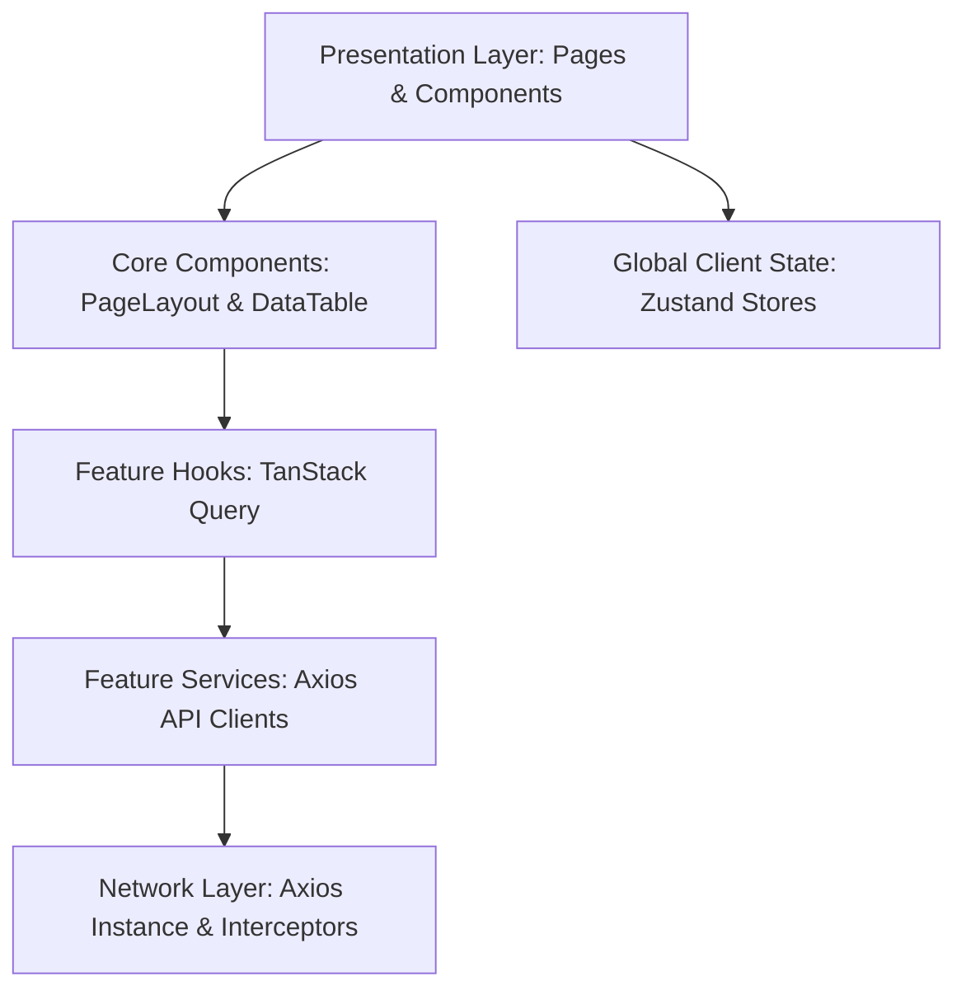
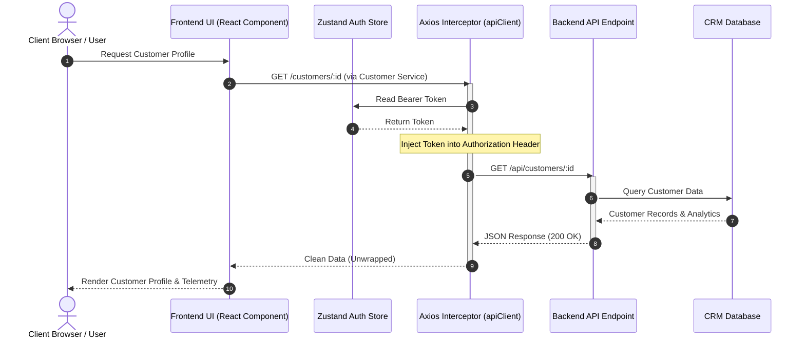

Listed directory Briefly-Client
Viewed ARCHITECTURE.md:1-759
Listed directory src
Listed directory features
Viewed router.tsx:1-27
Viewed Dashboard.tsx:1-54
Viewed package.json:1-46
Viewed auth.store.ts:1-63
Viewed client.ts:1-42
Listed directory components
Viewed PermissionGuard.tsx:1-46
Viewed ProtectedRoute.tsx:1-26
Viewed GuestRoute.tsx:1-25
Viewed Sidebar.tsx:1-305
Viewed index.tsx:1-93
Viewed customer.hooks.ts:1-95
Viewed ui.store.ts:1-31
Listed directory orders
Viewed types.ts:1-73
Searched for "shopify"
Searched for "subscription"
Listed directory components
Viewed OrganizationProfileTab.tsx:1-192
Viewed RolesPermissionsTab.tsx:1-401
Searched for "lazy"
Viewed Image.tsx:1-39
Viewed providers.tsx:1-23
Viewed index.css:1-86
Listed directory analytics
Searched for "analytics"
Searched for "rfm"
Searched for "rfm"
Viewed CustomerProfile.tsx:1-566
Viewed DataTable.tsx:1-344
Viewed PageLayout.tsx:1-163

# Chapter 6

# Frontend System Design and Implementation

## 6.1 Introduction

The frontend subsystem of the Briefly CRM platform represents the primary interaction medium between the system’s users—typically e-commerce business operators, managers, agents, and administrators—and the underlying backend service architecture. Designed as a modern, single-page application (SPA), the Briefly frontend is engineered to handle complex data presentation, real-time metrics telemetry, customer support workflows, and multi-tenant organization management. 

In a multi-tenant customer relationship management (CRM) ecosystem, the user interface must reconcile two opposing demands: processing high-throughput analytical query updates while maintaining an intuitive, responsive, and visually cohesive user experience. The Briefly client addresses these challenges by decoupling the state coordination layer from the rendering pipeline, enforcing domain isolation, and utilizing a custom-designed, token-driven aesthetic system. 

The primary responsibilities of the frontend subsystem include:
1. **Presentation and Data Management:** Rendering multi-faceted tables, deep profile records, and integration settings templates using custom component abstractions.
2. **State Orchestration and Caching:** Managing client-side session states, application interface layouts, and cached server responses to minimize network overhead.
3. **Session Security and Routing:** Enforcing Role-Based Access Control (RBAC) across public, guest, and protected routing hierarchies.
4. **Integration Telemetry:** Providing clean workflows to connect, synchronize, and monitor external platforms, such as Shopify.

By prioritizing academic software engineering principles—specifically the Separation of Concerns (SoC) and Feature Isolation—the Briefly frontend ensures that the application remains maintainable as the software scales.

---

## 6.2 Frontend Requirements Analysis

### Functional Requirements

The functional specifications of the Briefly frontend are derived directly from active domain modules found in the codebase. These modules correspond to the business logic containers necessary for e-commerce CRM operations:

* **Authentication and Authorization:** Users must be able to securely sign up, log in, perform multi-tenant onboarding, and access dashboard resources matching their assigned roles (e.g., Administrator, Manager, Agent).
* **Multi-Tenant Organization Management:** Administrators must have the capability to update their organization's identity parameters (name, slug, and brand logo asset) or execute tenant deletion procedures subject to strict security confirmations.
* **Customer Management:** The system must display customer profiles containing detailed metadata (email, phone, geographic location, and marketing consent) alongside advanced metrics such as Recency, Frequency, Monetary (RFM) segments, cohort groups, lifetime value (LTV) scores, and churn risk indices. Additionally, support for adding customer notes and viewing chronologically ordered event logs is required.
* **Product Management:** Users must have the ability to view, search, and manage products, inspect specific details, and associate product entries with customer transaction records.
* **Order Tracking:** The system must process e-commerce transaction details, including order identifiers, purchase dates, payment statuses (e.g., Paid, Refunded, Pending), shipping statuses (e.g., Processing, Shipped, Delivered), and lifetime spending totals.
* **Support Ticket Systems:** The client interface must facilitate customer service ticket tracking, rendering ticket details, conversation threads, and assignment statuses.
* **Shopify Integration Control:** The frontend must provide a connection panel allowing users to link external Shopify stores by specifying domain names and API credentials, manage data conflict rules (such as "Shopify wins"), and audit real-time synchronization logs.
* **Role-Based Access Control (RBAC) UI:** Administrators must be able to create, edit, or delete custom roles and assign explicit Read, Write, and Delete permissions across primary system resources (Customers, Segments, Campaigns, Products, Tickets, Employees).

### Non-Functional Requirements

To support the business operations of multiple concurrent merchants, the frontend is constrained by the following non-functional engineering standards:

* **Performance:** High-density data tables must load in under 1.5 seconds under standard broadband conditions. Data-fetching libraries must implement aggressive query caching, maintaining stale-while-revalidate configurations to avoid redundant network roundtrips.
* **Scalability:** The architecture must adhere to a strict modular folder structure, allowing developers to add features or modify existing business logic without causing regression side-effects in unrelated components.
* **Security:** Sensitive tokens must be stored securely and transmitted via interceptors. Application routes must be guarded client-side to prevent unauthorized rendering of administrative panels.
* **Maintainability:** Coding standards must restrict files to under 200 lines where possible. Complex formatting, validation, and filtering logic must be extracted to isolated utility modules.
* **Responsiveness:** The layout must adapt seamlessly across desktop, tablet, and mobile displays, utilizing collapsible navigation rails and responsive layout grids.
* **Accessibility:** All form elements must be properly labeled, interactive components must have distinct highlight states, and semantic HTML5 structures must be used to ensure screen-reader compatibility.

---

## 6.3 Frontend Technology Stack

The technological foundation of the Briefly frontend consists of modern, library-supported tools selected to maximize runtime performance and minimize build times.

| Technology | Purpose | Justification |
| :--- | :--- | :--- |
| **React 19.2.4** | Core UI Component Framework | Provides declarative component rendering, concurrent rendering pipelines, and efficient DOM reconciliation. |
| **TypeScript 6.0.2** | Static Type Safety and Contracts | Enforces compile-time type verification, minimizing runtime exceptions and establishing clear interface contracts. |
| **Vite 8.0.4** | Build Tool and Dev Server | Replaces slower bundlers with native ESM-based hot module replacement (HMR), reducing development build cycles. |
| **Zustand 5.0.12** | Client-Side Global State Management | Offers a lightweight, flux-like store architecture with automatic local storage persistence, avoiding the boilerplate of Redux. |
| **TanStack Query v5.100.6** | Server State and Cache Management | Eliminates manual `useState` and `useEffect` data-fetching loops, providing automatic query invalidation and loading state tracking. |
| **Axios 1.15.2** | HTTP Client | Simplifies API communication with built-in support for request/response interceptors, cookie management, and standard JSON transformation. |
| **Tailwind CSS 4.2.2** | Utility-First Styling Framework | Accelerates UI implementation with compile-time utility classes, ensuring design consistency and eliminating unused CSS rules. |
| **Better Auth 1.6.9** | Authentication Integration | Provides standard client helpers to connect seamlessly with modern oauth/session-based backend validation. |
| **Formik 2.4.9** | Form State Management | Handles complex form state validation, field tracking, and submission states with low performance overhead. |
| **Yup 1.7.1** | Schema Validation | Enables declarative validation schemas that link with Formik to validate client inputs before API transmission. |
| **Framer Motion 12.40.0** | Interactive Micro-animations | Handles hardware-accelerated transitions, sliding overlays, and modal scaling to create a polished user experience. |
| **Hugeicons React 0.4.0** | Consistent Graphic Iconography | Supplies clean, modern SVG vector assets that fit the system's professional aesthetic. |

---

## 6.4 Frontend Architecture

The architectural design of the Briefly client conforms to the **Feature-Isolated Layered Pattern**. Rather than grouping files by technical role (e.g., all hooks in one folder, all components in another), Briefly isolates code by business domain (e.g., Customers, Orders, Campaigns) under `src/features/`. Each domain is a self-contained module containing its own services, hooks, type definitions, utility helpers, and subcomponents. Shared structural components reside in `src/core/`.

This approach ensures a unidirectional dependency flow: page controllers import from their local feature modules, and feature modules import shared code from the `core/` layer. Direct cross-imports between independent feature directories are strictly prohibited. If two features must share logic, that logic is extracted to the `core/` directory, preventing cyclic dependency graphs.

```
src/
├── api/                   # Global network infrastructure and client instance
├── app/                   # Top-level shell bootstrap, providers, and main router
├── assets/                # Structural SVGs, logo assets, and custom icon definitions
├── core/                  # Reusable, feature-agnostic infrastructure
│   ├── components/        # Generic UI widgets (DataTable, PageLayout, Modal, etc.)
│   ├── layouts/           # Dashboard shell layout structure
│   ├── types/             # Global interface contracts and API definitions
│   └── hooks/             # Shared hooks (e.g., useAuth for session extraction)
├── features/              # Self-contained business domain modules
│   ├── customers/         # Customer profiles, notes, list page, hooks, services
│   ├── orders/            # Transaction listing, status updates, detail view
│   ├── segments/          # Customer cohort filtering and rule definition
│   └── settings/          # Multi-tenant settings, RBAC profiles, integrations
├── store/                 # Zustand global client-side state engines
└── pages/                 # Public entry views (landing, signup, login)
```

### Figure 6.1 Frontend Architecture Diagram

The architectural layers and their communication pathways are organized sequentially, routing visual interactions through state management managers before triggering network operations.



*Figure 6.1: Monidirectional data flow and architectural layering of the Briefly client.*

---

## 6.5 User Interface and User Experience Design

The Briefly design philosophy emphasizes clarity, information density, and interactive responsiveness. The visual design avoids standard default styles, using a custom color system and modern typography to establish a clean, professional aesthetic.

### Typography and Color System
The visual presentation uses two primary font families from Google Fonts, imported via `src/index.css`:
* **Poppins:** Used as the primary typeface for body text, form elements, table contents, and navigation menus to ensure legibility across all screen sizes.
* **Parkinsans:** Used selectively for primary numeric statistics, metrics headings, and analytics telemetry readouts.

The platform's color system is defined using CSS variables in the `:root` scope, allowing for consistent branding and potential theme extensions:
* **Primary Brand Colors:** `--color-primary-500` (`#4B91E2`) serves as the system's signature blue for primary buttons, selection indicators, and active sidebar states. The shades range from `--color-primary-100` (`#D3E4F8`) for background highlights to `--color-primary-900` (`#07182C`) for high-contrast text elements.
* **Status Indicators:** Clear status communication is achieved using specific semantic color codes: `--color-success` (`#22C55E`), `--color-warning` (`#F59E0B`), and `--color-error` (`#EF4444`).
* **Background Surfaces:** The main workspace uses a soft slate background (`#F8FAFC`), while cards, data grids, and modals use a solid white surface (`#FFFFFF`) framed by a subtle gray border (`#E5E7EB`).

### Key UI Layout Patterns and Workflows
* **Collapsible Sidebar Navigation:** The application sidebar uses a custom width allocation model. On large displays, it adjusts between an expanded layout of `14.72vw` (or `212px`) and a collapsed rail of `70px` that displays only icons. On smaller screens, the sidebar transitions to a sliding overlay drawer controlled by Zustand state flags.
* **Metric Grids:** Dashboards and detail views present key performance indicators in a responsive grid. For example, the customer profile view organizes LTV, average order values, ticket volume, and shopping cart abandonment rates into a two-column grid.
* **Organization Settings Panel:** To manage multi-tenant details, the system provides a tabbed settings interface. This allows administrators to adjust brand identifiers, configure synchronization mappings, and set up role assignments within a single view.
* **Role-Based Access Control Interface:** The RBAC interface presents a grid mapping resource types to operations (Read, Write, Delete). This visual matrix lets administrators configure granular permissions for custom roles, with updates saved directly to the database via API calls.

---

## 6.6 Routing and Navigation System

Routing within the Briefly client is managed by the React Router library (specifically `react-router-dom` v7). The routing architecture separates public entry views from the secure dashboard environment. 

Security is enforced using two route wrapper components:
1. **ProtectedRoute:** Restricts access to authenticated users. If no session token is found, it redirects the browser to `/login` while preserving the requested path in the router state. If the user's onboarding flow is incomplete, it redirects them to `/onboarding`.
2. **GuestRoute:** Restricts access to unauthenticated users. Logged-in users attempting to access public login or registration pages are automatically redirected back to `/dashboard`.

The route mapping hierarchy is defined in `src/app/router.tsx`:

```typescript
export default function AppRouter() {
    return (
        <Router>
            <Routes>
                {/* Public Routes */}
                <Route path="/" element={<LandingPage />} />

                {/* Guest-Only Routes */}
                <Route path="/login" element={<GuestRoute><Login /></GuestRoute>} />
                <Route path="/signup" element={<GuestRoute><Signup /></GuestRoute>} />

                {/* Protected Routes */}
                <Route path="/onboarding" element={<ProtectedRoute><Onboarding /></ProtectedRoute>} />
                <Route path="/dashboard/*" element={<ProtectedRoute><Dashboard /></ProtectedRoute>} />
            </Routes>
        </Router>
    );
}
```

Within the dashboard, nested routes are resolved dynamically inside the main layout controller (`src/core/layouts/Dashboard.tsx`). Dynamic URL parameters (such as `customers/:id`) are extracted by detail views to fetch specific records:

```typescript
const Dashboard = () => {
  return (
    <div className="flex h-screen overflow-hidden bg-white">
      <Sidebar />
      <div className="flex-1 flex flex-col min-w-0 overflow-hidden bg-[#F8FAFC]">
        <Navbar />
        <main className="flex-1 overflow-y-auto p-4 md:p-6 lg:p-8">
          <Routes>
            <Route path="/" element={<DashboardHome />} />
            <Route path="customers" element={<Customers />} />
            <Route path="customers/:id" element={<CustomerProfile />} />
            <Route path="segments" element={<Segments />} />
            <Route path="campaigns" element={<Campaigns />} />
            <Route path="products" element={<Products />} />
            <Route path="orders" element={<Orders />} />
            <Route path="tickets" element={<Tickets />} />
            <Route path="employees" element={<Employees />} />
            <Route path="settings" element={<Settings />} />
          </Routes>
        </main>
      </div>
    </div>
  );
};
```

---

## 6.7 State Management Strategy

To ensure high performance and clean code, Briefly categorizes application state into three distinct layers, using specialized tools for each:

### 1. Local UI State
Component-specific interactive states (such as active dropdown flags, input fields, and modal visibility states) are managed using React's native `useState` hook. This keeps temporary interface states isolated within their respective components and avoids polluting global stores.

### 2. Global Client State
Global client-side states that persist across page transitions are managed using Zustand. The application defines two primary Zustand stores:
* **useAuthStore (`src/store/auth.store.ts`):** Stores session tokens, user profiles, current organization roles, and permissions. This store is persisted to `localStorage` using Zustand's `persist` middleware, ensuring user sessions survive browser refreshes.
* **useUIStore (`src/store/ui.store.ts`):** Manages interface layout states, such as whether the navigation sidebar is collapsed or expanded.

### 3. Server State
Server-side data synchronization is managed entirely by TanStack Query. Rather than using manual fetching patterns, components retrieve data through custom React hooks that call the underlying service API.

```typescript
// Example custom hook from src/features/customers/customer.hooks.ts
export const useCustomer = (id: string | undefined) =>
    useQuery({
        queryKey: customerKeys.detail(id!),
        queryFn: () => customerService.getOne(id!),
        enabled: !!id,
    });
```

### State Synchronization and Caching Rules
TanStack Query is configured globally in `src/app/providers.tsx` to optimize caching and reduce server load:
* **staleTime:** Set to 5 minutes (`1000 * 60 * 5`). During this window, cached data is considered fresh, preventing duplicate API requests.
* **refetchOnWindowFocus:** Disabled (`false`) to prevent unnecessary background queries when switching browser tabs.
* **Targeted Mutation Invalidation:** When modifications are made (such as creating or deleting a customer), the corresponding query keys are invalidated. This triggers an automatic, background update of the UI.

```typescript
// Automatic invalidation flow upon mutating a record
export const useCreateCustomer = () => {
    const qc = useQueryClient();
    return useMutation({
        mutationFn: (payload: Record<string, unknown>) => customerService.create(payload),
        onSuccess: () => {
            // Invalidates all queries starting with the "customers" key
            qc.invalidateQueries({ queryKey: customerKeys.all });
            toast.success("Customer created successfully!");
        },
        onError: (err: any) => {
            toast.error(err?.response?.data?.message || "Failed to create customer");
        },
    });
};
```

---

## 6.8 Authentication and Authorization

Briefly secures sessions and manages client-side access control through a combined architecture of session tokens and granular permissions:

### Session Lifecycle and Token Management
1. **Login and Registration:** Users authenticate via `/login` or `/signup`. The API returns a secure token, user metadata, active role definitions, and permission tables.
2. **Session Persistence:** The credentials are saved to `useAuthStore` using the `setSession` action, initializing the user session and redirecting them to the dashboard.
3. **Authentication Injection:** An Axios request interceptor injects the active token into the `Authorization` header of every outgoing API call as a Bearer token.
4. **Token Expiry and Logout:** If an API call returns a `401 Unauthorized` response, a response interceptor catches the error, clears the active session state, and redirects the user to the login page.

### Role-Based Access Control (RBAC)
Briefly implements a granular authorization model. Users are assigned roles (e.g., `role-admin`, `role-manager`, `role-agent`), and each role contains a permission map that matches resources to actions (read, write, delete).

To enforce authorization rules in the UI, the frontend uses a custom `<PermissionGuard>` component:

```typescript
export function PermissionGuard({ permission, fallback = null, children }: PermissionGuardProps) {
    const permissions = useAuthStore((s) => s.permissions) || {};
    const [resource, action] = permission.split(".");

    if (!resource || !action) {
        console.warn(`[PermissionGuard] Invalid permission format: "${permission}".`);
        return <>{fallback}</>;
    }

    // Check if the permission map contains the required action for the resource
    const resourcePermissions = permissions[resource];
    const hasPermission = resourcePermissions?.includes(action);

    if (!hasPermission) {
        return <>{fallback}</>;
    }

    return <>{children}</>;
}
```

This element dynamically updates the interface based on the user's permissions. For example, it will hide restricted navigation links in the sidebar or disable actions like deleting records:

```jsx
// Conditionally rendering the Customers link in the sidebar
<PermissionGuard permission="customers.read">
    <SidebarItem to="/dashboard/customers" label="Customers" icon={customersIcon} />
</PermissionGuard>
```

---

## 6.9 API Integration Layer

API communication is managed by a centralized Axios instance (`src/api/client.ts`) configured with a base URL, request timeout rules, and cross-origin credential parameters:

```typescript
const apiClient = axios.create({
    baseURL: import.meta.env.VITE_API_BASE_URL,
    headers: {
        "Content-Type": "application/json",
    },
    withCredentials: true,
});
```

### Request and Response Interceptors
1. **Request Interceptor:** Dynamically reads the current session token from the Zustand store state and inserts it into the HTTP headers before the request is sent.
2. **Response Interceptor:** Standardizes response formatting. If a `401 Unauthorized` status is received, it triggers a clean logout flow by clearing cached session credentials.

```typescript
// Request Interceptor
apiClient.interceptors.request.use((config) => {
    const token = useAuthStore.getState().token;
    if (token) {
        config.headers.Authorization = `Bearer ${token}`;
    }
    return config;
});

// Response Interceptor
apiClient.interceptors.response.use(
    (response) => response,
    (error) => {
        if (error.response?.status === 401) {
            useAuthStore.getState().clearSession();
        }
        return Promise.reject(error);
    }
);
```

### Endpoints and Services
To keep network logic separated from UI rendering, Briefly registers backend routes in a single endpoints map (`src/api/endpoints/endpoints.ts`). Individual services (such as `customerService` or `settingsService`) call these endpoints using Axios, unwrap the response data, and return clean objects to the UI.

```typescript
// Service implementation example from src/features/customers/customer.service.ts
export const customerService = {
    async getAll(): Promise<Customer[]> {
        const { data } = await apiClient.get(ENDPOINTS.CUSTOMER.GET_ALL);
        return data?.data || data || [];
    },

    async getOne(id: string): Promise<Customer> {
        const { data } = await apiClient.get(ENDPOINTS.CUSTOMER.GET_ONE(id));
        return data?.data || data;
    },

    async create(payload: Record<string, unknown>): Promise<Customer> {
        const { data } = await apiClient.post(ENDPOINTS.CUSTOMER.CREATE, payload);
        return data;
    }
};
```

---

### Figure 6.2 Frontend–Backend Communication Flow

The sequence diagram below illustrates the communication flow when a user requests a customer profile, showing how the frontend coordinates auth tokens and handles backend data fetching.



*Figure 6.2: Frontend-backend lifecycle for secured dynamic resource requests.*

---

## 6.10 Performance Optimization Techniques

The Briefly client uses several optimization techniques to ensure the UI remains fast and responsive, even when handling large datasets:

### 1. Global Cache Strategy (TanStack Query)
By caching server responses and configuring a 5-minute `staleTime`, the frontend avoids sending redundant network requests for unchanged resources. Subcomponents can mount and request the same data without triggering additional HTTP requests.

### 2. Native Image Lazy Loading
The shared image component (`src/core/components/Image.tsx`) uses native browser lazy loading (`loading="lazy"`). This delays loading images that are off-screen until the user scrolls near them, reducing initial page load times.

```typescript
// Lazy loading in Image.tsx
export const Image = ({ src, alt, fallbackSrc = DefaultFallback, className, ...props }: ImageProps) => {
  const [imgSrc, setImgSrc] = useState(src);
  const [hasError, setHasError] = useState(false);

  return (
     {
        if (!hasError) {
          setHasError(true);
          setImgSrc(fallbackSrc);
        }
      }}
      {...props} 
    />
  );
};
```

### 3. Dynamic Rendering with Virtual Tables
The generic `DataTable` component uses pagination client-side or server-side to limit DOM size. By rendering only active rows, the application maintains a low memory footprint and ensures smooth scrolling and layout calculations.

### 4. Code Splitting and Type Safety
The build pipeline uses TypeScript's `verbatimModuleSyntax` standard. This ensures that type imports are stripped out during compilation, reducing bundle sizes and preventing type definitions from leaking into the output code.

```typescript
// Enforced compilation standard
import type { Customer } from "./types"; // Stays as a type contract, stripped at build
import { customerService } from "./customer.service"; // Compiled into runtime bundle
```

---

## 6.11 Responsive Design and Accessibility

To support users working across different devices, the Briefly interface adapts fluidly to desktop, tablet, and mobile screens.

### Responsive Design implementation
* **Fluid Layout Grids:** The interface uses Tailwind CSS's flexbox and grid layouts. For example, columns in the settings and profile sections wrap dynamically:
  ```html
  <div className="grid grid-cols-1 md:grid-cols-2 lg:grid-cols-3 gap-6">
  ```
  On mobile devices, this layout stacks fields vertically to prevent horizontal scrolling, while automatically expanding to multi-column grids on wider screens.
* **Responsive Sidebar Transitions:** The navigation sidebar utilizes media queries to adjust its display. On screens below `1024px`, it transitions from a persistent sidebar to a sliding drawer controlled by global layout state flags. This drawer slides in over a dark overlay (`bg-black/40`) to maintain focus, and closes automatically when a navigation item is selected.

### Accessibility Standards
* **Keyboard Navigation:** Custom interactive elements (such as modally presented forms) support standard keyboard controls. Checked lists use native HTML input types (`type="checkbox"`) to preserve keyboard focus indicators.
* **Semantic HTML Structure:** Pages are organized using structural HTML5 tags (like `<nav>`, `<aside>`, `<main>`, and `<header>`), allowing screen readers to parse the layout structure.
* **Visual Contrast:** High-contrast text values (such as charcoal `text-gray-900` on off-white backgrounds) ensure the interface meets readability standards for visually impaired users.

---

## 6.12 Challenges, Future Work, and Conclusion

### Challenges Encountered

Developing a multi-tenant CRM frontend presented several architectural and implementation challenges:

1. **State Synchronization Across Subsystems:** Ensuring real-time analytical calculations (like RFM models) updated correctly in the UI after data changes required careful coordination. Resolving this without causing rendering loops was achieved by structuring TanStack Query key invalidation cascades correctly.
2. **Dynamic Role-Based UI Rendering:** Rendering settings views dynamically based on the current tenant's access rights required a robust authorization model. Implementing the `<PermissionGuard>` component allowed the UI to filter out unauthorized elements while maintaining type safety.
3. **Complex Form Validations:** Management modals (such as the permissions matrix) required complex validation rules. Combining Formik with Yup schemas allowed the frontend to validate inputs locally, minimizing API errors due to invalid data.

### Future Work

The platform's roadmap includes two major technical enhancements to expand its capabilities:

#### 1. Real-Time Telemetry via WebSockets
To display events and integration updates instantly without manual page refreshes, the application will integrate a real-time communication layer. Replacing short-polling loops with WebSockets (using `socket.io-client` or native WebSockets) will allow the backend to push events immediately to a unified state listener. This will let managers monitor customer interactions and incoming support tickets in real-time.

```
[WebSocket Client Hub] <--- Event Payload (JSON) --- [WebSocket Server]
         │
         ├──> Dispatch UPDATE_TICKET ──> Refresh active tickets view
         └──> Trigger toast notification ──> Alert active agent
```

#### 2. Progressive Web Application (PWA) Support
To improve access on mobile devices, the Briefly client will be updated to support PWA capabilities. This includes adding service worker scripts to cache key assets (styles, navigation routes, and core bundles) and setting up a manifest configuration for offline access. Offline storage will capture edits locally in IndexedDB and synchronize them with the server once connection is restored, ensuring a reliable user experience even in poor network conditions.

### Conclusion

The system design of the Briefly frontend demonstrates a modern approach to building CRM platforms. By utilizing a **Feature-Isolated Layered Pattern**, the client codebase remains decoupled and modular. Integrating Zustand for global client state and TanStack Query for server state ensures high performance and reliable caching. Combined with a robust security architecture (RBAC and Permission Guards) and a responsive, typography-driven layout, the Briefly frontend provides an intuitive, scalable, and secure workspace for e-commerce business operations.