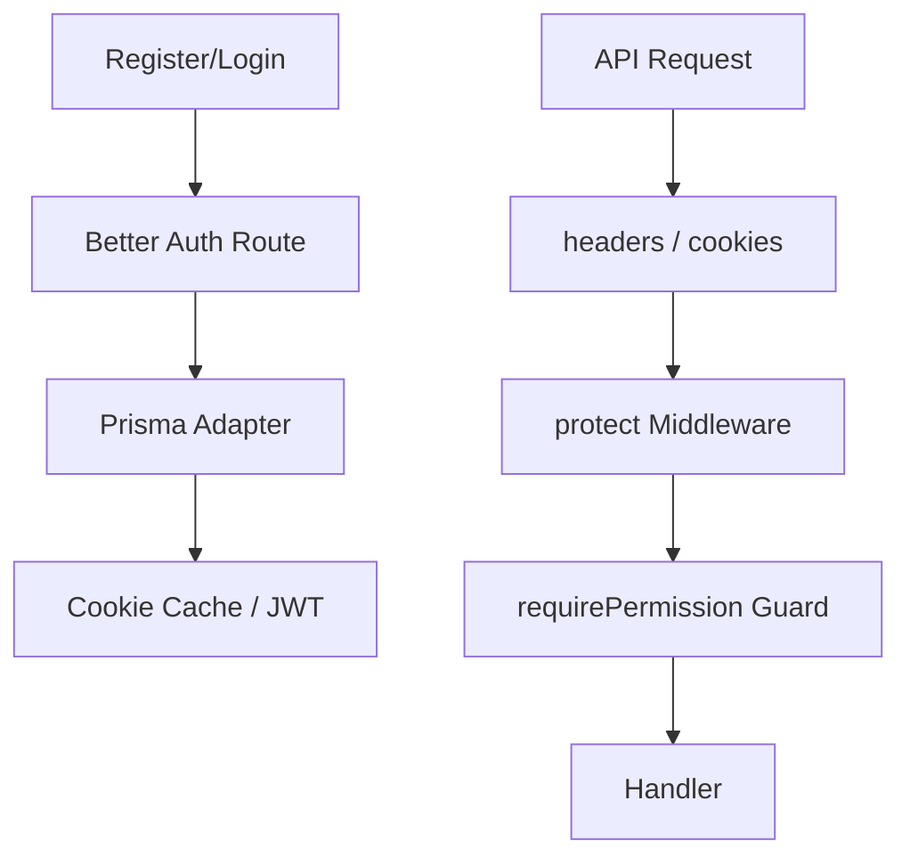
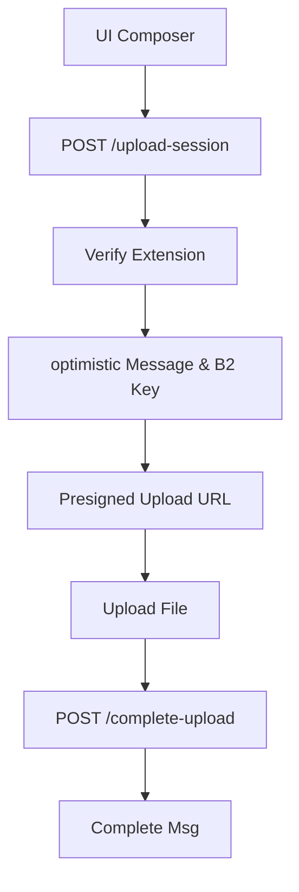
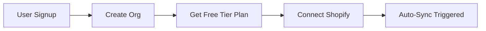
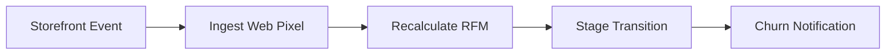

Here is the same content restructured and styled for better readability, using clear headings, tables, lists, and consistent formatting in Markdown.

---

# Briefly CRM: Complete Project Audit & Technical Documentation Report

---

## 1. Project Overview

| **Attribute** | **Description** |
| :--- | :--- |
| **Project Name** | Briefly CRM |
| **One-Sentence Description** | A high-performance, multi-tenant E-Commerce Customer Relationship Management (CRM) platform designed to aggregate transactions, analyze customer telemetry (RFM, lifetime value, and churn risk), streamline ticket support, and centralize messaging. |
| **Problem Being Solved** | Modern e-commerce merchants suffer from fragmented customer data isolated across storefront platforms (like Shopify), support ticketing systems, and social media messaging channels. This fragmentation prevents merchants from obtaining unified customer profiles, assessing behavioral metrics, detecting churn patterns, and executing targeted automated outreach. |

### 👥 Target Users

- **E-Commerce Merchants & Store Owners:** Need high-level dashboards, financial reports, integration configurations, billing, and subscription management.
- **Support & Sales Agents (Employees):** Need access to customer profiles, support ticket queues, message logs, and conversational inboxes to handle customer inquiries.
- **Administrators / Organization Owners (Root):** Need complete control over organization settings, employee invitations, role mapping, data export queues, and billing.

### 💎 Business Value

- **Reduced Churn Rate:** By predicting churn risk scores and identifying "At Risk" and "Churned" cohorts, merchants can proactively launch targeted email/SMS campaigns to win back customers.
- **Operational Efficiency:** Support and messaging channels (WhatsApp, Facebook Messenger, Instagram) are unified in a single, real-time chat console with assignment workflows, reducing response times.
- **Increased LTV (Lifetime Value):** RFM segmentation (Champions, Loyal Customers, Potential Loyalists) empowers marketing teams to optimize promotions.

### ✨ Main Differentiators

- **Shopify Web Pixel Storefront Ingestion:** Real-time event telemetry tracking (`page_viewed`, `product_viewed`, `product_added_to_cart`, `checkout_started`) resolved via customer email on the merchant storefront.
- **Pre-Deletion Protection:** An anti-data-loss constraint where an organization cannot be deleted without first executing a full tenant data export, triggering automated admin notification emails.
- **Multi-Instance Real-Time Scalability:** A WebSocket server using a Redis adapter to synchronize state across multiple server nodes, combined with BullMQ persistent background queues for resilient data pipelines.

---

## 2. User Types & Permissions

### 👑 Root User (Organization Owner)

| **Attribute** | **Description** |
| :--- | :--- |
| **Permissions** | Complete permissions on all resources: `organization:read/update/delete`, `member:read/create/update/delete`, `invitation:read/create/cancel`, `team:read/create/update/delete`, `ac:create/read/update/delete`, `customers:read/write/delete`, `orders:read/write/delete`, `payments:read/write/delete`, `products:read/write/delete`, `imports:read/write`, `exports:read/write`, `integrations:read/write/delete`, `webhooks:read/write/delete`, `sync:read/write`, `segments:read/write/delete`, `campaigns:read/write/delete`, `supportTickets:read/write/delete`, `tags:read/write/delete`, `reports:read`, `notifications:read/write/delete`, `templates:read/write/delete`, `conversations:read/write/delete`, `subscriptions:read/write`. |
| **Capabilities** | Full system administration. Can change billing plans, view invoices, configure Shopify / Meta integrations, manage roles and permissions, delete the organization (subject to data export verification), invite and delete employee memberships, execute manual synchronization, import/export records, view full reports, and assign conversations. |
| **Restrictions** | Limit of 1 organization creation. Cannot delete their own membership without deleting the organization or transferring ownership. |

### 🛡️ Admin User (Administrator)

| **Attribute** | **Description** |
| :--- | :--- |
| **Permissions** | Nearly identical to Root, excluding organization deletion. Has `organization:read/update`, `member:read/create/update/delete`, `invitation:read/create/cancel`, `team:read/create/update/delete`, `ac:read`, and full read/write/delete capabilities on business features. |
| **Capabilities** | Manages day-to-day operations. Can invite members, update roles, configure connections, execute manual syncs, view billing metrics, and run RFM calculations. |
| **Restrictions** | Cannot delete the organization. Cannot modify Root permissions. |

### 👤 Member User (Standard Employee / Support Agent)

| **Attribute** | **Description** |
| :--- | :--- |
| **Permissions** | Restricted read/write access. Permissions include: `customers:read`, `orders:read`, `products:read`, `exports:read`, `integrations:read`, `segments:read`, `campaigns:read`, `supportTickets:read/write`, `tags:read`, `notifications:read`, `templates:read`, `conversations:read`, `subscriptions:read`. |
| **Capabilities** | Support tickets handling (read and write responses), chat inbox management (can read conversations, but can only claim unassigned conversations or respond to conversations assigned to them). |
| **Restrictions** | Cannot modify settings, configure integrations, view financial reports, manage employees/members, run data imports, create segments, schedule campaigns, or access billing information. |

---

## 3. Complete Feature Inventory

### 🔐 Module: Authentication & Tenant Isolation

- **Multi-Tenant Signup & Onboarding**
    - **Description:** Dual onboarding flow allowing users to sign up and establish a new organization (isolated workspace) or accept an active email invitation to join an existing organization.
    - **Why it exists:** To guarantee strict tenant isolation where database records, integrations, and users are segmented by organization.
    - **User Roles:** All.
    - **Status:** Completed.
    - **Frontend Pages:** `/login`, `/signup`, `/onboarding`, `/accept-invitation`
    - **Backend Services:** Better Auth server instance and routes, `prismaAdapter`.
    - **Database Tables:** `User`, `Session`, `Account`, `Verification`, `Organization`, `Member`, `Invitation`
    - **APIs:** `/api/auth/*`

- **Granular Role-Based Access Control (RBAC)**
    - **Description:** Permissions matrix in workspace settings that maps static roles (root, admin, member) and custom roles to CRUD actions on modules.
    - **Why it exists:** To restrict employee access to sensitive customer data, settings, and billing operations.
    - **User Roles:** Root, Admin.
    - **Status:** Completed.
    - **Frontend Pages:** `/dashboard/settings` (Roles & Permissions Tab)
    - **Backend Services:** `roles.router.ts`, Better Auth access control plugins.
    - **Database Tables:** `OrganizationRole`, `Member`
    - **APIs:** `/api/roles/*`

### 🔌 Module: Integrations & Synchronization

- **Shopify Custom OAuth & Settings**
    - **Description:** Integration panel allowing organization administrators to connect their custom Shopify app using credentials (API Key, Secret Key, Access Token).
    - **Why it exists:** To establish a secure link for ingesting orders, products, and customer profiles from the storefront.
    - **User Roles:** Root, Admin.
    - **Status:** Completed.
    - **Frontend Pages:** `/dashboard/settings` (Connections Tab)
    - **Backend Services:** `shopify.controller.ts`, `integration.service.ts`
    - **Database Tables:** `Integration`, `SyncLog`
    - **APIs:** `/api/integrations/*`

- **Shopify Auto-Sync Pipeline**
    - **Description:** Queue-based background worker that retrieves products, customers, and orders from Shopify REST APIs. Utilizes HTTP link-header pagination.
    - **Why it exists:** To synchronize storefront data into the CRM without triggering rate-limit blocks.
    - **User Roles:** Root, Admin.
    - **Status:** Completed.
    - **Backend Services:** `sync.service.ts`, `shopify-sync.worker.ts`, BullMQ queues.
    - **Database Tables:** `Integration`, `SyncLog`, `Customer`, `Order`, `Product`
    - **APIs:** `/api/integrations/sync/*`

- **Shopify Storefront Web Pixel Ingestion**
    - **Description:** Public ingest endpoint tracking real-time events (`product_viewed`, `product_added_to_cart`, `checkout_started`, `page_viewed`) on the storefront. Resolves anonymous users via email fields.
    - **Why it exists:** To capture customer behavioral telemetry directly from storefront interactions.
    - **User Roles:** All (triggered by storefront visitors).
    - **Status:** Completed.
    - **Backend Services:** `pixel.controller.ts`, Zod validation schemas.
    - **Database Tables:** `Integration`, `Customer`, `CustomerEvent`
    - **APIs:** `POST /api/integrations/shopify/pixel-ingest`

### 📊 Module: Analytics & Intelligence

- **RFM Scoring Engine**
    - **Description:** System that scores customer profiles based on Recency (1-5), Frequency (1-5), and Monetary (1-5) parameters. Groups them into cohorts (e.g. Champions, Cant Lose Them).
    - **Why it exists:** To evaluate customer value segments for marketing.
    - **User Roles:** Root, Admin.
    - **Status:** Completed.
    - **Frontend Pages:** `/dashboard`, `/dashboard/customers`, `/dashboard/customers/:id`
    - **Backend Services:** `rfm.queue.ts`, `rfm.processor.ts`, BullMQ.
    - **Database Tables:** `Customer`, `Order`
    - **APIs:** `/api/cron/rfm`

- **Customer Lifecycle & Churn Risk Tracking**
    - **Description:** Computes churn risk (0-1) and lifecycle stages (Prospect, Lead, One-Time, Returning, Loyal, VIP, At Risk, Churning, Winback) based on orders.
    - **Why it exists:** To flag churn risks and trigger warning notifications and emails.
    - **User Roles:** Root, Admin, Member.
    - **Status:** Completed.
    - **Frontend Pages:** `/dashboard/customers`, `/dashboard/customers/:id`
    - **Backend Services:** `lifecycle.service.ts`, `notification.service.ts`, `email.util.ts`
    - **Database Tables:** `Customer`, `Notification`
    - **APIs:** `/api/cron/lifecycle`

- **Customer Profile Timeline & Activity Logs**
    - **Description:** Centralizes customer transactions, notes, support tickets, and web pixel events into a chronological feed.
    - **Why it exists:** To give agents context on customer interactions.
    - **User Roles:** All.
    - **Status:** Completed.
    - **Frontend Pages:** `/dashboard/customers/:id` (Timeline View)
    - **Backend Services:** `timeline.service.ts`
    - **Database Tables:** `Customer`, `CustomerEvent`, `Order`, `SupportTicket`, `Note`
    - **APIs:** `GET /api/customers/:id/timeline`

### 💬 Module: Unified Messaging Center

- **Social Messaging Inbox**
    - **Description:** Unified messaging console supporting WhatsApp, Facebook Messenger, and Instagram.
    - **Why it exists:** To centralize customer support chats.
    - **User Roles:** All (Subject to agent assignment rules).
    - **Status:** Completed.
    - **Frontend Pages:** `/dashboard/conversations/*`
    - **Backend Services:** `messaging.service.ts`, `meta-webhook.router.ts`, BullMQ queues, Socket.io presence events.
    - **Database Tables:** `Conversation`, `Message`, `Customer`
    - **APIs:** `/api/messaging/*`

- **Rich Media Attachments & S3 Upload Session**
    - **Description:** Secure media upload flow using Backblaze B2.
    - **Why it exists:** To allow agents and customers to exchange attachments.
    - **User Roles:** All.
    - **Status:** Completed.
    - **Frontend Pages:** `/dashboard/conversations/*` (MessageComposer)
    - **Backend Services:** `messaging.controller.ts`, `b2.config.ts`
    - **Database Tables:** `Conversation`, `Message`
    - **APIs:** `/api/messaging/conversations/:id/messages/upload-session`

### 🎫 Module: Support Center

- **Support Ticket Routing**
    - **Description:** Ticketing pipeline with priority (Low, Medium, High, Urgent), status (Open, Pending, Closed), and assignee fields.
    - **Why it exists:** To manage and assign incoming customer inquiries.
    - **User Roles:** All.
    - **Status:** Completed.
    - **Frontend Pages:** `/dashboard/tickets`, `/dashboard/tickets/:id`
    - **Backend Services:** `ticket.router.ts`, controllers.
    - **Database Tables:** `SupportTicket`, `TicketNote`, `User`, `Customer`, `Order`
    - **APIs:** `/api/tickets/*`

### 📣 Module: Marketing & Outreach

- **Dynamic Segment Builder**
    - **Description:** Rules-based builder filtering cohorts using logical operators (field, operator, value).
    - **Why it exists:** To generate target lists for campaigns.
    - **User Roles:** Root, Admin.
    - **Status:** Completed.
    - **Frontend Pages:** `/dashboard/segments`
    - **Backend Services:** `segment.router.ts`, `segment.utils.ts`
    - **Database Tables:** `Segment`, `Customer`
    - **APIs:** `/api/segments/*`

- **Marketing Campaigns & Templates**
    - **Description:** Visual campaign manager with custom HTML template builders.
    - **Why it exists:** To run automated promotions.
    - **User Roles:** Root, Admin.
    - **Status:** Completed.
    - **Frontend Pages:** `/dashboard/campaigns`
    - **Backend Services:** `campaign.router.ts`, BullMQ queues.
    - **Database Tables:** `Campaign`, `EmailTemplate`, `CampaignRecipient`
    - **APIs:** `/api/campaigns/*`

### 💳 Module: Financial Billing & Payments

- **Paymob Subscription Gateway**
    - **Description:** Subscription workflow using Paymob Intention card payments.
    - **Why it exists:** To monetize the CRM system.
    - **User Roles:** Root.
    - **Status:** Completed.
    - **Frontend Pages:** `/dashboard/settings` (Billing Tab)
    - **Backend Services:** `subscriptions-payment.controller.ts`, `paymob.util.ts`
    - **Database Tables:** `Subscription`, `Plan`, `Transaction`
    - **APIs:** `/api/subscriptions/*`

---

## 4. Frontend Modules

### 📊 Module: Dashboard Console

- **Purpose:** The visual landing page for authenticated merchants, presenting system health metrics, support ticket summaries, and recent revenue stats.
- **Routes:** `/dashboard`
- **Pages:** `DashboardHome.tsx`
- **Components:** `MetricCards`, `RevenueChart` (Recharts), `SupportSummaryCard`, `AuditLogsPanel`.
- **State Management:** React Query (`useDashboardStats`), local state.
- **UI Libraries:** Tailwind CSS v4, Lucide React / Hugeicons React, Framer Motion.
- **Charts Used:** AreaChart (Recharts) for sales overview, PieChart for support ticket breakdown.
- **Real-time Updates:** Listening to `presence:update` for active users and `inbox:updated` for live chat counts.
- **Special UX Features:** Micro-animations for card entries using Framer Motion.

### 💬 Module: Unified Inbox (conversations)

- **Purpose:** Unified agent console for chats.
- **Routes:** `/dashboard/conversations`, `/dashboard/conversations/:id`
- **Pages:** `Conversations` (`src/features/conversations/index.tsx`)
- **Components:** `MessageThread.tsx`, `MessageComposer.tsx`, `NewConversationModal.tsx`.
- **State Management:** Zustand (`usePresenceStore`), React Query.
- **Forms & Validation:** Zod validator.
- **UI Libraries:** Tailwind CSS, Hugeicons.
- **Real-time Updates:** Full Socket.io connection (`message:created`, `message:status_updated`, `typing:status`, `upload:progress`).
- **Special UX Features:** Real-time typing indicators, upload progress bar, drag-and-drop file composer.

### 👥 Module: Customer Directory (customers)

- **Purpose:** Searchable data grid and profile view.
- **Routes:** `/dashboard/customers`, `/dashboard/customers/:id`
- **Pages:** `Customers`, `CustomerProfile`
- **Components:** `DataTable`, `CustomerFormModal`, `FilterPanel`, `ActionMenu`.
- **State Management:** React Query caching.
- **Forms & Validation:** Formik with Yup validation.
- **UI Libraries:** Tailwind CSS.
- **Charts Used:** RFM radar and cohort charts in profile view.
- **Special UX Features:** Responsive filter drawers, infinite scrolling timelines.

### 📈 Module: Campaign & Template Manager (campaigns)

- **Purpose:** Marketing design and tracking.
- **Routes:** `/dashboard/campaigns`, `/dashboard/campaigns/:id`
- **Pages:** `Campaigns`, `CampaignDetails`
- **Components:** `CampaignColumns`, `CampaignFormModal`, `TemplateEditor`, `FilterPanel`.
- **State Management:** React Query.
- **Forms & Validation:** Formik/Yup.
- **UI Libraries:** Tailwind CSS.
- **Charts Used:** BarCharts for open, click, and bounce rates.
- **Special UX Features:** Live HTML campaign previews.

---

## 5. Backend Modules

### 🔐 Module: Authentication & Permissions

- **Purpose:** Handles signups, sessions, invitations, and permissions checks.
- **Controllers:** Better Auth routes (`auth.ts`), `me.router.ts`, `roles.router.ts`.
- **Services:** Prisma adapter, `AuditService`.
- **Middleware:** `protect` (verifies session), `requirePermission` (handles permission checks).
- **Guards:** `requirePermission('resource:action')` decorators.
- **Event Handlers:** Better Auth database hooks.
- **Real-time Components:** Authentication handshake in Socket.io.

### 🔌 Module: Integrations & Webhooks

- **Purpose:** Processes Shopify data syncs and webhooks.
- **Controllers:** `shopify.controller.ts`, `webhook.controller.ts`, `sync.controller.ts`, `pixel.controller.ts`.
- **Services:** `sync.service.ts`, `webhook.service.ts`.
- **Middleware:** Signature verification check.
- **Guards:** HMAC signature validator.
- **Background Jobs:** `shopify-sync.worker.ts`, `shopify-webhook.worker.ts`.
- **Event Handlers:** BullMQ event listeners.
- **Real-time Components:** Ingest status broadcasts.

### 📈 Module: Analytics & Crons

- **Purpose:** Computes RFM metrics and churn.
- **Controllers:** `cron.controller.ts`.
- **Services:** `lifecycle.service.ts`, `analytics.service.ts`.
- **Guards:** API Cron secret token check.
- **Background Jobs:** `rfm.processor.ts` worker.
- **Event Handlers:** System health reports.

---

## 6. Database Design (Prisma PostgreSQL Schema)

```mermaid
erDiagram
    user {
        string id PK
        string name
        string email UK
        boolean emailVerified
        string image
        datetime createdAt
        datetime updatedAt
    }
    session {
        string id PK
        datetime expiresAt
        string token UK
        string userId FK
        string activeOrganizationId
    }
    account {
        string id PK
        string accountId
        string providerId
        string userId FK
        string accessToken
        string refreshToken
    }
    verification {
        string id PK
        string identifier
        string value
        datetime expiresAt
    }
    organization {
        string id PK
        string name
        string slug UK
        string logo
        json settings
        datetime createdAt
    }
    plan {
        string id PK
        string name
        string displayName
        decimal price
        string billingCycle
        json features
        boolean isActive
    }
    subscription {
        string id PK
        string organizationId FK
        string planId FK
        string status
        datetime startDate
        datetime endDate
        string paymobSubscriptionId
    }
    organizationRole {
        string id PK
        string organizationId FK
        string role
        json permission
        string description
    }
    member {
        string id PK
        string organizationId FK
        string userId FK
        string role
        datetime createdAt
    }
    invitation {
        string id PK
        string organizationId FK
        string email
        string role
        string status
        string inviterId FK
    }
    customer {
        string id PK
        string name
        string phone
        string email
        string source
        string lifecycleStage
        string organizationId FK
        string externalId
        int totalOrders
        decimal totalSpent
        decimal totalRefunded
        decimal avgOrderValue
        datetime firstOrderAt
        datetime lastOrderAt
        float avgDaysBetweenOrders
        float churnRiskScore
        string rfmScore
        string rfmSegment
    }
    note {
        string id PK
        string customerId FK
        string authorId FK
        string body
        datetime createdAt
    }
    integration {
        string id PK
        string orgId FK
        string provider
        string shopDomain
        string accessToken
        string syncStatus
        boolean isActive
    }
    webhookLog {
        string id PK
        string integrationId FK
        string topic
        string shopDomain
        json payload
        string status
    }
    webhookIdempotencyKey {
        string id PK
        string integrationId FK
        string provider
        string key
        datetime expiresAt
    }
    customerEvent {
        string id PK
        string customerId FK
        string eventType
        string description
        string source
        datetime occurredAt
    }
    customerMetric {
        string id PK
        string customerId FK
        float churnProbability
        decimal avgOrderValue
        int daysSinceLastPurchase
    }
    interaction {
        string id PK
        string customerId FK
        string type
        string content
        float sentiment
        json extractedInsights
    }
    tag {
        string id PK
        string name
        string color
        string organizationId FK
    }
    segment {
        string id PK
        string name
        json filter
        string organizationId FK
        string creatorId FK
    }
    campaign {
        string id PK
        string name
        string organizationId FK
        string segmentId FK
        string templateId FK
        string status
        json content
    }
    emailTemplate {
        string id PK
        string organizationId FK
        string name
        string subject
        string htmlBody
    }
    campaignRecipient {
        string id PK
        string campaignId FK
        string customerId FK
        string status
    }
    product {
        string id PK
        string name
        decimal price
        string organizationId FK
        string externalId
        string sku
        int inventory
    }
    productVariant {
        string id PK
        string productId FK
        string name
        decimal price
        int inventory
    }
    order {
        string id PK
        string organizationId FK
        string customerId FK
        string shippingStatus
        string paymentStatus
        decimal totalAmount
        string currency
    }
    orderItem {
        string id PK
        string orderId FK
        string productId FK
        int quantity
        decimal price
    }
    transaction {
        string id PK
        string organizationId FK
        string orderId FK
        string externalId
        decimal amount
        string provider
        string status
    }
    supportTicket {
        string id PK
        string organizationId FK
        string customerId FK
        string orderId FK
        string subject
        string description
        string status
        string priority
        string assignedToId FK
    }
    ticketNote {
        string id PK
        string ticketId FK
        string authorId FK
        string body
    }
    auditLog {
        string id PK
        string organizationId FK
        string userId FK
        string action
        string targetId
        string targetType
    }
    importJob {
        string id PK
        string organizationId FK
        string createdByUserId FK
        string entityType
        string fileName
        string status
    }
    importJobError {
        string id PK
        string importJobId FK
        int rowNumber
        string message
    }
    exportJob {
        string id PK
        string organizationId FK
        string createdByUserId FK
        string entityType
        string status
    }

    user ||--o{ session : "creates"
    user ||--o{ account : "links"
    user ||--o{ member : "belongs"
    user ||--o{ invitation : "sends"
    user ||--o{ auditLog : "performs"
    user ||--o{ note : "writes"
    user ||--o{ importJob : "requests"
    user ||--o{ exportJob : "requests"
    user ||--o{ supportTicket : "assigned"
    user ||--o{ ticketNote : "comments"
    user ||--o{ segment : "creates"
    user ||--o{ conversation : "manages"

    organization ||--o{ member : "contains"
    organization ||--o{ invitation : "issues"
    organization ||--o{ customer : "owns"
    organization ||--o{ segment : "configures"
    organization ||--o{ campaign : "sends"
    organization ||--o{ product : "catalogues"
    organization ||--o{ order : "receives"
    organization ||--o{ supportTicket : "handles"
    organization ||--o{ auditLog : "tracks"
    organization ||--o{ tag : "labels"
    organization ||--o{ integration : "authorizes"
    organization ||--o{ organizationRole : "defines"
    organization ||--o{ importJob : "queues"
    organization ||--o{ exportJob : "queues"
    organization ||--o{ notification : "triggers"
    organization ||--o{ emailTemplate : "stores"
    organization ||--o{ conversation : "logs"
    organization ||--o{ transaction : "logs"
    organization ||--o{ subscription : "bills"

    plan ||--o{ subscription : "defines"
    customer ||--o{ order : "places"
    customer ||--o{ supportTicket : "initiates"
    customer ||--o{ customerEvent : "records"
    customer ||--o{ customerMetric : "aggregates"
    customer ||--o{ interaction : "interacts"
    customer ||--o{ campaignRecipient : "targeted"
    customer ||--o{ conversation : "chats"

    integration ||--o{ webhookLog : "handles"
    integration ||--o{ syncLog : "records"
    integration ||--o{ webhookIdempotencyKey : "deduplicates"

    campaign ||--o{ campaignRecipient : "delivers"
    product ||--o{ orderItem : "includes"
    product ||--o{ productVariant : "splits"
    order ||--o{ orderItem : "contains"
    order ||--o{ transaction : "bills"
```



### 🔍 Relationship Explanation

- **Strict Database Tenancy:** All business models (`Customer`, `Order`, `Product`, `Segment`, `Campaign`, `SupportTicket`, `Conversation`, `Integration`, `ImportJob`, `ExportJob`, `AuditLog`) maintain a direct, indexed foreign key to the `Organization` table.
- **Cross-Tenant Query Prevention:** Join queries across different tenant scopes are blocked at the database level by composite indexes, such as `@@unique([organizationId, name])` on the `Segment` table and `@@unique([organizationId, externalId])` on the `Conversation` table.

---

## 7. Authentication & Authorization



### 🔄 Login Flow

The frontend sends email/password payloads or Google OAuth redirects to the Better Auth endpoints. Better Auth verifies credentials, initializes session state, writes to the `Session` table, and sets cookies.

### 📝 Registration Flow

User registers via `/signup`. Better Auth creates a new user, checks the organization limit (max 1), creates an organization record, assigns the creator as the root member, and invokes a database hook to automatically assign a free tier subscription plan (`assignFreePlanToOrg`).

### 🎫 Session Management

Sessions are tracked in the database (`Session` model) and cached in cookies. The session expires in 7 days (`expiresIn: 60 * 60 * 24 * 7`) with a 1-day rolling update window.

### 🔑 JWT & Token Usage

In addition to cookie authentication, the system supports header token verification (`Bearer` plugin) for API-first requests.

### 🛡️ RBAC & Permissions

Implemented via Better Auth's organization access control (`createAccessControl`). The system defines three roles:

- **`root`:** Full organization permissions.
- **`admin`:** Full operational permissions, cannot delete the organization.
- **`member`:** Restricted to reading records and handling support tickets.

**Permissions Checking:** Checked via the `requirePermission('resource:action')` middleware using the `auth.api.hasPermission()` endpoint.

---

## 8. Messaging & Real-Time Features

### 📨 Messaging Architecture

```mermaid
graph TD
    A[Meta App Webhook] --> B[Express webhook Router]
    B --> C[verifySignature]
    C --> D[Queue Webhook Job (BullMQ)]
    D --> E[handleInboundMessage]
    E --> F[emitToOrg]
    F --> G[Socket.io Broadcast]
```

### ⬇️ Inbound Messaging Flow

1. A webhook arrives from Meta's servers (WhatsApp, Messenger, or Instagram).
2. The webhook router validates the `x-hub-signature-256` signature using HMAC-SHA256.
3. The request payload is parsed against Zod schemas. If valid, the system immediately returns a `200 EVENT_RECEIVED` response.
4. The job is queued in BullMQ (`addWebhookJob`) to avoid connection timeouts.
5. The worker calls `handleInboundMessage()`, which resolves the customer, creates a conversation, logs the message, and broadcasts it to the organization's socket room (`org_${orgId}`) via `message:created`.

### ⬆️ Outbound Messaging Flow

1. The agent types a message in the UI and sends it.
2. The API creates a pending message record and queues the delivery job in BullMQ (`addOutboundJob`).
3. The worker makes a POST request to Meta Graph API endpoints using the encrypted integration access token.
4. On success, the message status is updated to `SENT` or `DELIVERED`, and a Socket.io broadcast updates the agent's screen.

### ⚡ Real-time Features

Real-time updates are handled via Socket.io with a Redis adapter for multi-instance sync. It handles online presence tracking, typing indicators, and upload progress.

---

## 9. File Management System



### 📤 Request Session

The client requests an upload session by passing the file name, mime type, size, and category (`image`, `video`, `audio`, or `document`).

### ✅ Validation

The system validates the file extension against an allowed list:

| **Category** | **Allowed Extensions** |
| :--- | :--- |
| **image** | jpg, jpeg, png, webp, gif |
| **video** | mp4, mov, webm |
| **audio** | mp3, wav, m4a, ogg |
| **document** | pdf, doc, docx, xls, xlsx, ppt, pptx, txt, zip, rar, csv |

### 📝 Placeholder Record

The system creates a placeholder message in the database with a `PENDING` status.

### 🔗 Presigned Upload URL

The system generates a B2 storage key: `chat-[type]s/org_[orgId]/conv_[convId]/msg_[msgId]/[uuid].[ext]`. It returns a presigned upload URL from Backblaze B2.

### ⬆️ Direct Upload

The client uploads the file directly to Backblaze B2.

### ✅ Complete Upload

The client calls `/complete-upload`. The system verifies the upload, fetches a pre-signed download URL, updates the message content to the download URL, changes the status to `SENT`, and queues the outbound message job.

---

## 10. AI Features (Planned & Deterministic Implementation)

The system includes placeholders for AI features in the database schema:

- `extractedInsights` (JSON) on the `Interaction` table.
- `sentiment` (Float) on the `Interaction` table.
- `churnRiskScore` (Float) on the `Customer` table.

### 📊 Current Implementation

The calculations for these features in the current codebase are implemented as follows:

- **Churn Risk Score:** Calculated deterministically in `rfm.queue.ts` based on order intervals:
    - If no historical average order interval exists:
        - `churnRiskScore = 0.8` if the last purchase was over 60 days ago.
        - `churnRiskScore = 0.5` if the last purchase was over 30 days ago.
        - `churnRiskScore = 0.1` otherwise.
    - If a historical average exists:
        - `churnRiskScore = daysSinceLastOrder / avgDaysBetweenOrders` (capped between 0 and 1).
- **Sentiment & Insights:** Structured in the database and seeded via `seed.script.ts` using random float distributions. Direct LLM integrations are ready to be connected to these fields.

---

## 11. External Integrations

### 🛍️ Shopify Integration

| **Attribute** | **Description** |
| :--- | :--- |
| **Purpose** | Sync products, orders, and customer data; track storefront events. |
| **APIs Used** | REST Admin API, Webhooks API, Storefront Web Pixel API. |
| **Authentication** | Access Token-based authentication, with tokens encrypted at rest. |
| **Data Exchanged** | Orders (payment/shipping statuses, lines, costs), Products (SKUs, variants, prices, inventory), Customers (profiles, marketing consents), Storefront Telemetry. |

### 💬 Meta Graph API Integration

| **Attribute** | **Description** |
| :--- | :--- |
| **Purpose** | Centralizes WhatsApp, Messenger, and Instagram communications. |
| **APIs Used** | `/messages` endpoint, Webhooks API. |
| **Authentication** | OAuth System user tokens, verified via SHA-256 HMAC headers. |
| **Data Exchanged** | Text, templates, audio, video, documents, read receipts, delivery statuses. |

### 💳 Paymob Integration

| **Attribute** | **Description** |
| :--- | :--- |
| **Purpose** | Intention card payments and subscription management. |
| **APIs Used** | Paymob Intention API, Webhooks API. |
| **Authentication** | Paymob API key, HMAC-SHA256 signature verification. |
| **Data Exchanged** | Transaction totals, client email/phone, payment status, transaction reference IDs. |

---

## 12. API Inventory

### 🔐 Auth Module

| **Endpoint** | **Purpose** | **Auth Required** | **Request Body** | **Response** |
| :--- | :--- | :--- | :--- | :--- |
| `POST /api/auth/signup` | Create user and organization. | No | `email`, `password`, `name`, `organizationName` | User session payload. |
| `POST /api/auth/login` | Authenticate user. | No | `email`, `password` | Session cookies and user payload. |
| `GET /api/me` | Fetch active session details. | Yes | - | Current user, active organization, role, and permissions. |

### 👥 Customers Module

| **Endpoint** | **Purpose** | **Auth Required** | **Request Body** | **Response** |
| :--- | :--- | :--- | :--- | :--- |
| `GET /api/customers` | Paginated list of customer profiles. | Yes (`customers:read`) | - | List of customers, total count. |
| `POST /api/customers` | Create a customer profile. | Yes (`customers:write`) | `name`, `email`, `phone`, `city`, `address`, `source`, `lifecycleStage` | Created customer record. |
| `GET /api/customers/:id/timeline` | Fetch customer timeline events. | Yes (`customers:read`) | - | Chronological feed of orders, notes, and tickets. |

### 💬 Unified Messaging Module

| **Endpoint** | **Purpose** | **Auth Required** | **Request Body** | **Response** |
| :--- | :--- | :--- | :--- | :--- |
| `GET /api/messaging/conversations` | Paginated list of organization conversations. | Yes (`conversations:read`) | - | Conversations array, total counts. |
| `POST /api/messaging/conversations/:id/messages` | Send outbound message. | Yes (`conversations:write`) | `content`, `type`, `metadata` | Queued message. |
| `POST /api/messaging/conversations/:id/messages/upload-session` | Create media upload session. | Yes (`conversations:write`) | `fileName`, `mimeType`, `fileSize`, `type` | Presigned B2 upload URL, placeholder message. |

### 💳 Subscriptions Module

| **Endpoint** | **Purpose** | **Auth Required** | **Request Body** | **Response** |
| :--- | :--- | :--- | :--- | :--- |
| `POST /api/subscriptions/paymob/initialize` | Create subscription payment intention. | Yes (`subscriptions:write`) | `planId`, `billingCycle` | Paymob payment redirection URL. |
| `POST /api/subscriptions/paymob/callback` | Paymob payment callback. | Checksum Signature verified | - | Status acknowledgement. |

---

## 13. Security Features

| **Feature** | **Description** |
| :--- | :--- |
| **Authentication & Authorization** | Handled via Better Auth sessions. Express middleware validates organization membership and checks permissions via the `requirePermission` guard. |
| **Password Handling** | Passwords are encrypted using Argon2. |
| **Data Encryption** | Sensitive integration tokens (e.g., Shopify, Meta) are encrypted at rest using AES-256-GCM. |
| **Validation** | Inputs are validated on the backend using Zod schemas and on the frontend using Formik/Yup. |
| **Rate Limiting** | Managed by Express Rate Limit configurations. |
| **CORS Configuration** | Rejects requests from unauthorized origins. |
| **File Upload Security** | Restricts uploads to permitted file extensions, handles uploads via B2 presigned URLs, and purges files on deletion. |
| **Input Sanitization** | Structured inputs are parsed to prevent SQL injection (via Prisma) and XSS (via React routing). |
| **Secrets Management** | Configuration parameters and credentials are loaded securely using environment variables (`.env`). |

---

## 14. Infrastructure

| **Component** | **Details** |
| :--- | :--- |
| **Hosting** | Frontend: Vercel. Backend: Node.js on Render or AWS ECS. |
| **Deployment** | Automated Git-triggered CI/CD pipelines. |
| **Docker** | Supported with a multi-stage Dockerfile and a local `docker-compose.yml` defining services for PostgreSQL and Redis. |
| **Monitoring & Logging** | Sentry SDK integration, with custom Winston loggers. |
| **Queues** | Redis-backed BullMQ instances for background jobs (sync, webhooks, imports, exports, RFM). |

---

## 15. Application Flow

### 🚀 User Onboarding Flow



1. **Register:** User signs up with email/password.
2. **Create Organization:** The system creates a new organization workspace and sets the user as the root member.
3. **Assign Subscription:** A database hook automatically assigns a free-tier subscription plan.
4. **Connect Shopify:** User enters their Shopify credentials.
5. **Trigger Sync:** The system schedules a background sync job.

### 🤖 Customer Intelligence & Automation Flow



1. **Storefront Event:** Visitor triggers a storefront event (e.g., product viewed).
2. **Ingest Event:** The webhook receiver matches the visitor's email and logs the event in the CRM.
3. **Calculate RFM:** A cron job runs RFM calculations.
4. **Update Stage:** The system updates the customer's lifecycle stage (e.g., transitions to "At Risk").
5. **Alert Agent:** The system generates an in-app notification and sends warning emails to organization administrators.

---

## 16. Most Important Features (Business Value Ranking)

1.  **Shopify Data Synchronizer:** Synchronizes orders, products, and customer profiles to populate the CRM.
2.  **Social Inbox:** Unifies WhatsApp, Messenger, and Instagram communications.
3.  **RFM Scoring Engine:** Classifies customers into action cohorts (e.g. Champions, Loyal).
4.  **Customer Lifecycle Tracker:** Identifies customer progression stages.
5.  **Paymob Payment Gateway:** Handles premium subscription billing.
6.  **Shopify Storefront Web Pixel:** Tracks customer events directly from the storefront.
7.  **Support Tickets System:** Routes customer support requests.
8.  **Audit Logs Ledger:** Tracks workspace activities for security and compliance.
9.  **Organization Invite Flow:** Allows administrators to invite team members.
10. **Roles & Permissions Matrix:** Enforces granular RBAC access.
11. **B2 Export Manager:** Generates files for customer exports.
12. **B2 Import Manager:** Bulk imports customers, products, and orders via CSV/XLSX.
13. **Storefront Event Timeline:** Chronological feed of events for each customer.
14. **Customer Notes:** Allows agents to add internal comments to customer profiles.
15. **Meta Webhook Deduplicator:** Avoids duplicate webhook processes using idempotency keys.
16. **Dynamic Segment Builder:** Builds targeted filters for customer lists.
17. **Campaign Scheduler:** Schedules email outreach campaigns.
18. **Campaign Metrics Dashboard:** Monitors click, open, and bounce rates.
19. **Presigned Media Uploads:** Uploads chat attachments directly to B2.
20. **Notifications Engine:** Alerts administrators when customers are at risk of churning.

---

## 17. Most Complex Technical Features

| **Feature** | **Description** |
| :--- | :--- |
| **Meta Webhook Broker** | Handled using Zod validation, HMAC signatures, BullMQ queues, and Socket.io broadcasts. |
| **Storefront Web Pixel Resolver** | Matches storefront pixel payloads to existing CRM customer records. |
| **Redis-Adapter Socket.io Server** | Synchronizes WebSocket events across multiple server nodes. |
| **BullMQ Queue Failover** | Automatically switches to inline synchronous processing if Redis goes offline. |
| **Paymob Intention Payments** | Manages Paymob billing flows, signatures, and callbacks. |
| **Pre-Deletion Protection Hook** | Blocks organization deletion until data is exported and uploaded to B2. |
| **Shopify REST Link-Header Sync** | Syncs large merchant datasets using link-header pagination. |
| **AES-256-GCM Encryption** | Encrypts and decrypts third-party integration tokens. |
| **Presigned B2 Media Uploads** | Optimistic message creation, B2 upload URL generation, and download URL signing. |
| **RFM Aggregator** | Computes scores in batches using PostgreSQL aggregate functions. |
| **Better Auth Custom Session Adapter** | Dynamically merges role memberships and permissions into active sessions. |
| **XLSX/CSV Import Mapping** | Applies dynamic column mappings to database structures. |
| **PDF Invoice Generator** | Generates PDFs dynamically using `pdfkit-table`. |
| **Dynamic Segment SQL Compiler** | Parses filter rules and translates them into Prisma queries. |
| **Campaign Link Tracker** | Modifies HTML campaign links to track clicks, opens, and bounces. |
| **VIP Percentile Processor** | Evaluates and updates the top 5% of spenders in transactions. |
| **Webhook Idempotency Layer** | Uses TTL verification records to deduplicate incoming webhooks. |
| **Better Auth Invite Workflow** | Manages secure, link-based email invitations. |
| **Sentry Context Logger** | Tracks and logs exceptions with transaction contexts. |
| **Zustand Presence Store** | Tracks online user states using Socket presence events. |

---

## 18. Unique Selling Points

- **Zero-Loss Deletion Safeguard:** Prevents accidental deletion of organization data.
- **Direct Storefront Web Pixel Integration:** Real-time event tracking on merchant websites.
- **Resilient Webhook Handlers:** Queue-based webhook receivers prevent data loss.
- **Paymob Intention API Integration:** Seamless, secure subscription upgrades.
- **Redis Socket.io sync:** Real-time collaborative agent messaging.

---

## 19. Demo Scenarios

### Scenario A: Workspace Activation & Synchronization

1.  **Signup:** Administrator registers at `/signup` and creates the organization "Delta Retail".
2.  **Add Shopify:** Navigates to settings and enters their Shopify store credentials.
3.  **Sync:** Clicks "Run Sync". A background job imports 5,000 customers, 200 products, and 12,000 orders.
4.  **Verify:** The dashboard displays updated stats (e.g., total sales, customer segments).

### Scenario B: Customer Management & Churn Prevention

1.  **Identify:** The dashboard notifies the administrator that "John Doe" has transitioned to "At Risk" with a 78% churn score.
2.  **Inspect:** The administrator clicks the notification to view John's profile, timeline, and order history.
3.  **Respond:** The administrator assigns John to a "VIP Churn Segment" and schedules a promo campaign.

### Scenario C: Support Collaboration

1.  **Incoming Chat:** A customer sends a WhatsApp message.
2.  **Alert Agent:** The inbox updates in real time, and the conversation is marked as Unassigned.
3.  **Assign & Chat:** An agent claims the conversation. The customer uploads an image, which appears in the chat thread. The agent resolves the issue and closes the ticket.

---

## 20. Presentation Preparation

### ✨ Features Worth Presenting

- **Unified Messaging Console:** Show real-time chats (WhatsApp/Messenger) and agent collaboration.
- **Customer Telemetry Timeline:** Show order histories, notes, and storefront events in a single feed.
- **Dynamic Segment Builder:** Show dynamic segment updates based on rules.
- **Connections Settings:** Demonstrate the Shopify connection status and sync logs.

### ❌ Features to Avoid Presenting (Backend/Low Visuals)

- Argon2 hashing and cryptographic utilities.
- Background Sentry handlers and logs.
- BullMQ Redis queue configurations.

### 🖼️ Media & Diagrams Recommended

- **Screenshots:** Unified Inbox, Settings Permissions matrix, Customer profile telemetry.
- **Architecture Diagram:** Web pixel ingestion, real-time message routing.
- **Sequence Diagram:** Paymob payment initialization and webhook verification.

---

## 21. Graduation Defense Preparation

### ❓ Expected Examiner Questions & Answers

**Q: How does the application enforce tenant isolation?**
> **A:** Strict separation is maintained at the database layer. All business tables reference `organizationId`. Composite unique constraints and index mappings prevent cross-tenant queries.

**Q: What happens if the Redis server goes offline?**
> **A:** The system falls back to inline synchronous operations, logging the exception to Sentry while maintaining service availability.

**Q: Why use presigned upload URLs for chat media?**
> **A:** Direct uploads to B2 bypass the backend server, reducing network load and improving security by using short-lived tokens.

**Q: How is webhook security enforced?**
> **A:** Meta webhooks verify signatures using HMAC-SHA256 headers. Webhooks are queued in BullMQ immediately to avoid timeouts.

**Q: How are VIP segments calculated?**
> **A:** The system runs a transaction calculation that identifies the top 5% of spenders and transitions them to the VIP stage.

---

## 22. Architecture Summary

### 🖥️ Frontend Architecture

- **UI Engine:** React 19 + Vite.
- **Styling:** Tailwind CSS.
- **Routing:** React Router v7.
- **State Management:** TanStack Query (server state) and Zustand (client state).

### ⚙️ Backend Architecture

- **Runtime:** Bun.
- **Framework:** Express.
- **Authentication:** Better Auth.
- **Queuing:** BullMQ.
- **Storage:** Backblaze B2.

### 🗄️ Database Architecture

- **Engine:** PostgreSQL.
- **ORM:** Prisma.
- **Isolation:** Tenant ID scoping.

### ⚡ Real-Time Architecture

- **Engine:** Socket.io.
- **Scalability:** Redis Adapter.
- **Events:** Inbound messages, typing status, upload progress.

### 🔌 Integration Architecture

- **Shopify:** Custom OAuth and Webhook receivers.
- **Meta Graph API:** Inbound/outbound WhatsApp, Facebook, and Instagram messaging.
- **Paymob:** Card payments via the Intention API.