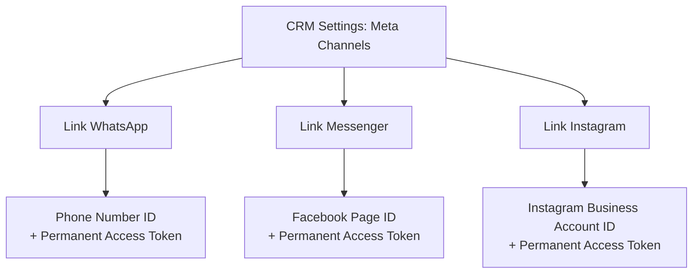

# Meta Integrations Setup Guide (WhatsApp, Messenger, Instagram)

This document outlines the step-by-step configuration required to connect your Briefly CRM with Meta's Graph APIs for **WhatsApp Business Cloud API**, **Facebook Messenger**, and **Instagram DMs**.

---

## 1. Meta Developer App Setup

To connect to Meta, you must register a developer app.

1. Go to the [Meta for Developers Portal](https://developers.facebook.com/) and sign in with your Facebook account.
2. Click **Create App**.
3. Select **Other** -> Click **Next** -> Choose **Business** as the app type (this is required to access WhatsApp and Business permissions).
4. Enter your app details (e.g., App Name: `Briefly CRM Integration`) and select your **Meta Business Portfolio**. Click **Create app**.

---

## 2. Add Products to Your Meta App

On your App Dashboard, find and set up the following products:

### A. WhatsApp
* Click **Set up** on the WhatsApp card.
* Choose or create a WhatsApp Business Account and click **Continue**.
* This provides you with a **Temporary Access Token**, a **Phone Number ID**, and a **WhatsApp Business Account ID** under the *WhatsApp* -> *API Setup* (or *Getting Started*) tab.
* Make note of your **Phone Number ID** (used to link WhatsApp in the Briefly settings).

### B. Messenger
* Click **Set up** on the Messenger card.
* Under the Messenger settings, click **Add or remove Pages** to connect the Facebook Page you want to route messages from.
* Generate a Page Access Token for this Page and save it.
* Make note of your **Facebook Page ID** (visible under the Page's *About* tab or inside Meta Business Manager).

### C. Instagram Graph API (for Instagram DMs)
* Ensure your Instagram Account is a **Professional/Business Account** and is **linked to your Facebook Page**.
* Enable message access: In the Instagram App, go to *Settings* -> *Privacy* -> *Messages* -> toggle **Allow Access to Messages** to **ON**.
* Make note of your **Instagram Business Account ID** (retrievable via Meta Business Manager or by querying `/me?fields=instagram_business_account` on the Graph API).

---

## 3. Generate a Permanent (System User) Access Token

Meta's standard Page and User access tokens expire after 60 days. To prevent your CRM connections from breaking, you **must** generate a permanent System User Token:

1. Go to the [Meta Business Suite Settings](https://business.facebook.com/settings/).
2. Under **Users**, click **System Users**.
3. Click **Add** to create a new Admin System User (e.g., named `briefly-connector`).
4. Select the system user, click **Assign Assets**, and select your Meta App. Grant it full permissions.
5. Click **Generate New Token** and select your app.
6. Select the following permissions/scopes:
   * **`whatsapp_business_messaging`** (WhatsApp message send/receive)
   * **`whatsapp_business_management`** (WhatsApp template retrieval)
   * **`pages_messaging`** (Messenger messaging)
   * **`instagram_basic`** & **`instagram_manage_messages`** (Instagram messages)
   * **`pages_show_list`** (List connected Pages)
7. Click **Generate**. Copy and store this token safely. It does not expire.

---

## 4. Webhook Configuration

Meta uses webhooks to push real-time customer messages and status events back to your server.

### Callback URL and Verification
1. In your Meta App Dashboard, click **Add Product** and select **Webhooks**.
2. Select **Page** from the dropdown and click **Configure a webhook**:
   * **Callback URL**: `https://<your-api-domain>/api/messaging/meta/webhook`
   * **Verify Token**: Enter a custom secret string (e.g., `briefly_verification_secret_2026`).
3. Set the exact same Verification Token and App Secret in your backend's **`.env`** file:
   ```env
   META_VERIFY_TOKEN=briefly_verification_secret_2026
   META_APP_SECRET=your_meta_app_secret
   ```
   *Note: Your `META_APP_SECRET` can be found under the Meta App Dashboard -> **App settings** -> **Basic**.*
4. Click **Verify and save**. Meta will make a handshake request to verify the server is live.

### Subscribing to Event Fields
Once verified, subscribe to the following fields:

| Product Type | Webhook Selection (Dropdown) | Subscribed Fields |
| :--- | :--- | :--- |
| **Facebook Messenger** | **Page** | `messages`, `messaging_postbacks`, `message_deliveries`, `message_reads` |
| **Instagram DM** | **Instagram** | `messages` |
| **WhatsApp Business** | **WhatsApp Business Account** | `messages` |

---

## 5. Connecting Channels in Briefly CRM

Once the Meta App and Webhooks are live, navigate to your Briefly CRM web interface:

1. Go to **Settings** -> **Meta Channels** page.
2. Fill in the connection form for each channel:



3. Click **Connect [Channel Name]**.
4. Test the connection by clicking the **Test** button. The server will run a health check against the Meta Graph API to confirm authorization is working.
