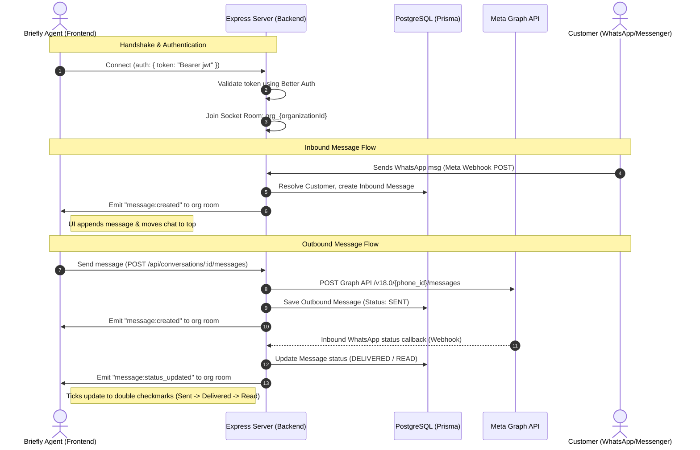

# Architecture Brief: Real-time WhatsApp/Messenger Chat System

This document outlines the system architecture, real-time WebSocket communication flows, message journeys, and current status of the Briefly CRM messaging integration.

---

## 1. System Architecture Diagram



---

## 2. Real-time WebSocket Flow

### Connection & Authentication Handshake
- **Client (Frontend)**: Loads the client socket wrapper (`socket.ts`) and attempts lazy connection when a valid user token is loaded in the Zustand auth store (`useAuthStore`). Passes the JWT token in `auth.token`.
- **Server (Backend)**:
  - Socket.io middleware extracts the Bearer token or cookies.
  - Calls `auth.api.getSession({ headers })` (via Better Auth) to retrieve the active session.
  - Validates `activeOrganizationId` presence.
  - Saves user details to `socket.data.user` and joins the socket to room `org_${activeOrganizationId}`.

### Supported Events
1. `message:created` (Server -> Client)
   - **Trigger**: Fired when a new inbound message comes from webhooks or an outbound message is successfully processed.
   - **Payload**:
     ```json
     {
       "conversation": {
         "id": "conv-123",
         "status": "OPEN",
         "lastMessageAt": "2026-06-10T02:44:57Z",
         "customer": { "name": "John Doe", "email": "john@example.com" }
       },
       "message": {
         "id": "msg-456",
         "conversationId": "conv-123",
         "direction": "INBOUND",
         "content": "Hello Briefly CRM!",
         "status": "READ",
         "createdAt": "2026-06-10T02:44:57Z"
       }
     }
     ```
2. `message:status_updated` (Server -> Client)
   - **Trigger**: Fired when Meta sends a webhook status update callback (Sent, Delivered, Read, or Failed).
   - **Payload**:
     ```json
     {
       "conversationId": "conv-123",
       "messageId": "msg-456",
       "status": "DELIVERED",
       "errorMessage": null
     }
     ```

---

## 3. The Message Journey

### A. Outbound Message Flow
1. **Frontend Composer**: Agent types message inside `<MessageComposer />` and clicks send.
2. **API Request**: Mutation hook `useSendMessage(conversationId)` fires a POST request to `/api/messaging/conversations/:id/messages`.
3. **Graph API Dispatch**: Backend `messaging.service.ts` checks the provider (`whatsapp`, `facebook`, `instagram`) and calls the respective Meta endpoint using the connection access token.
4. **Database Log**: Creates a message record in PostgreSQL with status `SENT` (or `FAILED` if API errors).
5. **Real-time Push**: Emits `message:created` to the organization room `org_${organizationId}`. All logged-in users instantly see the message appear in their thread without page reloading.
6. **Ticks Update**: When the recipient's phone receives and reads the message, Meta sends status callbacks. Webhook endpoints update the database status and emit `message:status_updated`, transitioning ticks on the frontend:
   - **SENT**: Single grey tick.
   - **DELIVERED**: Double grey ticks.
   - **READ**: Double blue ticks.

### B. Inbound Message Flow
1. **Meta Webhook POST**: Customer replies. Meta calls the server webhook `POST /api/messaging/meta/webhook`.
2. **Signature Check**: Backend verifies signature using `META_APP_SECRET`.
3. **Resolve/Create Customer & Chat**:
   - Backend scans the database for the phone number/social ID.
   - Resolves or creates a Customer record.
   - Resolves or creates an active Conversation record.
4. **Message Save**: Inserts the incoming message with direction `INBOUND` and status `READ`.
5. **Real-time Push**: Emits `message:created` containing the updated conversation card and message details.
6. **UI Reactivity**: The `<useSocketEvents />` hook updates the React Query cache:
   - Appends the message to the thread.
   - Places the conversation card at the top of the left-hand list with updated previews.

---

## 4. Implementation Checklist Status

### Completed
- [x] Sockets dependencies installed on client (`socket.io-client`) and server (`socket.io` with peer-dependencies resolution).
- [x] Backend WebSocket connection architecture, Better Auth handshake verification middleware, and organization room routing.
- [x] Real-time socket event emissions on inbound messages, outbound messages, and Meta status webhooks.
- [x] Frontend lazy connection controller (`socket.ts`) and global event sync hook (`useSocketEvents.ts`) synced to React Query caching.
- [x] Responsive dual-pane "WhatsApp Web-style" dashboard layout (`index.tsx`).
- [x] Premium message bubble design with double tick status trackers (`MessageThread.tsx`).

### Next Steps / Missing
- [ ] Run automated typechecks and linting scripts to verify full project build sanity.
- [ ] Play a subtle browser audio chime when an inbound message is received (optional UX polish).
