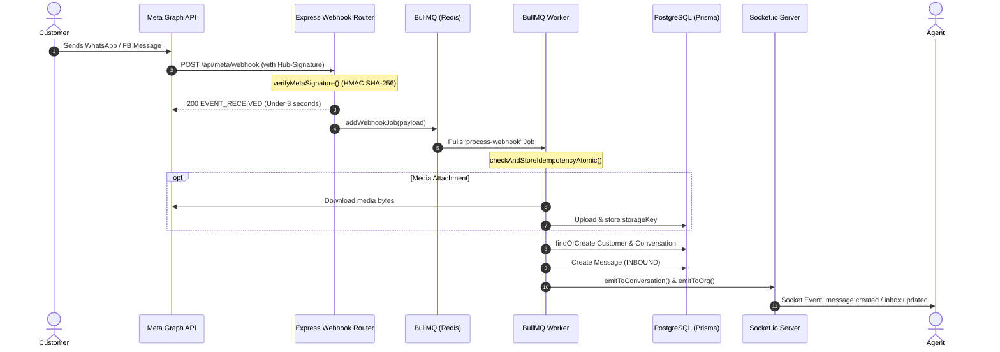
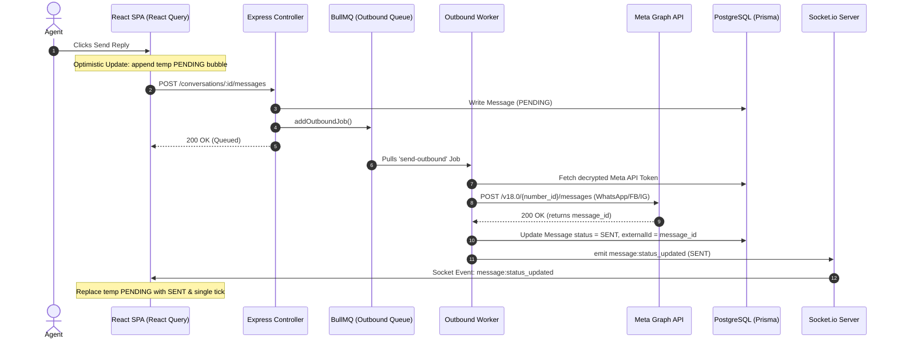
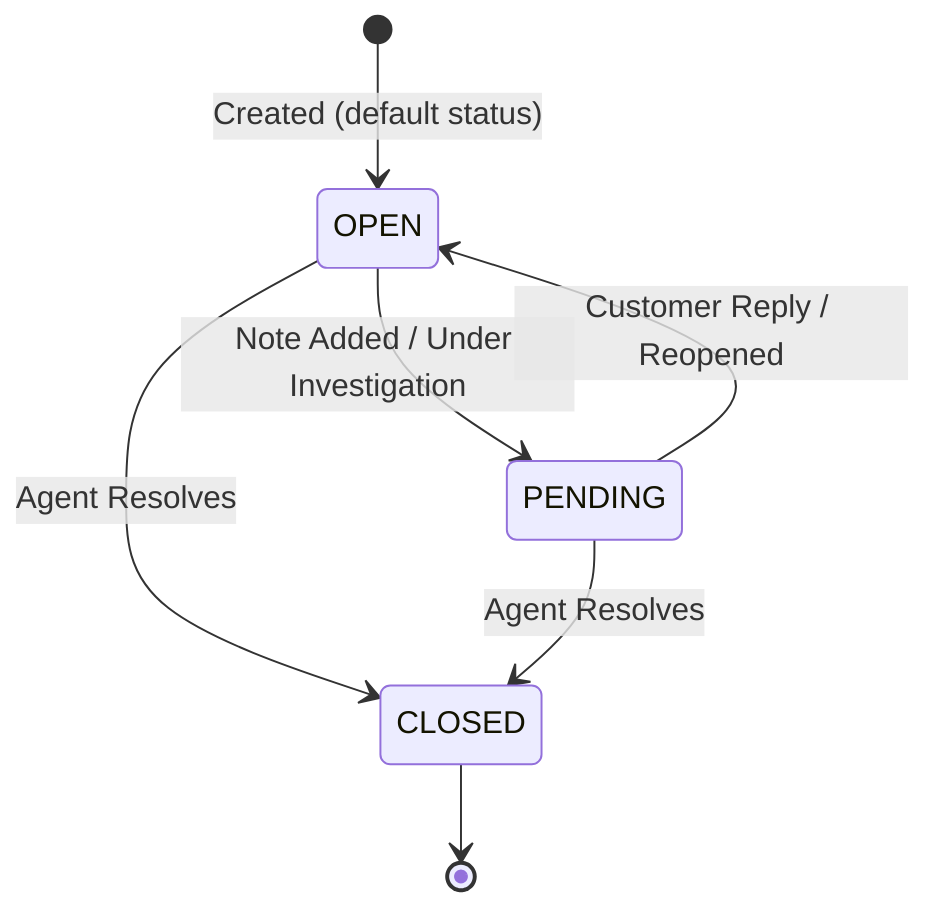
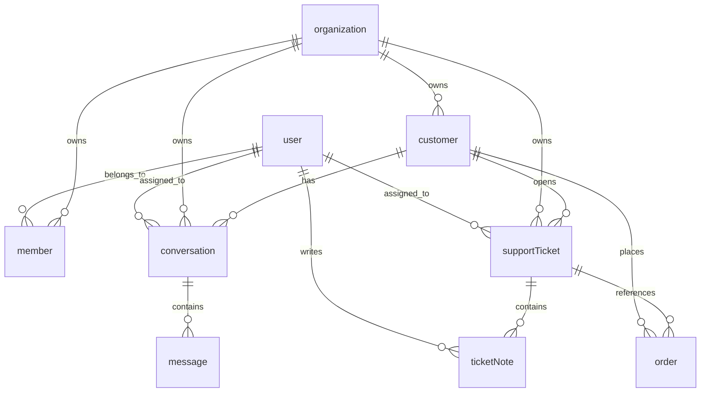

# Briefly CRM System — Architectural Audit & Graduation Presentation Report

This report provides an implementation-level architectural analysis of **Briefly CRM**, a multi-tenant, real-time customer relationship management system. The system consists of a React 19 single-page application ([briefly-client](file:///c:/Users/Azza/Documents/tbd/grad/Briefly-App)) and a Bun-powered Node.js API service ([e-commerce-crm](file:///c:/Users/Azza/Documents/tbd/grad/E-Commerce-CRM)) integrated with Redis, BullMQ, PostgreSQL, and Socket.io.

---

## Part 1 — Chat System Flow

The Briefly CRM chat system integrates Meta Channels (WhatsApp, Facebook Messenger, and Instagram Business) into a unified, real-time agent workspace.

### Complete Message Flow: Customer to Agent

#### 1. Customer Sends Message (Inbound Flow)
1. **Webhook Trigger**: The customer sends a message on WhatsApp/Facebook/Instagram. Meta sends an HTTPS `POST` request to the backend's webhook endpoint: `/api/meta/webhook` in [meta-webhook.router.ts](file:///c:/Users/Azza/Documents/tbd/grad/E-Commerce-CRM/src/api/messaging/meta-webhook.router.ts).
2. **Signature Verification**: The Express server intercepts the request using `verifyMetaSignature` middleware, validating the payload against the configured `META_APP_SECRET` using a timing-safe HMAC-SHA256 signature check (`crypto.timingSafeEqual`).
3. **Zod Validation**: The payload structure is parsed and validated using `MetaWebhookSchema` in [meta-webhook.schema.ts](file:///c:/Users/Azza/Documents/tbd/grad/E-Commerce-CRM/src/api/messaging/meta-webhook.schema.ts).
4. **Immediate Acknowledgment**: The server returns an HTTP `200 EVENT_RECEIVED` status within 3 seconds to avoid Meta retry loops.
5. **Enqueue Job**: The router dispatches the validated payload to the Redis-backed BullMQ queue via `addWebhookJob` in [messaging.queue.ts](file:///c:/Users/Azza/Documents/tbd/grad/E-Commerce-CRM/src/queues/messaging.queue.ts).
6. **Worker Processing**: The `webhookWorker` (in [messaging.worker.ts](file:///c:/Users/Azza/Documents/tbd/grad/E-Commerce-CRM/src/queues/messaging.worker.ts)) picks up the job:
    * **Idempotency**: It evaluates the unique Meta message ID (`mid` or WhatsApp message ID) using `checkAndStoreIdempotencyAtomic` to filter out duplicate delivery attempts.
    * **Media Extraction**: If the message is a media type (image, video, document, audio), the worker downloads the binary file from Meta using its access token and uploads it to private object storage (Backblaze B2/Cloudinary) via `downloadAndUploadMetaMedia`.
    * **Customer Normalization**: In `handleInboundMessage` ([messaging.service.ts](file:///c:/Users/Azza/Documents/tbd/grad/E-Commerce-CRM/src/api/messaging/messaging.service.ts)), the system looks up the customer by phone/email. If not found, it creates a new `Customer` record.
    * **Conversation Routing**: It resolves the `Conversation` using the customer's external channel ID. If no active conversation exists, it creates one.
    * **DB Write**: Inserts a new `Message` record with `direction: 'INBOUND'`, `status: 'READ'`, and links it to the conversation.
7. **Real-time Event Broadcast**:
    * Emits `message:created` with the message payload to the specific Socket.io conversation room: `conversation_${conversationId}`.
    * Emits `inbox:updated` with the updated conversation status to the organization room: `org_${organizationId}`.
8. **Frontend Update**:
    * The frontend Socket.io client (listening via [useSocketEvents.ts](file:///c:/Users/Azza/Documents/tbd/grad/Briefly-App/src/core/hooks/useSocketEvents.ts)) plays an audio chime and appends the message to the active message thread's React Query infinite query cache.
    * The sidebar list is re-sorted, bumping this conversation to the top with an incremented unread count badge.



---

#### 2. Agent Receives and Replies (Outbound Flow)
1. **Frontend Input**: The agent views the incoming message in [MessageThread.tsx](file:///c:/Users/Azza/Documents/tbd/grad/Briefly-App/src/features/conversations/components/MessageThread.tsx) and types a reply into the [MessageComposer.tsx](file:///c:/Users/Azza/Documents/tbd/grad/Briefly-App/src/features/conversations/components/MessageComposer.tsx).
2. **Optimistic UI Update**: The frontend immediately appends a local message object to the React Query cache with `status: 'PENDING'` and `id: temp-${Date.now()}`.
3. **HTTP Post**: The client calls `/api/messaging/conversations/:id/messages` ([conversation.service.ts](file:///c:/Users/Azza/Documents/tbd/grad/Briefly-App/src/features/conversations/conversation.service.ts)).
4. **Backend Controller**:
    * `sendMessage` controller ([messaging.controller.ts](file:///c:/Users/Azza/Documents/tbd/grad/E-Commerce-CRM/src/api/messaging/messaging.controller.ts)) validates the request.
    * It immediately writes a new `Message` record to PostgreSQL with `status: 'PENDING'`.
    * Enqueues a sending task to the `messaging-outbound-queue` via `addOutboundJob`.
    * Returns the DB message record, allowing the API request to resolve quickly.
5. **Outbound Dispatcher**: The `outboundWorker` ([messaging.worker.ts](file:///c:/Users/Azza/Documents/tbd/grad/E-Commerce-CRM/src/queues/messaging.worker.ts)) handles the job:
    * Fetches the organization's Meta integration access token and decrypts it using `decryptSafe`.
    * Invokes the Meta Graph API Endpoint depending on the provider (`whatsapp`, `facebook`, or `instagram`).
    * On successful response, it updates the database message status to `SENT` and assigns the external Meta message ID to `externalId` and `providerMessageId`.
    * Emits `message:status_updated` with status `SENT` to the conversation Socket.io room.
6. **Frontend Realtime Sync**: The client receives `message:status_updated`, replaces the optimistic `PENDING` status with `SENT`, and updates the tick mark indicator in the bubble.



---

### Core Questions Answered

#### 1. How a message enters the system
Messages enter via public HTTPS webhooks (`/api/meta/webhook`). Meta calls the endpoint, the request signature is verified using HMAC-SHA256, validated against a Zod schema, and enqueued into BullMQ (`messaging-webhook-queue`) for async consumption.

#### 2. How it is processed
The worker retrieves the webhook payload from Redis. It checks message idempotency in the DB. If it contains media, the worker downloads it from Meta's servers, uploads it to Backblaze B2, and overwrites the content field with the static storage URL. It then queries the customer database to resolve profile identifiers (phone or email) and groups them under the active conversation.

#### 3. How it is stored
All entities are persisted to a PostgreSQL database via Prisma:
* **`Customer`**: Stores demographic info, lifecycle stage, and cumulative e-commerce metrics.
* **`Conversation`**: Stores channel metadata, active status, and the assigned agent.
* **`Message`**: Stores text or media URL content, direction (`INBOUND`/`OUTBOUND`), status (`PENDING`/`SENT`/`DELIVERED`/`READ`/`FAILED`), and raw Meta JSON metadata.

#### 4. How it is displayed
The frontend uses a React Query infinite query hook `useConversationMessages` ([conversation.hooks.ts](file:///c:/Users/Azza/Documents/tbd/grad/Briefly-App/src/features/conversations/conversation.hooks.ts)). The message thread reads from the cache and lists message bubbles in chronological order grouped by date.

#### 5. How replies are handled
Agent replies are sent via the API (`POST /conversations/:id/messages`). They are created as `PENDING` in the database, pushed to a BullMQ outbound queue, and sent asynchronously via Meta REST Graph API endpoints using decrypted access tokens.

#### 6. How delivery/read statuses are updated
Meta sends status callbacks (e.g. `delivered`, `read`, or `failed`) to the webhook endpoint. These are enqueued into the `messaging-status-queue`. The `statusWorker` updates the matching `Message` records in PostgreSQL and fires a Socket.io event (`message:status_updated` or `conversation:read_receipt`) to update the tick-mark UI (double ticks for delivered, blue ticks for read).

---

## Part 2 — Frontend Architecture

The chat interface is built as a self-contained feature module located at [features/conversations](file:///c:/Users/Azza/Documents/tbd/grad/Briefly-App/src/features/conversations).

```
Inbox (index.tsx)
├─ Conversations List Sidebar
│  ├─ Search Bar & New Chat Button
│  ├─ Filter Tabs (All, Mine, Unassigned)
│  └─ Active Conversation List Item
├─ Chat Window (Active Conversation Detail Pane)
│  ├─ Active Chat Header (Info, Assignment dropdown, Provider badge)
│  │  └─ Assignment Selector / Claim Shortcut
│  ├─ MessageThread
│  │  ├─ Infinite Scroll Loader
│  │  ├─ Date Header Dividers
│  │  └─ MessageBubble (renders Text, Image, Audio player, Document link, Status ticks)
│  ├─ Typing Indicators
│  └─ MessageComposer
│     ├─ Attachment Button & Emoji Picker
│     └─ AttachmentPreviewComposer
```

### Pages & Routing
* **Inbox Route**: Mounted inside the protected dashboard layout as `/dashboard/conversations` and `/dashboard/conversations/:id` inside [router.tsx](file:///c:/Users/Azza/Documents/tbd/grad/Briefly-App/src/app/router.tsx).
* **Workspace Entry Point**: [conversations/index.tsx](file:///c:/Users/Azza/Documents/tbd/grad/Briefly-App/src/features/conversations/index.tsx) handles the split panel layout (conversations list sidebar on the left, message thread/workspace pane on the right).

### State Management
* **Global Authentication State**: `useAuthStore` (Zustand) supplies the agent's credentials and `activeOrganizationId`.
* **Realtime Presence & Typing**: `usePresenceStore` (Zustand) tracks active agent presence and who is currently typing (`typingUsers`).
* **Upload Management State**: `useUploadStore` (Zustand) tracks presigned S3 upload progress, abort controllers for cancellation, and upload retry actions.
* **Local Workspace UI State**: `useState` is used for search terms, active workspace tabs (`"all" | "mine" | "unassigned"`), dropdown toggles, and modal states.

### Data Fetching & Cache Handling (React Query v5)
* **Infinite Scroll**: `useConversationMessages` uses `@tanstack/react-query`'s `useInfiniteQuery` to fetch message history paginated in chunks of 50. It fetches the next page when the scroll container hits the top (`scrollTop === 0`).
* **Caching Strategy**: Queries are keyed using structured arrays:
    ```typescript
    export const conversationKeys = {
        all:        ["conversations"] as const,
        list:       () => [...conversationKeys.all, "list"] as const,
        messages:   (id: string) => [...conversationKeys.all, "messages", id] as const,
    };
    ```

### Optimistic Updates & Realtime Sync
* **Sending Messages**: The `useSendMessage` mutation uses `onMutate` to inject a temporary message object (`tempId`) into the React Query cache:
    ```typescript
    const tempMessage = {
        id: `temp-${Date.now()}`,
        status: "PENDING",
        direction: "OUTBOUND",
        content: newMessage.content,
        // ...
    };
    ```
    If the API call fails, the mutation rolls back the cache to `previousMessages` inside `onError`.
* **Media Uploads**: For file attachments, `startUpload` generates a local preview URL (`URL.createObjectURL(file)`) and displays the uploading bubble immediately. It tracks the progress bar locally.
* **Socket Integration**: Real-time events received from Socket.io directly manipulate the React Query cache via `queryClient.setQueryData` rather than triggering refetch queries. When `message:created` is received, the frontend identifies and replaces the matching optimistic `PENDING` bubble with the real database message payload.

---

## Part 3 — Backend Architecture

The backend architecture is built using Express, Prisma ORM, Redis, and BullMQ, enforcing clean separation between API routes, business service logic, and async queue workers.

```
Incoming Request (HTTPS / WSS)
    │
    ├──> Webhook Router (/api/meta/webhook) ──> Webhook Job ──> [messaging-webhook-queue] ──> Webhook Worker (DB Sync / Media)
    │
    ├──> Protected Router (/api/messaging) ──> Controller ──> DB Write (PENDING) ──> [messaging-outbound-queue] ──> Outbound Worker
    │
    └──> Socket.io Connection ──> Authentication Middleware ──> Room Join (org_*, conversation_*) ──> Event Listeners
```

### Component Breakdown
* **Routes ([messaging.router.ts](file:///c:/Users/Azza/Documents/tbd/grad/E-Commerce-CRM/src/api/messaging/messaging.router.ts))**: Exposes protected REST paths for fetching threads, starting chats, sending messages, and assigning agents. It applies `requirePermission('conversations:write')` auth checks.
* **Controllers ([messaging.controller.ts](file:///c:/Users/Azza/Documents/tbd/grad/E-Commerce-CRM/src/api/messaging/messaging.controller.ts))**: Validates inputs with Zod, commits initial records to PostgreSQL via Prisma, pushes jobs to BullMQ, and immediately returns JSON responses.
* **Services ([messaging.service.ts](file:///c:/Users/Azza/Documents/tbd/grad/E-Commerce-CRM/src/api/messaging/messaging.service.ts))**: Houses Meta Graph API integration logic, customer matching rules, and WhatsApp phone number cleaning helper functions.
* **Queues ([messaging.queue.ts](file:///c:/Users/Azza/Documents/tbd/grad/E-Commerce-CRM/src/queues/messaging.queue.ts))**: Initiates BullMQ instance definitions (`webhookQueue`, `outboundQueue`, `statusQueue`) bound to a Redis connection pool.
* **Workers ([messaging.worker.ts](file:///c:/Users/Azza/Documents/tbd/grad/E-Commerce-CRM/src/queues/messaging.worker.ts))**: Async BullMQ instances that process inbound/outbound payloads, handle media uploads, check idempotency, and write to PostgreSQL.
* **Socket Server ([socket.config.ts](file:///c:/Users/Azza/Documents/tbd/grad/E-Commerce-CRM/src/config/socket.config.ts))**: Configures the WebSocket server, processes Better Auth sessions during handshake, updates user presence, and handles client channel subscriptions.

---

## Part 4 — DevOps & Infrastructure

The application is designed for horizontal scaling across cloud instances.

```
[Customer Client] 
       │ (Meta API Callback)
       ▼
 [Meta Webhook]
       │
       ▼
 [Express Endpoint]
       │
       ▼ (Enqueue Job)
   [BullMQ]
       │
       ▼ (Pushes payload to)
    [Redis] <─── [Rate Limit Store] & [Socket.io Adapter]
       │
       ▼ (Pulls job)
[BullMQ Workers] ──> [PostgreSQL Database] ──> [Socket.io Gateway] ──> [Agent Frontend]
```

### Redis & Queue Architecture
* **State & Pub/Sub Hub**: Redis acts as the messaging broker. It serves as the storage provider for rate-limiting (`rate-limit-redis`), the backing store for BullMQ, and the multi-instance Socket.io adapter.
* **BullMQ Distribution**: Three dedicated queues decouple the Express event loop from blocking tasks:
    1. `messaging-webhook-queue`: Buffers incoming Meta webhooks to survive traffic spikes.
    2. `messaging-outbound-queue`: Isolates network calls to the Meta Graph API.
    3. `messaging-status-queue`: Handles bulk read/delivery status syncs.
* **Workers**: Run inside isolated threads or processes. If a network request fails, BullMQ automatically retries the task.

### Socket.io Scale-Out Strategy
* **Redis Adapter**: The Socket.io server utilizes `@socket.io/redis-adapter` linked to a duplicated Redis client. If the backend is scaled horizontally (e.g. 5 nodes running behind an ALB), a socket connection on Node A can seamlessly broadcast events to a client connected to Node B via Redis Pub/Sub channels.
* **Room Layout**:
    * `org_${orgId}`: Shared organization channel for broad events (user presence updates, new unassigned ticket banners).
    * `conversation_${conversationId}`: Private conversation channels. Only assigned agents and organization managers are authorized to join.

### Resilience, Retries, and Failure Handling
* **Outbound Message Retries**: In `outboundWorker`, failures are classified:
    * **Permanent Failures**: (e.g., `"invalid recipient"`, `"permission denied"`). The worker catches the error, marks the message status as `FAILED` in PostgreSQL, updates the error message, and alerts the agent via WebSockets.
    * **Transient Failures**: (e.g., Meta API rate limit, gateway timeout). The worker throws an error, triggering BullMQ's exponential backoff policy (configured with `attempts: 3` and `delay: 2000ms`).
* **Signature Enforcement**: Webhook security is strictly verified. In production environments, requests lacking or failing the `x-hub-signature-256` SHA-256 signature check are rejected immediately with a `403 Forbidden` response.

---

## Part 5 — Ticketing System

The Briefly Ticketing system tracks customer requests and resolutions. It is managed in the backend via [ticket.service.ts](file:///c:/Users/Azza/Documents/tbd/grad/E-Commerce-CRM/src/api/tickets/ticket.service.ts) and in the frontend via the [tickets](file:///c:/Users/Azza/Documents/tbd/grad/Briefly-App/src/features/tickets) module.

### Ticket Lifecycle & States



* **OPEN**: The ticket is active and awaiting agent attention.
* **PENDING**: The agent is investigating or waiting for customer feedback. Adding a note or updating assignments typically moves a ticket to this state.
* **CLOSED**: The customer's issue has been resolved.

### Operations
* **Creation**: Agents create tickets via the UI, linking them to a `Customer` and optionally an `Order` for context. The ticket's default state is set to `OPEN`, with a default priority of `MEDIUM`.
* **Communication Log**: Agents add internal or public notes via `addTicketNote`. Adding a note updates the ticket's `lastResponseAt` and `updatedAt` timestamps in a single Prisma transaction.
* **Resolution**: An agent updates the status to `CLOSED`, marking the issue as resolved.

---

## Part 6 — Ticket & Conversation Assignment

Assignment distributes workload and establishes accountability.

```
       [Unassigned Chat / Ticket]
                   │
         ┌─────────┴─────────┐
         ▼                   ▼
    [Agent Claims]     [Manager Assigns]
    (Clicks 'Claim')    (Selects from Agent List)
         │                   │
         └─────────┬─────────┘
                   ▼
         [Prisma Database Update]
                   │
                   ▼ (Broadcast Event)
       [Socket.io: conversation:assigned]
                   │
                   ▼ (Cache Invalidation)
     [Agent UI Updates to Active Pane]
```

### Manual Assignment Flow
* **Conversation Assignment**: Agents can assign conversations manually via the `/conversations/:id/assign` endpoint. An agent can also click the **"Claim"** shortcut in [index.tsx](file:///c:/Users/Azza/Documents/tbd/grad/Briefly-App/src/features/conversations/index.tsx) to quickly assign an unassigned chat to themselves.
* **Ticket Assignment**: Support tickets are assigned using the `updateTicket` service function, which updates the `assignedToId` field in the database.

### Assignment Rules & Visibility
* **Role-Based Access**: Socket connection rooms enforce access security. Managers (`root`, `admin`, `owner`) can join and monitor all conversation rooms. Standard agents are restricted; they can only join conversation rooms that are unassigned or explicitly assigned to them.
* **Realtime Sync**: When an assignment changes, the backend emits a `conversation:assigned` event. Sockets broadcast this update to the frontend, which invalidates the current thread list cache and updates the UI to show the assigned agent's details.

---

## Part 7 — Ticket Automation

To ensure stability and predictability, Briefly CRM only implements specific automation rules directly supported by the codebase:

1. **Default State Setup**: When a ticket is created via `createTicket`, the backend automatically sets the status to `OPEN` and the priority to `MEDIUM` if no priority is supplied.
2. **Timestamp Updates**: Adding a note to a ticket runs inside a database transaction (`prisma.$transaction`). It creates the note and automatically updates the parent ticket's `lastResponseAt` and `updatedAt` fields.
3. **Idempotency Filtering**: Incoming Meta webhook messages are automatically validated. The system checks them against the database and ignores duplicate event payloads using atomic redis/database constraints.
4. **Phone Format Normalization**: Inbound WhatsApp messages automatically pass through `cleanWhatsAppNumber` to strip non-digit characters and prepend the country code (`20` for Egypt) to ensure consistent user profiling.

---

## Part 8 — Database Design

The database is built on PostgreSQL. Below are the tables and relationships defined in [schema.prisma](file:///c:/Users/Azza/Documents/tbd/grad/E-Commerce-CRM/prisma/schema.prisma):



### Entity Schemas

#### 1. Conversation
* **`id`** `String (Primary Key)`
* **`organizationId`** `String (Foreign Key -> Organization)`
* **`customerId`** `String (Foreign Key -> Customer, Optional)`
* **`externalId`** `String (Meta Chat Identifier, Optional)`
* **`provider`** `String ('whatsapp' | 'facebook' | 'instagram')`
* **`status`** `ConversationStatus (OPEN, PENDING, CLOSED, ARCHIVED)`
* **`assignedAgentId`** `String (Foreign Key -> User, Optional)`
* **`lastMessageAt`** `DateTime`
* **`unreadCount`** `Int`

#### 2. Message
* **`id`** `String (Primary Key)`
* **`conversationId`** `String (Foreign Key -> Conversation)`
* **`externalId`** `String (Meta message identifier, Optional)`
* **`direction`** `MessageDirection (INBOUND, OUTBOUND)`
* **`content`** `String (Text body or media URL)`
* **`type`** `String ('text' | 'image' | 'video' | 'template' | 'audio' | 'document')`
* **`status`** `MessageStatus (PENDING, SENT, DELIVERED, READ, FAILED)`
* **`errorMessage`** `String (Optional)`
* **`metadata`** `Json (Stores file info, captions, or WhatsApp template variables)`
* **`createdAt`** `DateTime`

#### 3. SupportTicket
* **`id`** `String (Primary Key)`
* **`organizationId`** `String (Foreign Key -> Organization)`
* **`customerId`** `String (Foreign Key -> Customer)`
* **`orderId`** `String (Foreign Key -> Order, Optional)`
* **`subject`** `String`
* **`description`** `String`
* **`status`** `SupportTicketStatus (OPEN, PENDING, CLOSED)`
* **`priority`** `SupportTicketPriority (LOW, MEDIUM, HIGH, URGENT)`
* **`assignedToId`** `String (Foreign Key -> User, Optional)`
* **`lastResponseAt`** `DateTime (Optional)`
* **`createdAt`** `DateTime`
* **`updatedAt`** `DateTime`

#### 4. TicketNote
* **`id`** `String (Primary Key)`
* **`ticketId`** `String (Foreign Key -> SupportTicket)`
* **`authorId`** `String (Foreign Key -> User)`
* **`body`** `String`
* **`isInternal`** `Boolean`
* **`createdAt`** `DateTime`

---

## Part 9 — Graduation Presentation Guide

This section is optimized for a **3-Minute Graduation Project Presentation**, focusing on technical achievements and system design.

### Slide 1: Unified Messaging Engine & Realtime Infrastructure

#### Slide Design
* **Title**: Real-Time Omnichannel Messaging Engine
* **Visuals**: A layout illustrating the frontend (React Query Cache & WebSockets) connected to the backend (Express API, Socket.io, Redis Pub/Sub, and Meta Graph APIs).
* **Technical Highlights**:
    * Unified inbox for WhatsApp, Messenger, and Instagram.
    * Decoupled architecture using Redis and BullMQ.
    * Multi-node horizontal scalability backed by a Socket.io Redis Adapter.

#### Speaker Notes (Time: 0:00 - 1:00)
> "Good morning, members of the jury. Today we present Briefly CRM, focusing on our unified real-time messaging engine.
> 
> When a customer sends a message on WhatsApp or Messenger, Meta triggers our secure webhook endpoint. Rather than processing this immediately and blocking the thread, we validate the request using Zod, verify the signature using HMAC-SHA256, and immediately return a 200 OK back to Meta in under 3 seconds to prevent timeout retries.
> 
> The payload is then sent to our Redis-backed BullMQ queue. A worker process cleans the data, downloads and stores any media attachments, and updates the database. Finally, the worker uses Socket.io to push a `message:created` event. The agent's browser receives the event, plays an audio notification, and appends the message to the screen in real-time."

---

### Slide 2: High-Performance Frontend & Optimistic UI

#### Slide Design
* **Title**: High-Performance Workspace & Optimistic State
* **Visuals**: A flowchart showing a user typing a message -> local UI updates immediately with a `PENDING` status bubble -> API request runs in the background -> socket pushes `SENT` status -> UI updates to show a checkmark.
* **Technical Highlights**:
    * Dynamic, zero-flicker UI updates using Zustand and TanStack Query.
    * Infinite scroll pagination for chat history.
    * Optimistic updates for text and media uploads.
    * Background media uploads using presigned S3/B2 URLs.

#### Speaker Notes (Time: 1:00 - 2:00)
> "To keep the user experience fast and responsive, the frontend does not block on network requests.
> 
> When an agent replies, our React Query mutation immediately performs an optimistic update. It generates a temporary ID and appends the message bubble with a `PENDING` icon. This visual feedback happens instantly.
> 
> For media attachments, the frontend calls the API to request a presigned Backblaze B2 upload URL. The file is uploaded directly from the browser to object storage. We track this progress using a Zustand upload store, showing upload percentages in real-time. Once the upload finishes, the backend registers the message, sends it via Meta, and broadcasts a `SENT` status. The frontend then replaces the optimistic bubble with the final message."

---

### Slide 3: Decoupled Queue System & DevOps Blueprint

#### Slide Design
* **Title**: Production-Ready DevOps Blueprint & Data Design
* **Visuals**: Diagram showing the pipeline flow:
  `Meta Hook -> Express Router -> BullMQ -> Worker -> PostgreSQL (via Prisma) -> Socket.io Gateway`.
* **Technical Highlights**:
    * Decoupled backend architecture using isolated BullMQ workers.
    * Resilient retry policy with exponential backoff for Meta API calls.
    * Relational PostgreSQL schema tracking Customers, Conversations, Messages, and Tickets.

#### Speaker Notes (Time: 2:00 - 3:00)
> "Finally, let's look at the infrastructure that keeps Briefly CRM stable and scalable.
> 
> We use Redis as a shared state hub. It manages rate-limiting, handles BullMQ queues, and coordinates WebSocket messages across servers. If one of our Meta API calls fails due to a network glitch, BullMQ automatically retries the task using an exponential backoff policy.
> 
> Our database design uses PostgreSQL and Prisma. It is fully normalized, keeping clear relationships between Customers, their Conversations, and their Support Tickets. This ensures that agents always have a complete view of a customer's history.
> 
> Together, these design choices create a fast, scalable, and resilient platform built for real-world support teams. Thank you, and we are open to your questions."
