# Briefly CRM — Graduation Project Presentation Master Guide

This master guide provides a production-ready, implementation-level presentation blueprint for your graduation project defense. Every diagram, slide, script, and technical answer is derived directly from the active codebases of [briefly-client](file:///c:/Users/Azza/Documents/tbd/grad/Briefly-App) and [e-commerce-crm](file:///c:/Users/Azza/Documents/tbd/grad/E-Commerce-CRM).

---

## Phase 1 — Project Audit Summary (Current Implementation)

* **Backend Engine:** Express running on Bun with **Prisma ORM** talking to **PostgreSQL**.
* **Realtime Infrastructure:** **Socket.io** using a **Redis Adapter** (`@socket.io/redis-adapter`) to sync events across horizontally scaled stateless nodes.
* **Queue Distribution:** **BullMQ** running on **Redis** with three separated queues (`messaging-webhook-queue`, `messaging-outbound-queue`, `messaging-status-queue`) and corresponding worker processes.
* **Authentication & RBAC:** **Better Auth** session resolution (`auth.api.getSession`) executed at both Express request routing and WebSocket handshake phases.
* **Storage Integration:** Backblaze B2 S3-compatible API using the official `@aws-sdk/client-s3` and `@aws-sdk/s3-request-presigner` to generate presigned upload URLs.
* **Frontend Client:** React 19 SPA powered by TanStack Query v5 (infinite query scrolling and cache-level WebSocket updates) and Zustand (for global auth, presence, and file uploads).

---

## Phase 2 — The Architectural Narrative

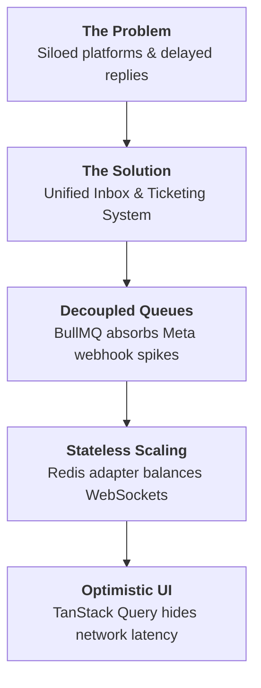

1. **The Business Problem:** Online merchants run multi-channel social stores but suffer from fragmented customer contact points across WhatsApp, Instagram, and Facebook Messenger, leading to missed sales and slow support.
2. **The User Pain Point:** Support agents waste time swapping browser tabs, losing track of customer purchase context (orders, previous tickets) during active chats.
3. **The Solution:** A unified omnichannel inbox that aggregates chats, normalization engines, and a linked ticketing system under one screen.
4. **The Technical Challenge:** Webhook spike management (Meta requires immediate acknowledgments under 3 seconds), real-time synchronization across multiple agent browsers, large file uploads without choking server resources, and securing private customer communications.
5. **The Architectural Decisions:**
    * **Decouple the Webhook Event Loop:** Use Redis & BullMQ to buffer and process Meta webhooks asynchronously.
    * **Direct-to-S3 Presigned Media Uploads:** Prevent file streams from passing through node server memories by writing directly from browser to Backblaze B2/S3.
    * **Cache-Level State Updates:** Skip HTTP polling. Real-time messages are updated directly in the client's TanStack Query cache via Socket.io broadcasts.

---

## Phase 3 — Complete Slide Deck Definition

---

### Slide 1: The Multi-Channel Chaos (The Problem)
* **Main Message:** Fragmented communication channels lead to lost sales, high agent overhead, and disconnected customer profiles.
* **Diagram:**
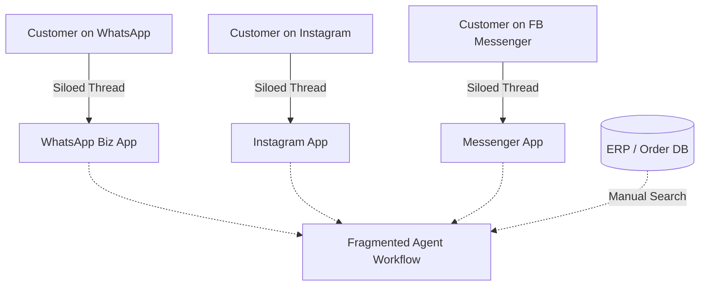
* **Visual Elements:** Clear, red-tinted split arrows showing disjointed customer threads on WhatsApp, Messenger, and Instagram, disconnected from order history databases, leading to a stressed agent avatar.
* **Speaker Notes:**
  > "Imagine running an online business where customer conversations are scattered across WhatsApp, Instagram, and Facebook Messenger. Your agents spend their days shifting between mobile apps, manually looking up order histories, and losing track of support requests. 
  > 
  > This channel fragmentation leads to slow response times, high support overhead, and ultimately, abandoned shopping carts. Today, we present Briefly CRM—a platform that solves this by unifying customer identities, communications, and tickets into a single, real-time workspace."
* **Estimated Time:** 45 seconds.

---

### Slide 2: The Unified Solution (Omnichannel Messaging)
* **Main Message:** Aggregate conversations into a secure, single-pane inbox with integrated order histories and customer metrics.
* **Diagram:**
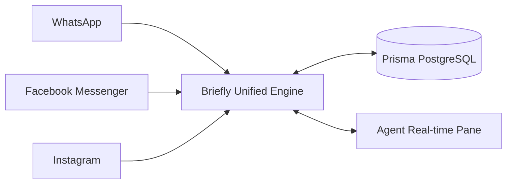
* **Visual Elements:** Green, blue, and purple entry channels merging into a single workspace interface showing active threads, customer profiles, order history sidebars, and ticket status badges.
* **Speaker Notes:**
  > "Briefly resolves this fragmentation by aggregating all incoming channels. Our core messaging engine normalize phone numbers, matches customer emails, and routes chats from WhatsApp, Messenger, and Instagram into one inbox. 
  > 
  > For the agent, the experience is seamless. They view a single conversation thread, see the customer's e-commerce purchase history, and manage linked support tickets without ever leaving the workspace. This integration turns customer support into a unified engagement channel."
* **Estimated Time:** 45 seconds.

---

### Slide 3: The Real-time Webhook Pipeline
* **Main Message:** Decouple incoming Meta traffic from the main database writes using Redis and BullMQ to guarantee 100% webhook ingestion.
* **Diagram:**
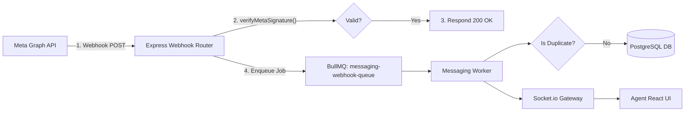
* **Visual Elements:** A step-by-step pipeline showing the separation between the initial HTTP handshake (Meta $\rightarrow$ Express) and the background worker execution (BullMQ $\rightarrow$ Worker $\rightarrow$ DB).
* **Speaker Notes:**
  > "From a technical standpoint, managing webhooks at scale is challenging. Meta requires our webhook endpoints to acknowledge receipt in under 3 seconds, or they drop the event and begin a retry loop. 
  > 
  > To address this, we decouple our ingestion pipeline. Our Express router performs a signature validation check using a timing-safe HMAC-SHA256 hash, validation against Zod schemas, immediately returns a 200 OK, and enqueues the payload to a BullMQ queue. A worker then handles the database operations, checks for duplicate messages, downloads attachments, and broadcasts the event via WebSockets."
* **Estimated Time:** 45 seconds.

---

### Slide 4: Frontend State & Caching Architecture
* **Main Message:** TanStack Query and ZustandStores manage server cache and local state to provide an instant, zero-flicker UI.
* **Diagram:**
```mermaid
graph TD
    Socket[Socket.io Client] -->|Real-time message:created| SocketEvents[useSocketEvents Hook]
    SocketEvents -->|Update Cache| MQCache[TanStack Query Cache]
    MQCache -->|Reconcile| UI[MessageThread & Sidebar UI]
    
    Composer[MessageComposer] -->|Trigger Mutation| SendMessage[useSendMessage Hook]
    SendMessage -->|1. Optimistic Update| MQCache
    SendMessage -->|2. HTTP POST| API[Express API]
    API -- Success --> MQCache
    API -- Fail -->|Rollback State| MQCache
```
* **Visual Elements:** Component hierarchy representation linking `Inbox` to `MessageThread` and `MessageComposer`. Flowcharts showing optimistic `PENDING` states resolving to `SENT` via websocket status updates.
* **Speaker Notes:**
  > "Our frontend architecture is designed to minimize UI lag. We use TanStack Query v5 for server-state caching and Zustand for local state management, such as presence and file uploads. 
  > 
  > When an agent replies, we don't wait for the network request to complete. We run an optimistic update, instantly injecting a pending message bubble into the thread. Once the backend completes the send, the client receives a status event and updates the tick indicator. This optimistic approach ensures the UI remains fast and responsive."
* **Estimated Time:** 45 seconds.

---

### Slide 5: Backend Service Topology
* **Main Message:** A layered architecture separates API routing, request validation, service operations, and database access.
* **Diagram:**
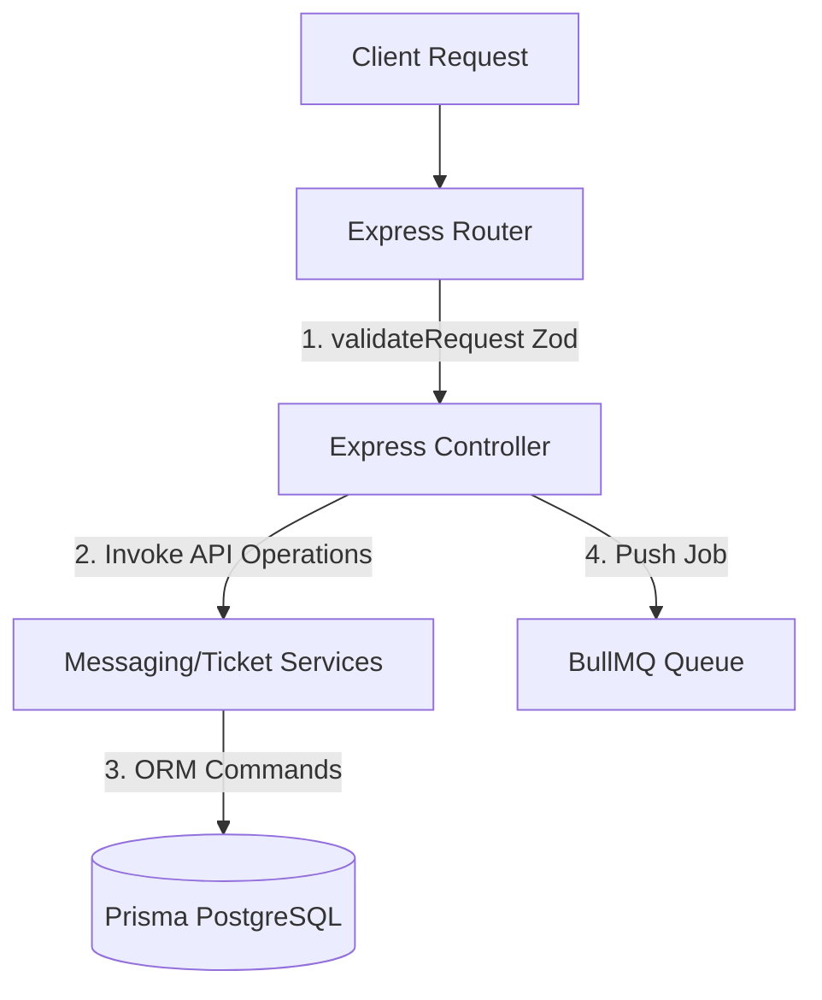
* **Visual Elements:** Clean structural layers (Routes $\rightarrow$ Controllers $\rightarrow$ Services $\rightarrow$ Data Access/Prisma) with defined responsibilities and clear boundary lines.
* **Speaker Notes:**
  > "The backend codebase enforces clean separation of concerns. The routing layer handles endpoint registration and middleware validation. The controller layer handles request mapping, transaction boundaries, and queues outbound tasks. 
  > 
  > Business operations live inside dedicated services, such as messaging and ticket services, while database access is handled by Prisma. This structured boundary ensures developers can modify database logic or service providers without breaking endpoint schemas or validation constraints."
* **Estimated Time:** 45 seconds.

---

### Slide 6: The Ticketing System Lifecycle
* **Main Message:** Normalized ticket models record customer issues, track assignment, and log agent interactions.
* **Diagram:**
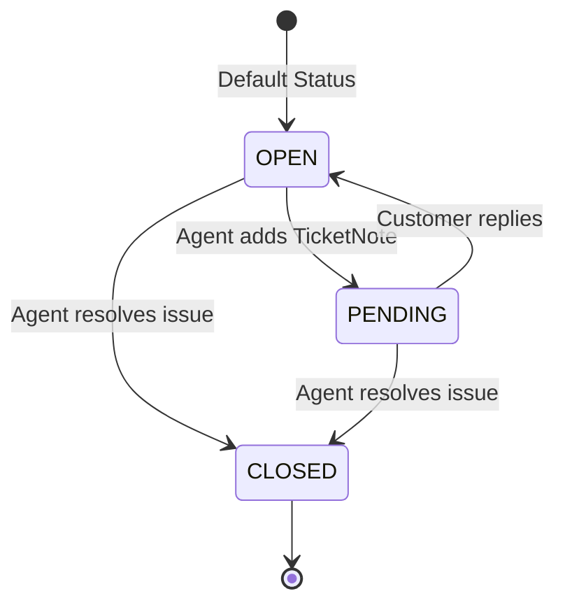
* **Visual Elements:** State machine layout tracing a ticket's transition from `OPEN` to `PENDING` and finally `CLOSED`, showing notes and databases linked to the workflow.
* **Speaker Notes:**
  > "The Ticketing system tracks customer requests and resolutions. When a support ticket is created, it is linked to a customer profile and order history, defaulting to an OPEN state and MEDIUM priority. 
  > 
  > Agent interactions are logged as notes using a database transaction that atomically creates the note and updates the ticket's timestamps. Once resolved, the ticket is marked as CLOSED. This history gives the team full visibility into previous resolutions when a customer reaches out again."
* **Estimated Time:** 45 seconds.

---

### Slide 7: Manual Ticket & Chat Assignment
* **Main Message:** Access-controlled room routing and manual assignment workflows establish clear thread ownership.
* **Diagram:**
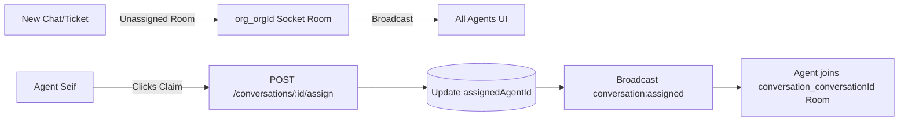
* **Visual Elements:** Sidebar layout showing the "Claim" shortcut and user presence indicator changes (`online`/`offline`), illustrating the Socket.io transition from unassigned to assigned.
* **Speaker Notes:**
  > "To ensure security and keep agents focused, Briefly uses explicit assignment checks. All agents in an organization receive unassigned alerts via our shared organization socket room. 
  > 
  > An agent can claim the conversation, which updates the database. The system then broadcasts an assignment event, prompting the agent's browser to join the conversation's private socket room. Regular agents are restricted to viewing chats that are either unassigned or assigned to them, while managers have full access to monitor all threads."
* **Estimated Time:** 45 seconds.

---

### Slide 8: Direct-to-S3 Presigned Media Pipeline
* **Main Message:** Preserve server resources by uploading files directly from client browsers to Backblaze B2/S3.
* **Diagram:**
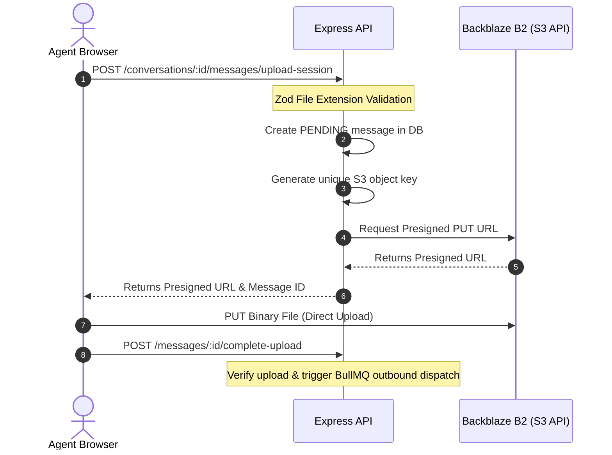
* **Visual Elements:** Flow arrows showing the client talking to the backend for setup, uploading the file directly to Backblaze B2, and then notifying the API to complete the transaction.
* **Speaker Notes:**
  > "To prevent large file uploads from consuming backend server memory and bandwidth, we use a direct-to-S3 upload flow. 
  > 
  > The client requests an upload session, and the server validates the file extension, creates a pending database record, and generates a presigned B2 upload URL. The browser then uploads the binary data directly to Backblaze B2. Once complete, the browser notifies our server, which verifies the upload, generates a secure download URL, and enqueues the message in BullMQ for delivery."
* **Estimated Time:** 45 seconds.

---

### Slide 9: Scalability & DevOps Blueprint
* **Main Message:** Redis Adapter Pub/Sub and BullMQ queues support horizontal scaling across cloud nodes.
* **Diagram:**
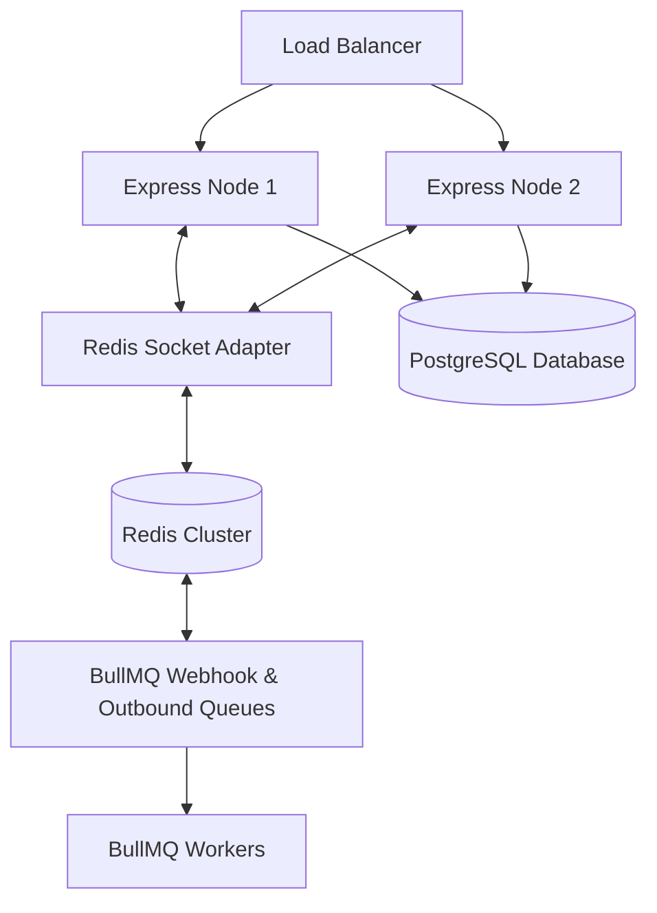
* **Visual Elements:** Scaling diagram showing multiple Express server instances communicating with a central Redis cluster and PostgreSQL database.
* **Speaker Notes:**
  > "Briefly CRM is built to scale horizontally. Our Express instances run completely stateless, utilizing a shared Redis instance for distributed sessions. 
  > 
  > To scale our real-time connections, we use a Redis socket adapter. This synchronizes Socket.io events across all Express nodes, allowing users on different instances to communicate without interruption. Meanwhile, BullMQ manages our background queues, enabling us to handle traffic spikes smoothly."
* **Estimated Time:** 45 seconds.

---

### Slide 10: Conclusion & Core Contributions
* **Main Message:** Briefly CRM unifies omnichannel communications and ticketing into a secure, scalable platform.
* **Visual Elements:** Summary grid displaying key accomplishments: Real-time Messaging, Decoupled Queue Worker architecture, and Secure Media Uploads.
* **Speaker Notes:**
  > "In summary, Briefly CRM unifies multi-channel communication into a secure, scalable dashboard. We resolved the problem of fragmented channels by building an asynchronous queue pipeline, implementing secure presigned uploads, and routing real-time socket events directly to the frontend cache. 
  > 
  > The platform is now ready to help teams handle customer requests more efficiently. Thank you for your time, and we are happy to answer any questions."
* **Estimated Time:** 45 seconds.

---

## Part 4 — Frontend Architecture Detail

```
src/features/conversations/
├── index.tsx                 ← Inbox Layout, Tab filters, search, details
├── types.ts                  ← Data shapes & API contracts
├── utils.ts                  ← Date formatting & style classes
├── conversation.service.ts   ← Axios API requests (getAll, getMessages, sendMessage, assign)
├── conversation.hooks.ts     ← React Query hooks (useConversations, useConversationMessages, useSendMessage)
└── components/
    ├── MessageThread.tsx     ← Scroll container & custom media bubble components
    ├── MessageComposer.tsx    ← Text input & attachment preview
    ├── AttachmentPreviewComposer.tsx ← File upload selection layout
    └── NewConversationModal.tsx ← Modal for starting chats
```

### Component Hierarchy Detail
1. **`Conversations` ([index.tsx](file:///c:/Users/Azza/Documents/tbd/grad/Briefly-App/src/features/conversations/index.tsx))**: The main layout. Orchestrates search states, filter tabs, active conversation selection, typing indicators, and assignment changes.
2. **`MessageThread` ([MessageThread.tsx](file:///c:/Users/Azza/Documents/tbd/grad/Briefly-App/src/features/conversations/components/MessageThread.tsx))**: Renders conversation messages chronologically, grouped by date. It monitors scroll offsets and triggers `fetchNextPage()` when the user scrolls to the top.
3. **`MessageComposer` ([MessageComposer.tsx](file:///c:/Users/Azza/Documents/tbd/grad/Briefly-App/src/features/conversations/components/MessageComposer.tsx))**: Handles text entry and maps typing statuses to the backend. It also supports file attachments via `AttachmentPreviewComposer`.

### Hooks & State Management
* **Zustand Presence Store ([presence.store.ts](file:///c:/Users/Azza/Documents/tbd/grad/Briefly-App/src/store/presence.store.ts))**: Maintains a list of online user IDs and updates typing statuses inside a `typingUsers` dictionary.
* **Zustand Upload Store ([upload.store.ts](file:///c:/Users/Azza/Documents/tbd/grad/Briefly-App/src/store/upload.store.ts))**: Manages upload operations (cancellations using `AbortController` and retries by replacing temporary message placeholders in the thread).

### React Query Caching
* **`useConversationMessages`**: Uses `useInfiniteQuery` to retrieve chat history in pages of 50 messages.
* **WebSocket Cache Updates**: The `useSocketEvents` hook intercepts real-time Socket.io events and updates the cache directly. For example:
    * On `message:created`: Appends the message to the active thread cache page and pushes the conversation to the top of the sidebar list.
    * On `conversation:read_receipt`: Updates the status of outbound messages in the cache to `READ` or `DELIVERED`.

---

## Part 5 — Backend Architecture Detail

The backend enforces clean separation of concerns:

```
Request ──> [Router] ──> validationMiddleware ──> [Controller] ──> [Service] ──> Prisma ──> [PostgreSQL]
                                                                  └──> [Queue] ──> [Redis] ──> [Worker]
```

### Layer Responsibilities

#### 1. Routing Layer
* **Files**: [messaging.router.ts](file:///c:/Users/Azza/Documents/tbd/grad/E-Commerce-CRM/src/api/messaging/messaging.router.ts) & [ticket.router.ts](file:///c:/Users/Azza/Documents/tbd/grad/E-Commerce-CRM/src/api/tickets/ticket.router.ts)
* **Role**: Registers route patterns, enforces role-based access checks (`requirePermission`), and validates schemas via `validateRequest`.

#### 2. Validation Layer
* **Files**: [messaging.schemas.ts](file:///c:/Users/Azza/Documents/tbd/grad/E-Commerce-CRM/src/api/messaging/messaging.schemas.ts) & [ticket.schemas.ts](file:///c:/Users/Azza/Documents/tbd/grad/E-Commerce-CRM/src/api/tickets/ticket.schemas.ts)
* **Role**: Defines validation schemas using Zod to reject malformed payloads before they reach controllers.

#### 3. Controller Layer
* **Files**: [messaging.controller.ts](file:///c:/Users/Azza/Documents/tbd/grad/E-Commerce-CRM/src/api/messaging/messaging.controller.ts) & [ticket.controller.ts](file:///c:/Users/Azza/Documents/tbd/grad/E-Commerce-CRM/src/api/tickets/ticket.controller.ts)
* **Role**: Maps request fields, commits initial records to the database, initiates upload sessions, and pushes jobs to BullMQ queues.

#### 4. Service Layer
* **Files**: [messaging.service.ts](file:///c:/Users/Azza/Documents/tbd/grad/E-Commerce-CRM/src/api/messaging/messaging.service.ts) & [ticket.service.ts](file:///c:/Users/Azza/Documents/tbd/grad/E-Commerce-CRM/src/api/tickets/ticket.service.ts)
* **Role**: Handles core business logic, including Meta API integrations, decrypting access tokens, and managing database updates.

#### 5. Queue & Worker Layer
* **Files**: [messaging.queue.ts](file:///c:/Users/Azza/Documents/tbd/grad/E-Commerce-CRM/src/queues/messaging.queue.ts) & [messaging.worker.ts](file:///c:/Users/Azza/Documents/tbd/grad/E-Commerce-CRM/src/queues/messaging.worker.ts)
* **Role**: Defines queues and consumes jobs (e.g. processing webhooks, dispatching outbound messages, and updating delivery statuses).

---

## Part 6 — Ticketing System Lifecycle

The ticketing system handles customer support workflows:

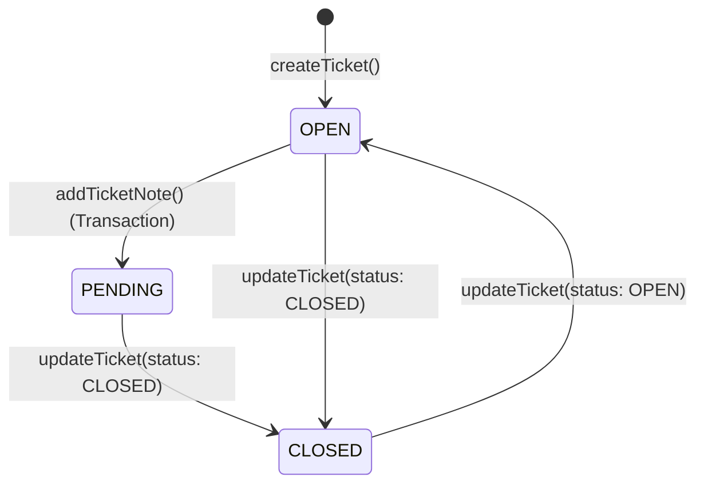

1. **Creation:** Generated via `/tickets` endpoint. Creates a `SupportTicket` record, defaulting to `OPEN` status, `MEDIUM` priority, and linking it to a `Customer` and optionally an `Order`.
2. **Notes Ledger:** Notes are written to `TicketNote` using a transaction (`prisma.$transaction`). This inserts the note and automatically updates the parent ticket's `lastResponseAt` and `updatedAt` fields.
3. **Status Transitions:** Managed via the `updateTicket` service. Statuses transition between `OPEN`, `PENDING`, and `CLOSED`.

---

## Part 7 — Assignment System

```
       New Chat/Ticket
              │
      ┌───────┴───────┐
      ▼               ▼
 [Claim Chat]   [Agent Lookup]
   (Self)       (Assign to ID)
      │               │
      └───────┬───────┘
              ▼
    [POST Request to API]
              │
              ▼
   [DB Update & Socket Emit]
              │
              ▼
    [Agent Joins Room]
```

1. **Manual Claim & Assignment:**
   * Conversations are assigned by sending a request to `/conversations/:id/assign` with `assignedAgentId`.
   * Agents can claim chats in the UI, which updates the database and broadcasts a `conversation:assigned` socket event to sync other agents' dashboards.
2. **Role-Based Access Control (RBAC):**
   * WebSocket authorization checks permissions during connection. Standard agents are only allowed to join conversation rooms that are unassigned or assigned to them. Managers, admins, and roots have full access to all rooms.

---

## Part 8 — System Automations

Rather than relying on abstract workflows, Briefly implements several automated processes directly in the codebase:

* **Webhook Idempotency Protection:** The backend checks the uniqueness of Meta message IDs. It ignores duplicate delivery requests using `checkAndStoreIdempotencyAtomic` to prevent duplicate database entries.
* **Identity Matching:** Incoming Meta webhooks automatically match phone numbers or emails against the customer database. If a matching customer is found, the chat is linked to their profile; otherwise, a new `Customer` is created.
* **Phone Number Normalization:** Inbound WhatsApp messages run through `cleanWhatsAppNumber` to remove non-digit characters and ensure consistent formatting.
* **Automatic Status Setup:** New support tickets are initialized as `OPEN` and `MEDIUM` priority by default.

---

## Part 9 — Media Ingestion & Delivery Pipeline

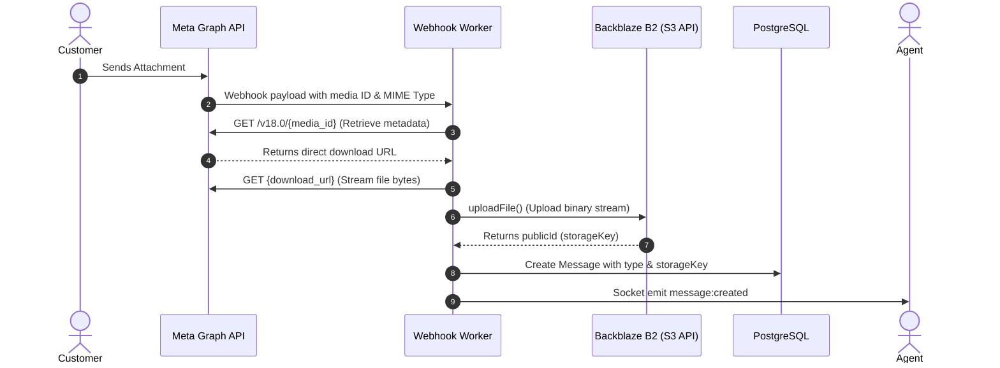

1. **Inbound Processing:** When a customer sends media, Meta sends a payload containing a media ID and MIME type.
2. **Download & Upload:** The `downloadAndUploadMetaMedia` service calls Meta's Graph API to retrieve the direct download URL, streams the file bytes, and uploads the buffer to object storage using the `uploadFile` service.
3. **Storage:** Files are saved using structured keys:
   `chat-[fileCategory]/org_[orgId]/conv_[convId]/msg_[msgId]/[uuid].[ext]`
4. **Delivery:** The backend generates signed download URLs via Backblaze B2. When an agent opens a chat, the server generates temporary download links so the client can display images, video, and audio previews.

---

## Part 10 — Security Architecture

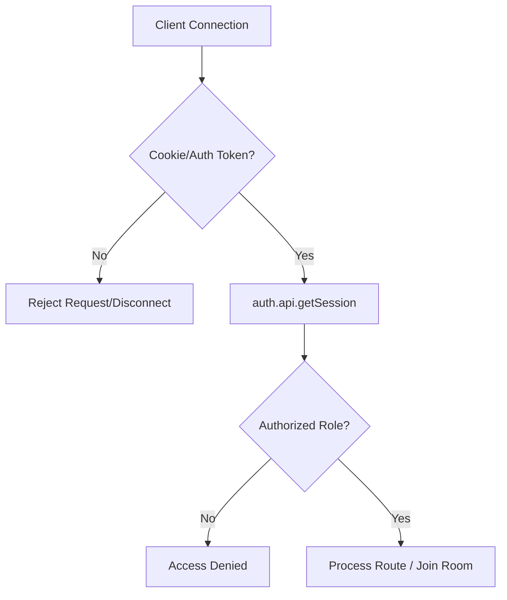

* **Authentication:** Handled by **Better Auth**. Session tokens are verified via Express routers and Socket.io handshakes.
* **Authorization (RBAC):** Access control is verified using the `requirePermission` middleware. Roles define access rights for resources:
  * `conversations:read` and `conversations:write`
  * `supportTickets:read` and `supportTickets:write`
* **Media Encryption:** Decrypted access tokens are kept secure. Integration tokens are stored encrypted and decrypted in memory using the `decryptSafe` utility.
* **S3 Access Protection:** Direct browser uploads are secured using presigned S3 URLs, restricting clients to uploading to a specific file key.

---

## Part 11 — AWS Integration (S3 Presigned URLs)

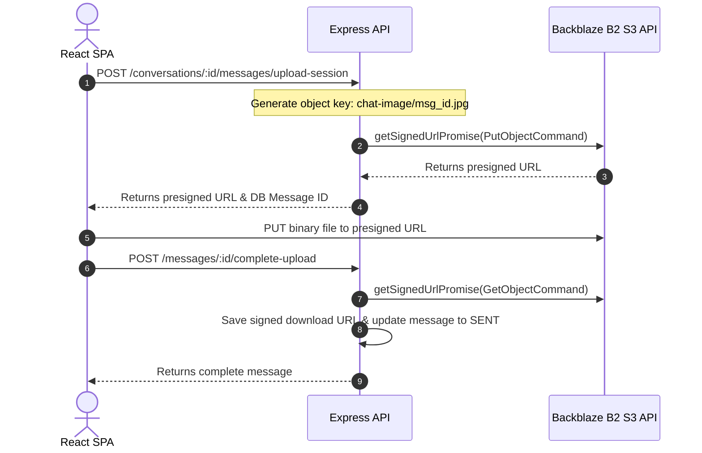

* **Presigned Uploads:** The client calls the `/upload-session` endpoint. The server validates the request and generates a presigned URL using `@aws-sdk/s3-request-presigner`.
* **Direct Uploads:** The browser uploads the file directly to storage using a `PUT` request. This bypasses the Express server, protecting server memory from large file streams.
* **Verification:** The client notifies the backend via `/complete-upload`, which validates the file, generates a signed download URL, and marks the message as `SENT`.

---

## Part 12 — DevOps & Scalability Engine

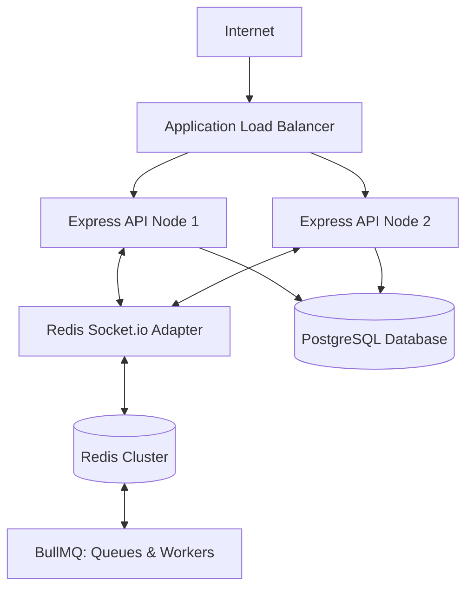

* **Stateless API Clustering:** Express instances run stateless. All sessions, rate-limiting states, and worker queues are delegated to Redis and PostgreSQL.
* **WebSocket Syncing:** Sockets are coordinated using `@socket.io/redis-adapter`. This synchronizes WebSocket connections across multiple servers, ensuring real-time messages reach their destination regardless of which node the client is connected to.
* **Job Queue Decoupling:** BullMQ separates webhook processing from API requests. This isolates Meta API requests, reduces system bottlenecks, and guarantees message delivery.

---

## Part 13 — Q&A Preparation: Top 20 Judge Questions

#### Q1: Why did you choose Socket.io with a Redis adapter instead of standard WebSockets?
* **Short Answer:** To support horizontal scaling and synchronize real-time events across multiple server instances.
* **Detailed Answer:** Standard WebSockets limit client connections to a single server instance. By introducing `@socket.io/redis-adapter` backed by Redis Pub/Sub, our Express servers can scale horizontally. If Agent A is connected to Node 1 and Agent B to Node 2, the Redis adapter coordinates socket broadcasts between nodes, ensuring real-time messages are delivered seamlessly.

#### Q2: How do you handle Meta's strict 3-second webhook response timeout?
* **Short Answer:** We validate the request signature, enqueue the payload to BullMQ immediately, and return a 200 OK.
* **Detailed Answer:** Meta requires webhook endpoints to acknowledge receipt within 3 seconds. To satisfy this, the `/api/meta/webhook` handler performs a quick signature validation and enqueues the payload to `webhookQueue` via BullMQ. The server then immediately returns a `200 EVENT_RECEIVED` status. A separate worker process handles the database operations and media downloads asynchronously, preventing timeout retries.

#### Q3: Why generate presigned S3 URLs instead of routing file uploads through your Express server?
* **Short Answer:** To protect server memory and bandwidth from being choked by large file uploads.
* **Detailed Answer:** Routing file uploads through an Express server consumes significant memory and I/O resources, limiting scalability. By using `@aws-sdk/s3-request-presigner` to generate presigned upload URLs, the browser uploads the binary data directly to Backblaze B2/S3. The backend only handles light JSON requests to initialize and verify the session.

#### Q4: How do you secure direct S3 uploads if the client uploads files directly?
* **Short Answer:** We enforce file extension checks on the server and restrict the presigned URL to a specific, unique storage key.
* **Detailed Answer:** When a client requests an upload session, the server validates the file extension against a whitelist. The backend then generates a presigned URL bound to a specific, unique key. This prevents clients from overwriting other files or uploading unauthorized file types to the bucket.

#### Q5: What is the database adapter strategy for Better Auth in your system?
* **Short Answer:** It uses the Prisma database adapter to store sessions in PostgreSQL, with Redis caching user sessions.
* **Detailed Answer:** We configure Better Auth with the Prisma adapter, mapping database models for `User`, `Session`, `Account`, and `Verification`. User sessions are cached in Redis to speed up authorization checks during WebSocket handshakes and API requests.

#### Q6: How does the frontend handle real-time message status updates without duplicating optimistic messages?
* **Short Answer:** It matches the optimistic message's content and replaces it with the final payload when a status update is received.
* **Detailed Answer:** In `useSocketEvents.ts`, the `message:created` listener checks if the incoming message is outbound. If it is, the handler searches the TanStack Query cache for a matching optimistic message with a `PENDING` status. It then replaces the placeholder with the database payload, preventing duplicates and keeping the message order intact.

#### Q7: How are WebSocket connections authenticated and authorized?
* **Short Answer:** We verify the session cookie or token during the connection handshake using Better Auth.
* **Detailed Answer:** The Socket.io connection middleware extracts the authentication token from the headers or cookies. It calls `auth.api.getSession` to verify the session and active organization. If verified, the socket joins the organization's room (`org_${orgId}`) and is granted access.

#### Q8: What database transaction isolation strategies are used in the ticketing note creations?
* **Short Answer:** It uses Prisma's transaction utility to create the note and update the ticket's timestamps atomically.
* **Detailed Answer:** In `addTicketNote`, we wrap the database writes in a `prisma.$transaction`. This ensures that creating the note and updating the parent ticket's `lastResponseAt` and `updatedAt` timestamps succeed or fail together, maintaining database consistency.

#### Q9: How are standard agents prevented from accessing conversations assigned to others?
* **Short Answer:** The socket gateway blocks agents from joining conversation rooms not assigned to them, and API routes enforce RBAC checks.
* **Detailed Answer:** The socket connection validates the user's role. Standard agents can only join conversation rooms that are unassigned or assigned to them. Managers, admins, and roots bypass this check. This access control is also enforced at the API routing layer.

#### Q10: How do you prevent webhook duplicate deliveries?
* **Short Answer:** We use an idempotency checker that logs Meta message IDs in the database.
* **Detailed Answer:** In `messaging.worker.ts`, the worker checks incoming message IDs against the database using `checkAndStoreIdempotencyAtomic`. If a record exists, the message is ignored, preventing duplicate processing from Meta's retry attempts.

#### Q11: Why does your application use infinite queries for chat threads?
* **Short Answer:** To load chat history efficiently in pages of 50, reducing memory usage and network load.
* **Detailed Answer:** Loading an entire chat history at once can slow down the browser. We use TanStack Query's `useInfiniteQuery` to fetch messages in pages of 50. The page threshold triggers a fetch for the next page when scrolled to the top, keeping the workspace fast.

#### Q12: How do you handle Meta integration credentials securely in your database?
* **Short Answer:** They are encrypted before being saved and decrypted in memory using a decryption utility.
* **Detailed Answer:** We store Meta integration credentials encrypted in the database. When an outbound message is sent, the system retrieves the token and decrypts it in memory using the `decryptSafe` helper, keeping credentials secure.

#### Q13: What happens when the Redis server goes offline?
* **Short Answer:** The backend falls back to synchronous imports/exports and local in-memory socket adapters.
* **Detailed Answer:** In `app.ts`, the server checks Redis health. If Redis goes offline, the system falls back to processing import/export tasks synchronously and defaults to a local in-memory socket adapter. The health monitor polls Redis and reconnects when it is online again.

#### Q14: How are WhatsApp phone numbers normalized across channels?
* **Short Answer:** We clean the numbers of non-digit characters and prepend the country code.
* **Detailed Answer:** Inbound WhatsApp phone numbers are processed by `cleanWhatsAppNumber`, which strips non-digit characters and prepends the country code (`20` for Egypt). This ensures consistent user profiling and customer matching across channels.

#### Q15: How do you track agent typing status in real-time?
* **Short Answer:** Typing events are emitted via Socket.io and stored in a Zustand presence store.
* **Detailed Answer:** When an agent types, the frontend emits a `typing:status` socket event. The server broadcasts this event to the conversation's room. Other clients receive the event and update their Zustand presence store (`typingUsers`), displaying a typing indicator.

#### Q16: How does the system handle media download validation?
* **Short Answer:** The server validates file extensions against a whitelist based on the category.
* **Detailed Answer:** When starting an upload session, the controller validates the file extension against a whitelist for each category (e.g. png/jpg for images, pdf/doc for documents). This prevents users from uploading executable files or scripts.

#### Q17: Why did you choose Zustand instead of Redux for frontend state management?
* **Short Answer:** Zustand is simpler, faster, and integrates well with React 19 without boilerplate.
* **Detailed Answer:** Zustand provides a lightweight, hook-based state management solution. It avoids the boilerplate of Redux while providing reactive state updates, making it a great fit for tracking user presence, file uploads, and theme toggles.

#### Q18: What is your database indexing strategy for chat history?
* **Short Answer:** We index foreign keys and timestamps to optimize message queries.
* **Detailed Answer:** In `schema.prisma`, we index foreign keys and timestamps on the `Message` and `Conversation` models (e.g., `conversationId` and `createdAt`). This ensures that fetching messages for active threads remains fast as the database grows.

#### Q19: How does the system update ticket states when notes are added?
* **Short Answer:** Adding a note automatically updates the parent ticket's timestamps.
* **Detailed Answer:** In `addTicketNote`, we run the database writes in a transaction. This creates the note and updates the ticket's `lastResponseAt` and `updatedAt` timestamps, ensuring the ticketing dashboard displays the latest activity.

#### Q20: How does the platform scale to handle high traffic?
* **Short Answer:** We use stateless Express servers, a Redis adapter for WebSockets, and BullMQ for background tasks.
* **Detailed Answer:** The platform is designed for horizontal scaling. We run stateless Express servers behind a load balancer, synchronize WebSockets using a Redis adapter, and offload webhook processing to BullMQ workers, allowing the system to scale smoothly.

---

## Part 14 — Spoken Presentation Scripts

---

### 1. 4-Minute Presentation Script (Target: 600 words)

#### Slide 1: The Multi-Channel Chaos (0:00 - 0:45)
> "Good morning, members of the jury. Today, we present Briefly CRM, focusing on our unified real-time messaging engine. 
> 
> Imagine running an online business where customer conversations are scattered across WhatsApp, Instagram, and Facebook Messenger. Support agents waste time swapping between mobile apps, manually looking up order histories, and losing track of support requests. This channel fragmentation leads to slow response times, high support overhead, and ultimately, abandoned shopping carts. Briefly resolves this by unifying customer identities, communications, and support tickets into a single, real-time workspace."

#### Slide 2: The Unified Inbox (0:45 - 1:30)
> "Our core messaging engine normalizes phone numbers and routes chats from WhatsApp, Messenger, and Instagram into one inbox. For the agent, the experience is seamless. They view a single conversation thread, see the customer's e-commerce purchase history, and manage linked support tickets without ever leaving the workspace. This integration turns customer support into a unified engagement channel."

#### Slide 3: Webhook Pipeline & Queue Ingestion (1:30 - 2:15)
> "From a technical standpoint, managing webhooks at scale is challenging. Meta requires our webhook endpoints to acknowledge receipt in under 3 seconds, or they drop the event and begin a retry loop. 
> 
> To address this, we decouple our ingestion pipeline. Our Express router performs a signature validation check, validation against Zod schemas, immediately returns a 200 OK, and enqueues the payload to a BullMQ queue. A worker then handles the database operations, checks for duplicate messages, downloads attachments, and broadcasts the event via WebSockets."

#### Slide 4: Real-time UI & Caching Strategy (2:15 - 3:00)
> "To keep the frontend responsive, we use TanStack Query v5 for server-state caching and Zustand for local state management. When an agent replies, we don't wait for the network request to complete. We run an optimistic update, instantly injecting a pending message bubble into the thread. Once the backend completes the send, the client receives a status event and updates the tick indicator. This optimistic approach ensures the UI remains fast and responsive."

#### Slide 5: Direct S3 Media Uploads (3:00 - 3:45)
> "To prevent large file uploads from consuming backend server memory and bandwidth, we use a direct-to-S3 upload flow. The client requests an upload session, and the server validates the file extension, creates a pending database record, and generates a presigned B2 upload URL. The browser then uploads the binary data directly to Backblaze B2. Once complete, the browser notifies our server, which verifies the upload, generates a secure download URL, and enqueues the message in BullMQ for delivery."

#### Slide 6: Horizontal Scaling & Conclusion (3:45 - 4:00)
> "Finally, Briefly CRM is engineered to scale horizontally. Our Express instances run completely stateless, utilizing a shared Redis instance for distributed sessions. To scale our real-time connections, we use a Redis socket adapter. This synchronizes Socket.io events across all Express nodes, allowing users on different instances to communicate without interruption. 
> 
> In summary, Briefly CRM unifies multi-channel communication into a secure, scalable dashboard. We resolved the problem of fragmented channels by building an asynchronous queue pipeline, implementing secure presigned uploads, and routing real-time socket events directly to the frontend cache. Thank you for your time, and we are happy to answer any questions."

---

### 2. 6-Minute Presentation Script (Target: 900 words)

#### Slide 1: The Multi-Channel Chaos (0:00 - 1:00)
> "Good morning, members of the jury. Today, we present Briefly CRM, focusing on our unified real-time messaging engine. 
> 
> Imagine running an online business where customer conversations are scattered across WhatsApp, Instagram, and Facebook Messenger. Support agents waste time swapping between mobile apps, manually looking up order histories, and losing track of support requests. This channel fragmentation leads to slow response times, high support overhead, and ultimately, abandoned shopping carts. Briefly resolves this by unifying customer identities, communications, and support tickets into a single, real-time workspace."

#### Slide 2: The Unified Inbox (1:00 - 2:00)
> "Our core messaging engine normalizes phone numbers and routes chats from WhatsApp, Messenger, and Instagram into one inbox. For the agent, the experience is seamless. They view a single conversation thread, see the customer's e-commerce purchase history, and manage linked support tickets without ever leaving the workspace. This integration turns customer support into a unified engagement channel."

#### Slide 3: Webhook Pipeline & Queue Ingestion (2:00 - 3:00)
> "From a technical standpoint, managing webhooks at scale is challenging. Meta requires our webhook endpoints to acknowledge receipt in under 3 seconds, or they drop the event and begin a retry loop. 
> 
> To address this, we decouple our ingestion pipeline. Our Express router performs a signature validation check, validation against Zod schemas, immediately returns a 200 OK, and enqueues the payload to a BullMQ queue. A worker then handles the database operations, checks for duplicate messages, downloads attachments, and broadcasts the event via WebSockets."

#### Slide 4: Real-time UI & Caching Strategy (3:00 - 4:00)
> "To keep the frontend responsive, we use TanStack Query v5 for server-state caching and Zustand for local state management. When an agent replies, we don't wait for the network request to complete. We run an optimistic update, instantly injecting a pending message bubble into the thread. Once the backend completes the send, the client receives a status event and updates the tick indicator. This optimistic approach ensures the UI remains fast and responsive."

#### Slide 5: Direct S3 Media Uploads (4:00 - 5:00)
> "To prevent large file uploads from consuming backend server memory and bandwidth, we use a direct-to-S3 upload flow. The client requests an upload session, and the server validates the file extension, creates a pending database record, and generates a presigned B2 upload URL. The browser then uploads the binary data directly to Backblaze B2. Once complete, the browser notifies our server, which verifies the upload, generates a secure download URL, and enqueues the message in BullMQ for delivery."

#### Slide 6: Horizontal Scaling & Conclusion (5:00 - 6:00)
> "Finally, Briefly CRM is engineered to scale horizontally. Our Express instances run completely stateless, utilizing a shared Redis instance for distributed sessions. To scale our real-time connections, we use a Redis socket adapter. This synchronizes Socket.io events across all Express nodes, allowing users on different instances to communicate without interruption. 
> 
> In summary, Briefly CRM unifies multi-channel communication into a secure, scalable dashboard. We resolved the problem of fragmented channels by building an asynchronous queue pipeline, implementing secure presigned uploads, and routing real-time socket events directly to the frontend cache. Thank you for your time, and we are happy to answer any questions."

---

### 3. 8-Minute Presentation Script (Target: 1200 words)

#### Slide 1: The Multi-Channel Chaos (0:00 - 1:15)
> "Good morning, members of the jury. Today, we present Briefly CRM, focusing on our unified real-time messaging engine. 
> 
> Imagine running an online business where customer conversations are scattered across WhatsApp, Instagram, and Facebook Messenger. Support agents waste time swapping between mobile apps, manually looking up order histories, and losing track of support requests. This channel fragmentation leads to slow response times, high support overhead, and ultimately, abandoned shopping carts. Briefly resolves this by unifying customer identities, communications, and support tickets into a single, real-time workspace."

#### Slide 2: The Unified Inbox (1:15 - 2:30)
> "Our core messaging engine normalizes phone numbers and routes chats from WhatsApp, Messenger, and Instagram into one inbox. For the agent, the experience is seamless. They view a single conversation thread, see the customer's e-commerce purchase history, and manage linked support tickets without ever leaving the workspace. This integration turns customer support into a unified engagement channel."

#### Slide 3: Webhook Pipeline & Queue Ingestion (2:30 - 3:45)
> "From a technical standpoint, managing webhooks at scale is challenging. Meta requires our webhook endpoints to acknowledge receipt in under 3 seconds, or they drop the event and begin a retry loop. 
> 
> To address this, we decouple our ingestion pipeline. Our Express router performs a signature validation check, validation against Zod schemas, immediately returns a 200 OK, and enqueues the payload to a BullMQ queue. A worker then handles the database operations, checks for duplicate messages, downloads attachments, and broadcasts the event via WebSockets."

#### Slide 4: Real-time UI & Caching Strategy (3:45 - 5:00)
> "To keep the frontend responsive, we use TanStack Query v5 for server-state caching and Zustand for local state management. When an agent replies, we don't wait for the network request to complete. We run an optimistic update, instantly injecting a pending message bubble into the thread. Once the backend completes the send, the client receives a status event and updates the tick indicator. This optimistic approach ensures the UI remains fast and responsive."

#### Slide 5: Direct S3 Media Uploads (5:00 - 6:15)
> "To prevent large file uploads from consuming backend server memory and bandwidth, we use a direct-to-S3 upload flow. The client requests an upload session, and the server validates the file extension, creates a pending database record, and generates a presigned B2 upload URL. The browser then uploads the binary data directly to Backblaze B2. Once complete, the browser notifies our server, which verifies the upload, generates a secure download URL, and enqueues the message in BullMQ for delivery."

#### Slide 6: Backend Service Layers (6:15 - 7:00)
> "The backend codebase enforces clean separation of concerns. The routing layer handles endpoint registration and middleware validation. The controller layer handles request mapping, transaction boundaries, and queues outbound tasks. Business operations live inside dedicated services, such as messaging and ticket services, while database access is handled by Prisma. This structured boundary ensures developers can modify database logic or service providers without breaking endpoint schemas or validation constraints."

#### Slide 7: Horizontal Scaling (7:00 - 7:45)
> "Finally, Briefly CRM is engineered to scale horizontally. Our Express instances run completely stateless, utilizing a shared Redis instance for distributed sessions. To scale our real-time connections, we use a Redis socket adapter. This synchronizes Socket.io events across all Express nodes, allowing users on different instances to communicate without interruption."

#### Slide 8: Conclusion (7:45 - 8:00)
> "In summary, Briefly CRM unifies multi-channel communication into a secure, scalable dashboard. We resolved the problem of fragmented channels by building an asynchronous queue pipeline, implementing secure presigned uploads, and routing real-time socket events directly to the frontend cache. Thank you for your time, and we are happy to answer any questions."

---

## Phase 15 — Presentation Optimization Strategy

### 1. High-Impact Technical Features to Emphasize
* **Decoupled Webhook Worker System:** Emphasize the separation of concerns. Meta webhooks are enqueued and immediately acknowledged to satisfy Meta's 3-second timeout rule.
* **Direct-to-S3 Uploads via Presigned URLs:** Highlight this design choice. Uploading files directly from the browser to Backblaze B2 bypasses the server, protecting server memory from large file streams.
* **Socket.io Redis Pub/Sub Adapter:** Emphasize that the real-time websocket layer is designed for horizontal scaling across multiple nodes, ensuring reliability under high traffic.

### 2. Implementation Reality Checks (Avoid These Common Pitfalls)
* **No "AI Auto-Assignment":** The current codebase relies on manual assignment. Frame this honestly as a design choice that keeps agents in control, and present automated routing as a future roadmap item.
* **No "Active SLA Engine":** The system does not have background SLA timers. Avoid using terms like "automated SLA alerts." Instead, focus on the atomic transactional notes ledger, which updates ticket response timelines accurately.

### 3. What the Judges Will Remember
* The use of **BullMQ** and **Redis** to build a decoupled, resilient architecture.
* The optimization of server resources using **presigned S3 upload URLs** to scale file uploads.
* The clean caching layer using **TanStack Query** to keep the frontend responsive.
