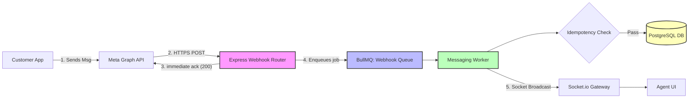
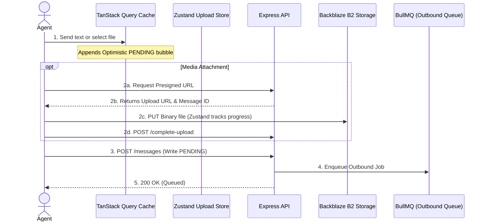
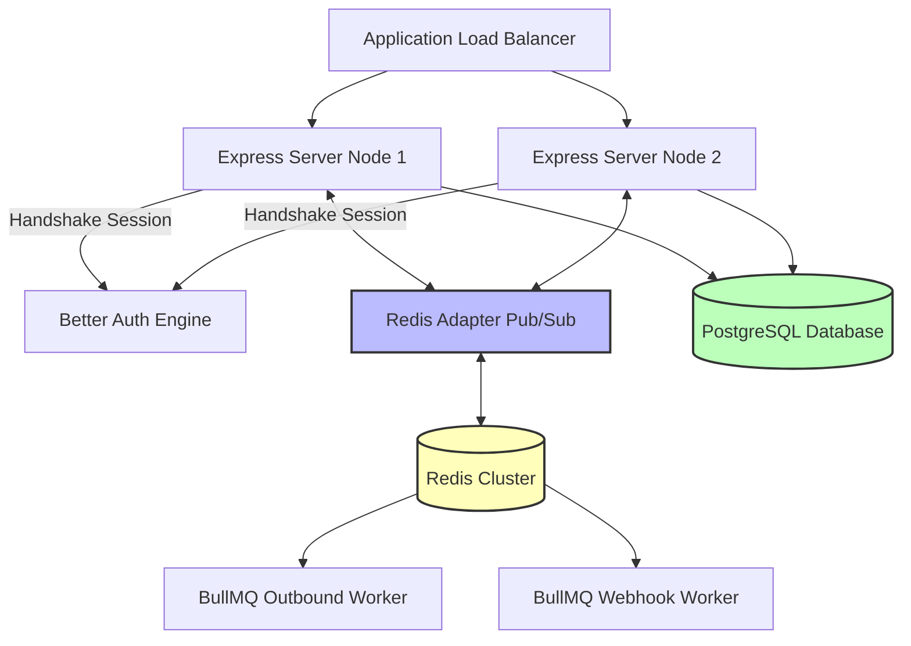

# Briefly CRM — 3-Slide Architectural Presentation

This slide deck is optimized for your graduation project defense. Each slide features an implementation-level architecture diagram, a maximum of 5 technical bullet points, and 45-second speaker notes.

---

## Slide 1: Real-Time Inbound Webhook Pipeline

### Architecture Diagram

### Technical Highlights
* **Decoupled Processing:** Signature-verified HTTPS webhooks hand off Meta payloads to BullMQ queues, freeing the main Express thread.
* **Immediate Acknowledgment:** Webhooks reply with `200 EVENT_RECEIVED` under 3 seconds to prevent Meta from initiating retry loops.
* **Idempotency Guard:** Atomic DB checks ignore redundant webhook delivery attempts using Meta `mid` transaction hashes.
* **Media Normalization:** Media buffers (audio, image, document) are fetched asynchronously, uploaded to Backblaze B2, and stored as signed URLs.
* **Real-time Event Invalidation:** Socket.io pushes events to conversation rooms, updating the client's cache without polling.

### 🎙️ Speaker Notes (Time: 45 seconds ~ 110 words)
> "When a customer sends a message on WhatsApp or Messenger, Meta triggers our secure Express webhook endpoint. To ensure the system remains resilient under load, we perform a timing-safe signature check and validation, reply with a 200 OK immediately, and hand the payload off to our Redis-backed BullMQ Webhook Queue. 
>
> An async worker process retrieves the message, verifies it against our idempotency ledger to filter out duplicates, downloads and uploads any media attachments to Backblaze B2, and writes to PostgreSQL. Finally, the worker broadcasts the message via Socket.io to the agent's browser, updating their workspace in real-time."

---

## Slide 2: High-Performance Frontend & Optimistic UI

### Architecture Diagram

### Technical Highlights
* **Optimistic Rendering:** Sends are appended to the TanStack Query cache instantly with `PENDING` states to eliminate UI lag.
* **Direct Storage Uploads:** Media files bypass the application server entirely, uploading directly to Backblaze B2 via secure presigned PUT URLs.
* **Zustand Progress Engine:** Tracks progress of active chunked uploads, handling cancellations via native `AbortController` signals.
* **Outbound Queue Dispatch:** Agent replies are committed as `PENDING` in the DB and enqueued into BullMQ for delivery via Meta Graph REST API.
* **State Reconciliation:** WebSockets emit status updates (`SENT`, `DELIVERED`, `READ`), swapping optimistic placeholders with final payloads.

### 🎙️ Speaker Notes (Time: 45 seconds ~ 110 words)
> "To keep the workspace responsive, Briefly CRM uses optimistic UI rendering. When an agent clicks send, the frontend immediately appends a pending bubble to the screen. For media attachments, the client requests a presigned URL from our backend, and uploads the file directly to Backblaze B2. Our Zustand store monitors the upload progress. 
>
> Once the upload finishes or a text reply is sent, the backend writes a pending message to PostgreSQL and enqueues the outbound dispatch job in BullMQ. This decoupling allows the API request to resolve immediately. The worker sends the message via Meta's Graph API and updates the status to sent."

---

## Slide 3: Horizontal DevOps & Database Scaling

### Architecture Diagram

### Technical Highlights
* **State-Free API Nodes:** Express server instances run stateless, relying on Better Auth for distributed session authentication.
* **Redis Pub/Sub Socket Adapter:** Broadside messaging events traverse horizontally across servers, enabling multi-node WebSocket routing.
* **Prisma Schema Isolation:** A fully normalized PostgreSQL schema isolates domains across Customers, Conversations, Messages, and Tickets.
* **Transaction Integrity:** Ticket operations (e.g. adding notes) run in Prisma database transactions, updating response timelines atomically.
* **Resilient Retry Mechanics:** Workers isolate third-party service failures, triggering automatic exponential backoffs on network dropouts.

### 🎙️ Speaker Notes (Time: 45 seconds ~ 110 words)
> "Finally, Briefly CRM is engineered to scale horizontally. By designing stateless Express servers behind a load balancer, we can spin up new instances dynamically. We use Redis as a shared state hub for rate-limiting, job queue distribution, and WebSocket coordination. 
>
> Through the Socket.io Redis adapter, servers automatically synchronize message events across different nodes via Pub/Sub. In the database layer, PostgreSQL and Prisma enforce strict relations between customer metrics, chat threads, and support tickets. If any Meta API request fails due to rate limits or network issues, our workers execute an exponential backoff policy, ensuring high system reliability."
