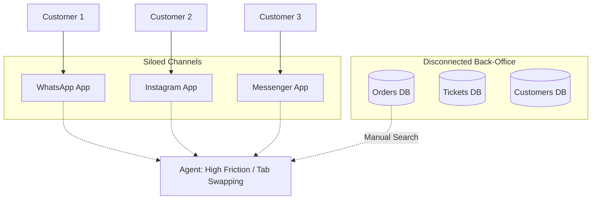
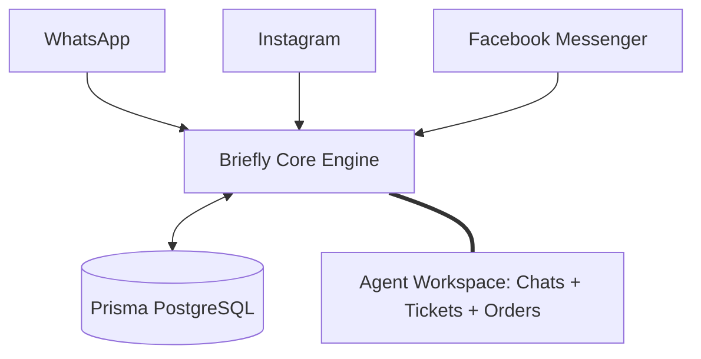
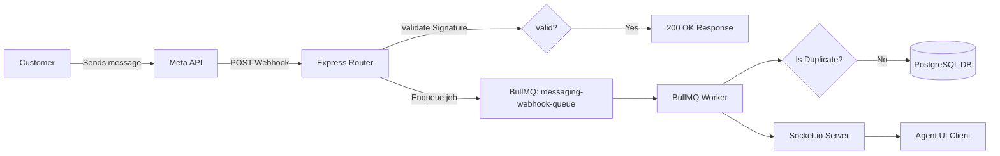
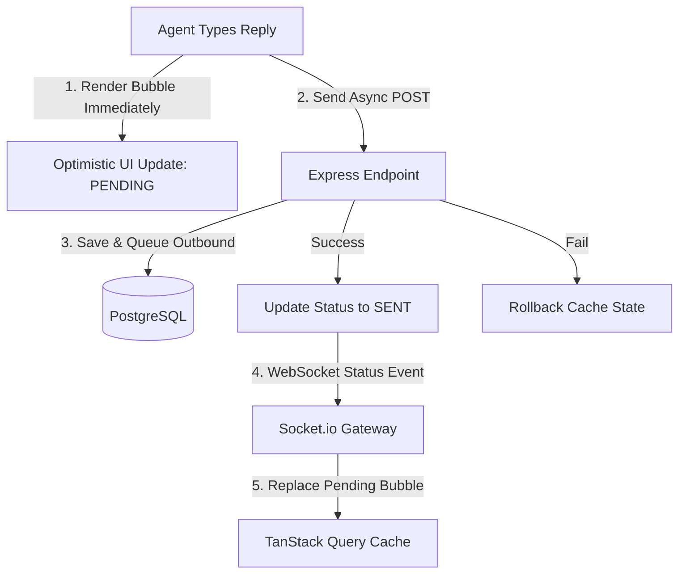
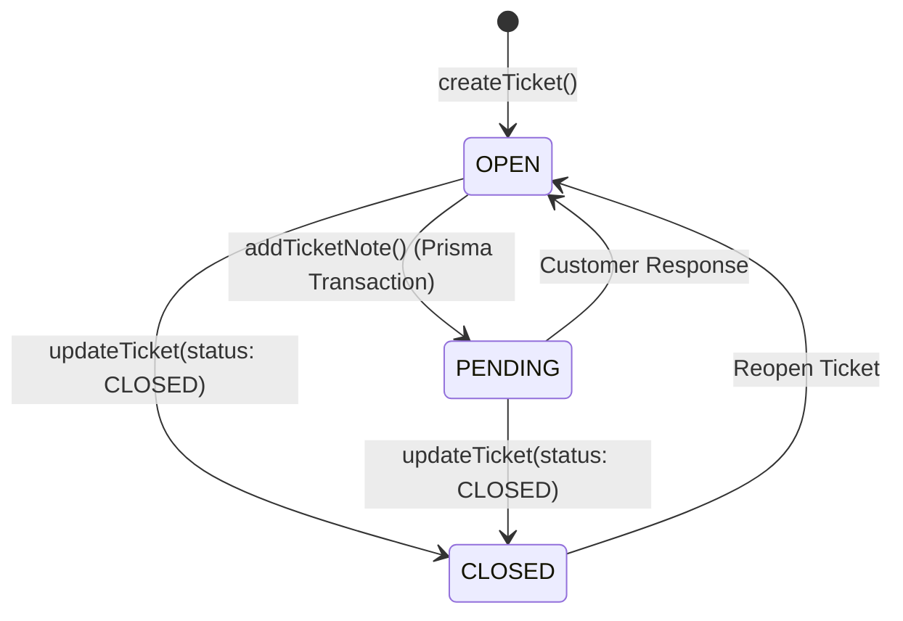
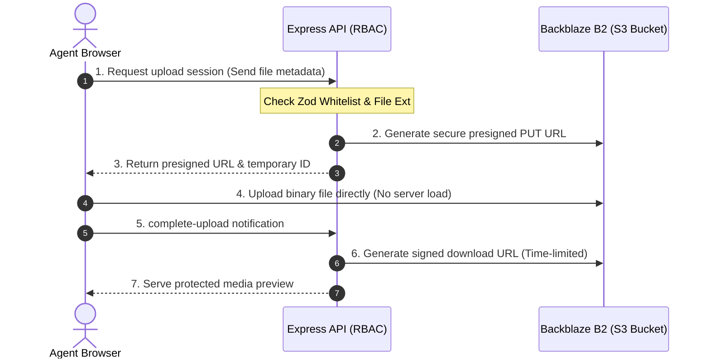
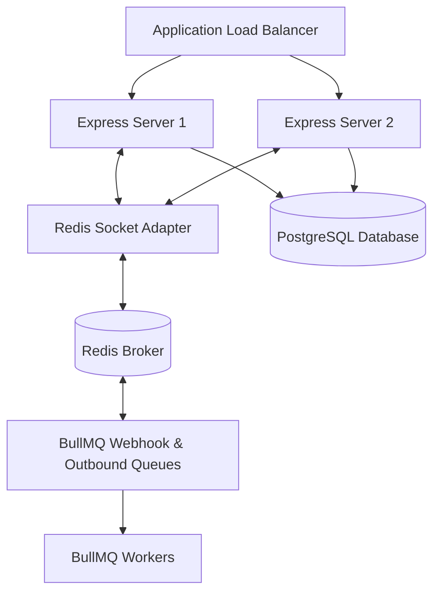

# Briefly CRM — Graduation Presentation (7-Slide Edition with Egyptian Arabic Speaker Notes)

This slide deck is customized to match your exact presentation structure. It includes Mermaid diagrams for each slide and speaker notes written in natural, engaging **Egyptian Arabic Slang (العامية المصرية)**, which is perfect for presenting confidently to Egyptian professors and technical judges.

---

## Slide 1: The Problem (المشكلة)

### Slide Title
* **Title:** The Multi-Channel Communication Chaos (تشتت قنوات التواصل)

### Main Message
* Managing customer channels in silos leads to lost revenue, delayed support, and disconnected data.

### Diagram

### Visual Elements
* Red alert icons next to fragmented channels.
* A stressed agent icon switching between multiple app windows and a separate order list database.

### 🎙️ Speaker Notes (Egyptian Arabic)
> "صباح الخير يا دكاترة ويا باشمهندسين.. تخيل كدة حضرتك مشغل بيزنس أونلاين، والعملاء بتوعك بيبعتوا لك على الواتساب، وناس تانية بتكلمك على إنستجرام، وناس على فيسبوك ماسنجر. 
> 
> شوية بيسألوا عن الأسعار، وشوية عايزين يتتبعوا الأوردرات بتاعتهم، وشوية تانيين عندهم شكاوى.. وفيه عملاء مهتمين ومستنيين رد فوري. 
> 
> المشكلة هنا إن كل حاجة متشتتة ومتفرقة! وعلشان الـ Agent يرد على العميل، بيقعد يلف بين كذا تطبيق، ويدور مانيوال على الأوردر بتاعه في قاعدة بيانات تانية خالص. لو وقعت مننا محادثة واحدة بس، ده معناه عميل ضاع وخسارة بيزنس حقيقية."

### Estimated Time
* **Speaking Time:** 45 seconds

---

## Slide 2: Our Solution (الحل: Briefly)

### Slide Title
* **Title:** Briefly — The Centralized CRM Workspace (Briefly: منصة خدمة العملاء الموحدة)

### Main Message
* One unified interface connecting social channels, customers, orders, and tickets in real-time.

### Diagram

### Visual Elements
* Channel icons (green, purple, blue) converging via smooth transition arrows into a clean, modern dashboard interface.
* The dashboard displays active chats, customer profiles, order history, and ticket statuses on a single screen.

### 🎙️ Speaker Notes (Egyptian Arabic)
> "وهنا بييجي دور مشروعنا: Briefly. المنصة بتشتغل كـ centralized communication hub أو مركز اتصالات موحد. 
> 
> بغض النظر العميل بدأ كلامه فين—سواء بعت رسالة على واتساب، أو كومنت على إنستجرام، أو ماسنجر—كل الرسايل دي بتظهر للـ Agent في شاشة واحدة وبشكل فوري. 
> 
> مش بس كدة، الـ Agent بيشوف مع الشات بيانات العميل الكاملة، وتاريخ أوردراته، وتذاكر الدعم الفني المرتبطة بيه. دي هي القيمة الأساسية للمشروع: تجميع الداتا وتوحيد تجربة العميل والـ Agent."

### Estimated Time
* **Speaking Time:** 45 seconds

---

## Slide 3: How Messages Flow (دورة حياة الرسالة)

### Slide Title
* **Title:** Asynchronous Inbound Message Pipeline (هندسة معالجة الرسائل الواردة)

### Diagram

### Visual Elements
* A step-by-step technical pipeline.
* Highlight the decoupling between the Webhook Router and the BullMQ Queue to show how the backend stays lightweight.

### 🎙️ Speaker Notes (Egyptian Arabic)
> "ندخل بقى في الجزء التقني.. إزاي الرسالة بتوصل من العميل للـ Agent؟ 
> 
> أول ما العميل يبعت، Meta بتبعت لنا Webhook على السيرفر. إحنا بنعمل خطوة مهمة جداً وهي إننا بنعمل Signature Verification بـ HMAC-SHA256 علشان نتأكد إن الرسالة فعلاً جاية من Meta مش هاكر. 
> 
> وعشان Meta بتطلب رد في أقل من 3 ثواني، بنقوم رادين بـ 200 OK فوراً ونرمي الرسالة في الـ Queue بتاع BullMQ عشان تتفرز براحتها. الـ Worker بياخد الرسالة دي، يتأكد إنها مش متكررة (Idempotency Check)، ويسجلها في الـ Database. وفي نفس اللحظة بيبعت إشارة لـ Socket.io اللي بيقوم باعتها كـ Real-time event للـ Agent على طول."

### Estimated Time
* **Speaking Time:** 55 seconds

---

## Slide 4: Real-Time Experience (سرعة واجهة المستخدم)

### Slide Title
* **Title:** Optimistic UI Updates & Real-time Caching (تحديثات الواجهة الفورية)

### Diagram

### Visual Elements
* UI component mockups illustrating the transition from a grey clock icon (`PENDING`) to a single grey checkmark (`SENT`) and finally blue double ticks (`READ`).
* Flowchart showing the integration between TanStack Query cache and Socket.io events.

### 🎙️ Speaker Notes (Egyptian Arabic)
> "عشان نخلي تجربة الاستخدام سريعة ومفيهاش أي تأخير أو تهنيج، صممنا الـ Frontend باستخدام TanStack Query v5 و Zustand. 
> 
> الـ Agent أول ما يكتب الرد ويدوس إرسال، مش بنستنى السيرفر يرد! إحنا بنعمل حاجة اسمها Optimistic Update: بنعرض الرسالة فوراً في الـ Chat Thread وتظهر كـ PENDING باللون الرمادي. 
> 
> في الخلفية، بنبعت طلب الـ API للسيرفر عشان يبعت لـ Meta. أول ما العملية تتم بنجاح، السيرفر بيبعت إشارة عبر الـ WebSocket عشان الـ Client يحدث الـ Cache بتاعه، ونقلب حالة الرسالة لـ SENT ونحط علامة الصح. ده بيضمن إن الـ UI سريع جداً وما يضطرش يستنى سرعة شبكات الاتصال الخارجية."

### Estimated Time
* **Speaking Time:** 50 seconds

---

## Slide 5: Ticketing & Assignment (نظام التذاكر وتوزيع المهام)

### Slide Title
* **Title:** Ticketing Lifecycle & Agent Assignment (إدارة التذاكر وتوزيع المهام)

### Diagram

### Visual Elements
* State transition diagram showing tickets moving from `OPEN` to `PENDING` and `CLOSED`.
* Agent profiles indicating assignment states (`Unassigned` vs. `Claimed by Agent`).

### 🎙️ Speaker Notes (Egyptian Arabic)
> "في Briefly، الرسايل مش مجرد شات والسلام.. إحنا ربطنا الشات بنظام تذاكر كامل (Ticketing System). 
> 
> أول ما الشات يفتح، الـ Agent يقدر يكريت تذكرة (Ticket) للدعم الفني تكون مربوطة ببيانات العميل وأوردراته. التذكرة بتبدأ بحالة OPEN وأول ما الـ Agent يكتب كومنت أو ملاحظة (TicketNote)، الحالة بتتحول أوتوماتيك لـ PENDING وده بيحصل في Database Transaction واحدة عشان نضمن سلامة البيانات. 
> 
> والتوزيع هنا مانيوال بشكل منظم: أي Agent يقدر يعمل Claim للمحادثة أو التذكرة عشان يضمها للـ Dashboard بتاعته، والسيرفر بيوزع الصلاحيات بحيث الـ Agent العادي يشوف حاجته بس، والـ Manager يقدر يراقب ويوزع على أي حد."

### Estimated Time
* **Speaking Time:** 45 seconds

---

## Slide 6: Security & Media Pipeline (حماية البيانات والملفات)

### Slide Title
* **Title:** Secure Cloud Storage & Presigned URLs (تأمين الملفات والصلاحيات)

### Diagram

### Visual Elements
* Key lock icons representing signature verification and security layers.
* Sequence diagram demonstrating direct upload from the browser to cloud storage, bypassing the API gateway.

### 🎙️ Speaker Notes (Egyptian Arabic)
> "الجزء ده بقى من أكتر الأجزاء التقنية القوية في المشروع: تأمين البيانات والملفات المرفوعة (Media Security). 
> 
> الصور والفويسات والملفات اللي العملاء بيبعتوها مش معروضة للعامة! إحنا بنستخدم بروتوكول تأمين قوي جداً. لما الـ Agent يعوز يرفع ملف، بيطلب Session من السيرفر. السيرفر بيعمل فلترة للملفات وامتدادها، وبيولد Presigned PUT URL من Backblaze B2. 
> 
> الـ Browser بيرفع الفايل دايركت على الـ Cloud Storage بدون ما نعدي الفايل على السيرفر بتاعنا ونحمل عليه باندويدث وميموري. ولما نيجي نعرض الملف، بنولد Presigned GET URL مؤقت بوقت محدد ومحمي بالـ RBAC، يعني الـ URL بيموت بعد مدة ومحدش يقدر يوصل للملفات دي غير الناس اللي ليهم صلاحية بس."

### Estimated Time
* **Speaking Time:** 55 seconds

---

## Slide 7: Scalability & DevOps (البنية التحتية والتحمل)

### Slide Title
* **Title:** Production-Ready Horizontally Scaled Infrastructure (هندسة البنية التحتية والتحمل)

### Diagram

### Visual Elements
* Server cluster representation behind an Application Load Balancer.
* Central database and Redis cluster connected to background workers.

### 🎙️ Speaker Notes (Egyptian Arabic)
> "عشان البيزنس يكبر، لازم السيستم بتاعنا يتحمل ضغط آلاف الرسايل والعملاء في نفس الوقت، عشان كدة صممنا البنية التحتية تدعم الـ Horizontal Scaling. 
> 
> سيرفرات الـ API بتاعتنا Stateless تماماً، يعني نقدر نقسم الشغل ونشغل أكتر من سيرفر ورا Load Balancer. وعشان نربط الـ WebSockets والرسايل الفورية بين السيرفرات دي، استخدمنا Redis Socket Adapter اللي بينقل الـ Events بين السيرفرات بـ Pub/Sub فوري. 
> 
> ده غير إن BullMQ على Redis بيمتص أي هجوم أو ضغط رسايل واردة، وبيوزع المهام على Workers منفصلين يخلصوا الشغل في الـ Background بدون ما السيرفر الرئيسي يقف أو يعطل. ده بيضمن سيستم قوي ومستقر ومستعد للإنتاج الفعلي."

### Estimated Time
* **Speaking Time:** 55 seconds
